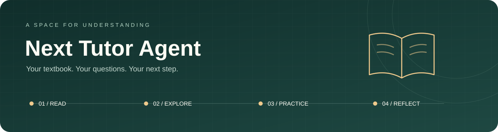

<div align="center">



# Next Tutor Agent

**从一本教材，到一段有方向的学习旅程。**

教材驱动的 AI 学习工作台 · 对话辅导 · 备课上课 · 练习测评 · 笔记复习

**简体中文** · [English](docs/README.en.md)

[快速开始](#快速开始) · [功能一览](#功能一览) · [项目展示](https://invincible-summer.github.io/The-Next-Tutor-Agent/)

</div>

---

Next Tutor Agent 把教材、讲解、练习与复习放进同一个学习空间。你可以围绕教材追问一个概念，也可以把章节准备成一堂课，在作答后查看反馈，再把值得留下的内容整理成笔记。

它关注的不只是给出答案，还包括**答案有什么依据、你已经表现出哪些理解，以及接下来适合学什么**。适合围绕教材自学、整理课程资料，以及持续开展一对一辅导。

## 功能一览

| 学习场景 | 你可以做什么 |
| :--- | :--- |
| **聊天辅导** | 围绕教材提问、追问推导、请求提示或例题；支持公式排版、图片提问，以及按需启用的语音交流。 |
| **备课上课** | 从教材章节或主题生成课件与讲稿，预览和编辑后开始 AI 讲授，继续未完成的课程，导出课件与讲稿。 |
| **资料中心** | 使用公共教材、上传个人材料，并为不同工作学习区关联教材；教材解析后可检索，知识图谱在后台继续构建。 |
| **练习与测评** | 在聊天中出题、参考原题生成变式，或发起按作答调整难度的测评；查看解析、近期习题与错题，按需生成题图。 |
| **教学素材库** | 浏览公有/个人 SVG 素材，搜索、放大、调参及黑白预览；上传、模板设计、AI 草稿和手动编辑，独立保存版本与短使用说明，管理员可增补公有素材。 |
| **知识图谱与学习总览** | 浏览概念及其联系，结合实际作答查看学习记录与当前评价，寻找需要继续练习的内容。 |
| **笔记与复习** | 用 Markdown、双向链接、标签和文件夹整理笔记，从对话、教材或错题生成内容，安排到期复习。 |
| **学习编排** | 将长期目标细化为周计划和今日任务，把学习与复习放进日常节奏。 |
| **站内学习助手** | 启用后，可询问功能入口、查看学习近况，并在确认后导航或继续课程。 |

界面支持中英文与浅色 / 深色主题，目前以桌面浏览器使用为主。课堂、语音、助手等能力取决于实例配置，页面会提示可用状态。

游客访问默认关闭，管理员可在「账号与数据」中开启。开启后，未登录用户仅可文字聊天、临时出题与本题批改，并可选公共教材；上传、历史记录、完整学习模块和导航助手须登录。游客内容只放在内存，刷新、关闭页面或登录后清空，不进入学习评价闭环。管理台「数据清理」提供游客专用清理入口，可结束临时体验并清除旧版游客残留，保留注册账号与公共教材。

## 一次学习，可以这样展开

1. **准备材料** — 在「资料中心」选择教材，创建工作学习区并关联本次学习材料。
2. **理解内容** — 打开「聊天辅导」逐步追问，或在「备课上课」把章节变成课程。
3. **动手验证** — 完成练习或测评，写出自己的思路，结合反馈找出卡点。
4. **留下积累** — 将关键解释整理成笔记，在「学习编排」安排下一次学习与复习。

> 可以从一句具体的问题开始：**“请根据这本教材解释导数的含义，先给一个直观例子，再让我做一道练习。”**

启动应用后，侧栏「文档」提供按场景编写的使用手册。

## 设计思路

- **教材是依据。** 检索相关原文后再组织讲解和出题；当教材依据不足时，保留明确边界。
- **表现是证据。** 学习评价参考实际回答、作答与获得的帮助，不把一句“懂了”当成已经掌握。
- **学习保持连续。** 教材、会话、课程、笔记与任务围绕学习空间组织，让下一次学习有迹可循。

基础检索使用 BM25，无需向量模型即可运行；向量检索是可选增强。自适应测评根据本轮表现调节题目难度，报告反映当前任务范围内的表现。

## 技术栈

| 层次 | 技术 |
| :--- | :--- |
| 前端 | Next.js 16 · React 19 · TypeScript · Tailwind CSS 4 · Zustand |
| 内容呈现 | Markdown · KaTeX · SVG 题图 · HTML 课件 |
| 后端 | Python 3.11 · FastAPI · Pydantic · OpenAI 兼容模型接口 |
| 教材与检索 | PyMuPDF · OCR · 结构化切片 · BM25 · 可选 Chroma 向量检索 |
| 学习与数据 | 多智能体教学编排 · 教材知识图谱 · 学习证据记录 · JSON / JSONL 与 Markdown 文件存储 |
| 验证工具 | unittest · TypeScript / ESLint · Playwright |

## 快速开始

### 1. 准备环境

建议使用 Linux / WSL，安装 **Python 3.11、Node.js 22 LTS 和 pnpm 11**，并准备一个可用的 OpenAI 兼容模型服务。

```bash
git clone https://github.com/invincible-summer/The-Next-Tutor-Agent.git
cd The-Next-Tutor-Agent

python3.11 -m venv .venv
source .venv/bin/activate
pip install -r services/api/requirements.txt

cd apps/web
pnpm install
cd ..
```

如果已使用 Conda，可建立名为 `edu_agent` 的 Python 3.11 环境代替 `.venv`；启动脚本会优先尝试激活该环境。

### 2. 配置模型

```bash
cp .env.example .env
```

编辑根目录 `.env`，填写模型服务提供的实际值：

```dotenv
LLM_BASE_URL=https://your-provider.example/v1
LLM_API_KEY=your-api-key
LLM_MODEL=your-model-name

ADMIN_EMAIL=you@example.com
ADMIN_PASSWORD=replace-with-your-own-password
```

`ADMIN_EMAIL` 与 `ADMIN_PASSWORD` 用于首次创建管理员。图片理解和视觉 OCR 需要模型支持视觉输入；扫描教材使用本地 OCR 回退时，还需要安装 Tesseract 与对应语言包。

### 3. 启动应用

首次使用课堂或 v2 题图，先安装本地 Chromium；课堂还需准备课件资源：

```bash
cd apps/web
pnpm run build:classroom
pnpm exec playwright install --with-deps chromium
cd ..

./start.sh
```

前端优先使用 http://localhost:3001，后端优先使用 `8123` 端口；端口占用时自动尝试其他端口，请以终端输出为准。首次启动会构建前端，后续可复用构建。使用热更新开发模式：

```bash
./start.sh dev
```

非交互环境（IDE 任务、远程命令等）会自动进入独立后台会话，避免启动任务结束时带走服务。也可使用 `./start.sh daemon` 显式后台启动，日志在 `.runtime/launcher.log`，用 `./start.sh stop` 停止；`ATTACHED=1 ./start.sh` 保留前台模式。停止清理核对 PID 与进程启动时间，只处理该启动实例登记的服务。

登录后，从「资料中心」选择教材，或直接进入「聊天辅导」开始。仅体验文字辅导时，可在 `.env` 中设置 `CLASSROOM_ENABLED=0`，跳过课堂准备步骤。

<details>
<summary><strong>按需开启更多能力</strong></summary>

| 能力 | 配置方式 |
| :--- | :--- |
| 课堂 | `.env.example` 已启用 `CLASSROOM_ENABLED=1`；需完成上述课堂准备。 |
| 题图 v2 | 默认 `QUIZ_ILLUSTRATION_PIPELINE=shadow`；开发验收时设为 `v2`，保留 `QUIZ_ILLUSTRATION_VISUAL_REVIEW=active`，需 Chromium 和支持图片输入的模型（`LLM_SUPPORTS_IMAGES=1`）。已完成14类情境与两组数值的真实模型验收，详见[验收记录](docs/DIAGRAM_LIBRARY_ACCEPTANCE.md)和[配图协议](docs/ASSESSMENT_ILLUSTRATION_PIPELINE.md)。 |
| 站内学习助手 | 设置 `SITE_ASSISTANT_ENABLED=1`。子开关：`SITE_ASSISTANT_ACTIONS_ENABLED`（领域写入，默认 1）、`SITE_ASSISTANT_WORKFLOWS_ENABLED`（跨模块工作流/办理事项，默认 1）、`SITE_ASSISTANT_VOICE_ENABLED`（语音输入与朗读，默认 0）、`SITE_ASSISTANT_PROACTIVE_ENABLED`（订阅与学习简报调度，默认 0；开启后用户仍需逐项订阅）。 |
| 课堂联网检索与配图 | 按需填写 `TAVILY_API_KEY`、`PEXELS_API_KEY` 或 `PIXABAY_API_KEY`。 |
| 课堂云端语音 | 填写 `AZURE_SPEECH_KEY` 与 `AZURE_SPEECH_REGION`。 |
| 本地语音 | 安装本地 MeloTTS 服务后设置 `VOICE_TTS_PROVIDER=melo`。 |

没有配置可选服务时，以页面显示的可用能力为准。完整配置项见 [`.env.example`](.env.example)。

</details>

开发与验证请参阅 [测试与 CI 维护](docs/TESTING.md)，包含环境准备、日常检查、完整回归及发布检查顺序。

## 项目结构

```text
apps/web/           Next.js 前端（页面、学习交互与共享组件）
services/api/       FastAPI 后端（API、教学智能体、教材处理与学习数据）
services/voice/     本地 MeloTTS 语音 sidecar（可选）
fixtures/demo/      GitHub Pages 演示的合成数据源（synthetic-only）
scripts/            repo 卫生 guard / demo 导出 / dev 工具
deploy/             systemd、nginx 等部署模板
```

仓库只包含源码、测试、部署模板与合成演示数据：教材原件、解析文本、切片、
知识图谱与用户运行数据均为部署本地状态（`.runtime/data`，见
`services/api/app/core/paths.py`），不随版本发布。

希望先看产品体验？打开 [GitHub Pages 只读演示站](https://invincible-summer.github.io/The-Next-Tutor-Agent/)，
用 `example@example.com / example` 查看合成示范数据的对话、笔记、学习档案、虚构教材知识图谱和课程。
演示内容全部为项目自写的合成数据（虚构教材库），不包含真实教材；AI、编辑与新建操作已关闭；
构建说明见 [docs/GITHUB_PAGES.md](docs/GITHUB_PAGES.md)。
