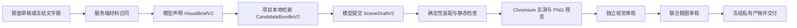

# 题目配图 v2 与 CAT 文字先行协议

题图由项目素材和受限场景编译得到，模型负责需求、构图与审核，最终 SVG 由服务端生成。v2 实现在 `services/api/app/illustration/`；普通出题在题目注册前完成题图，CAT 先交付自足文字题，再为同一题目身份生成补充图。

代码兼容默认仍为 `QUIZ_ILLUSTRATION_PIPELINE=shadow`。本地部署配置已启用 `v2`、`active` 和已实测的图片输入能力，重启后生效；真实模型验收覆盖14类情境及两组数值，见[验收记录](DIAGRAM_LIBRARY_ACCEPTANCE.md)。

## 1. 运行模式与发布门

| 配置 | 当前行为 |
| --- | --- |
| `QUIZ_ILLUSTRATION_PIPELINE=v1` | 使用兼容组件链路，继续读取历史题图 |
| `QUIZ_ILLUSTRATION_PIPELINE=shadow`（默认） | 兼容链路对外交付；CAT 另起账户私有 v2 对照任务，其结果不经公开任务接口展示 |
| `QUIZ_ILLUSTRATION_PIPELINE=v2` | 普通出题使用 v2 发布门；CAT 补图返回任务状态，前端轮询 |
| `QUIZ_ILLUSTRATION_VISUAL_REVIEW=active`（默认） | v2 运行真实 PNG 的视觉审核和联合题图审核；两项都通过才允许交付 |
| `QUIZ_ILLUSTRATION_VISUAL_REVIEW=off` 或 `shadow` | 不满足 v2 发布门，不能据此发布未经视觉审核的 v2 题图 |

`QUIZ_SVG_ENABLED`、账户 `prefs.quiz_svg_enabled` 和本次 `auto/none/required` 意图共同控制新生成。关闭生成开关后，已冻结的历史题图仍可读取。`QUIZ_DIAGRAM_MODE` 只保留兼容配置含义，不能开启模型直接输出 SVG。

v2 需要本地 Node/Playwright Chromium，以及支持图片输入的模型。使用 `LLM_SUPPORTS_IMAGES=1` 声明服务实际具备该能力；缺少浏览器、图片能力或审核结果时返回失败，不把结构可解析当成视觉审核通过。

## 2. 题目材料合同

`QuestionMaterialContract` 由服务端绑定题目身份、revision、公开题面和私有答案/量规。实体、事实、必要关系、待求量和禁止添加的内容均使用闭合 schema。

| `visual_role` | 语义与交付要求 |
| --- | --- |
| `none` | 不需要题图；`required` 意图不能以无图交付 |
| `supplemental` | 文字已包含全部解题条件；题图只表达已有事实和关系 |
| `essential` | 必要条件存在于图中，如仪器读数；完整材料与审核必须在题目注册、作答前完成 |

CAT 的 `/assessment/start`、`/assessment/next` 先生成、审核并注册自足文字题。即使要求配图，题干也不能引用尚不存在的“如图”条件。补图只能提取题干或选项中可逐字核对的事实，不能把冻结题转为 `essential`，也不能改题干、选项、答案、解析、量规或 revision。缺少必要材料时返回 `question_material_incomplete`。

普通出题可在注册前设计 `essential` 草稿。`Question/TaskSnapshot` 的发布检查要求最终图片、材料合同、题面、答案、量规和审核证据一致，缺图或未通过审核的必要图题不能成为可作答任务。

读数、真实数据、函数及其他条件参数以 `fact_id` 绑定，由服务端解析并驱动几何。`depict_only`/`symbol_only` 的数值和原文摘录不会交给构图模型；`hidden` 事实不允许用于构图。答案和量规只供独立联合审核使用。预览样例不是题目事实源。

## 3. v2 工作流



1. **声明**：一次结构化调用确定用途、视图、素材需求和应表达的关系。需求没有搜索工具或目录文件访问权。
2. **检索**：项目本地按名称、别名和语义能力筛选候选，每类最多六个。v2 当前使用 `semantics.py` 登记的首批 31 个组件与 10 个装配配方；完整浏览目录不等于全部素材已经具备 v2 装配能力。
3. **构图**：模型只可选择本题候选 ID/版本，并声明实体关联、事实绑定、位置、统一缩放、连接及外置标签。可在原需求实体和事实不变的条件下请求一次重新检索。
4. **编译**：实例按真实参数生成端口、液面、刻度和边界。编译器检查支撑、悬挂、浸没、连接等关系，使用 Chromium 的实际图形边界与字体尺寸检查出界、遮挡、文字可读性和连线。
5. **审核**：对最终 SVG 渲染的真实 PNG 做视觉审核，再联合检查题面、答案、量规与图中条件。刻度题使用同一成图的局部放大。模型自报的 hash 或“已通过”字段不能跳过这些阶段。
6. **冻结**：只有 `machine/visual/joint=passed` 才生成可交付产物；必要图材料须先完整冻结，再注册题目。

可修复的布局或视觉问题采用带 `base_scene_hash` 的 `ScenePatchV2`，仅能移动、缩放、合法旋转、在已授权候选间替换组件、重排标签或路由，并保持冻结事实。修复后重新编译、渲染和审核。无法修复、信息不足或预算耗尽时明确失败，不发布半成品。

## 4. 预算

v2 每次配图默认最多 **5 次模型调用、2 次补丁修复**，未冻结草稿最多 **45 秒**，冻结 CAT 文字题补图最多 **30 秒**。配置为：

- `QUIZ_ILLUSTRATION_MAX_CALLS=5`
- `QUIZ_ILLUSTRATION_DEADLINE_SECONDS=45`
- `QUIZ_ILLUSTRATION_MAX_REPAIRS=2`

无修复的成功流程需要声明、构图、视觉审核、联合审核四次调用。重新检索或修复也消耗同一预算；补丁与后续两项审核至少还需要三次调用，因此修复上限不保证一定有足够预算执行全部修复。

普通出题还受外层 `ASSESSMENT_GENERATION_*` 调用数和截止时间约束，不因嵌套 v2 工作流获得额外无界额度。CAT 文字题与补图分别计量；补图不重新生成文字题。兼容 v1 补图仍使用最多三次调用 / 30 秒。

账户 `quiz_illustration_review_enabled` 控制兼容 v1 的可选语义审查；它不能取消 v2 的视觉和联合发布门。`quiz_critic_enabled` 继续控制普通独立审题，受运维 `QUIZ_VERIFY_MODE` 限制。

## 5. API、所有权与任务生命周期

以下路径均以 `/api/v1` 为前缀，并使用真实登录身份。客户端只能引用自己 journal 中已有的题目，不能提交账户 ID、题干、答案、场景或 SVG。

| 方法 | 路径 | 行为 |
| --- | --- | --- |
| POST | `/assessment/questions/{question_id}/illustration` | 请求体为 `{"question_revision":1}`；按当前模式读历史或启动 CAT 补图 |
| POST | `/quiz/illustration-jobs` | 请求体为 `{"question_id":"q_…","question_revision":1}`；读取已有结果或为当前活跃 CAT 题启动 v2 任务 |
| GET | `/illustration-jobs/{job_id}` | 读取本人非 shadow 任务，含公开进度和结果 |
| POST | `/illustration-jobs/{job_id}/retry` | 失败/中断任务显式重试；创建新 job/run，保留旧运行记录 |
| GET | `/questions/{question_id}/illustration?question_revision=1` | 读取冻结题图或已有补图状态；不启动模型调用 |

只有进行中 CAT 的当前/最后题目可以发起新的补图或重试。历史、停止测评和账户关图后仍可读已有审核产物。已开始的任务可在学生提交答案后完成，但发布前会复查账户生成权限。

任务返回 `queued → running → ready | not_required | failed`。`not_required` 表示合法 `auto` 声明无需图；禁用策略不能新建 v2 任务。`required` 与开关冲突返回 409 `illustration_disabled`。他人或已删除任务返回 404；已就绪题图的重试返回 409 `illustration_frozen`。

相同题目身份的重复启动复用已有任务；并发请求只创建一个运行。已就绪产物始终优先，不随目录、提示词或开关变化重画。改变冻结题图必须创建新题目 revision。进程重启后，读取无存活后台任务的遗留 `queued/running` 记录会标记 `failed/run_interrupted`，由显式重试开启新运行。

学生接口只返回任务身份、视觉角色、进度、规范化图片和闭合失败码/重试标志。原始事实、gold、场景、候选轨迹、内部失败阶段和审核文字均留在账户私有记录中；shadow 任务不可通过公开任务接口读取。

## 6. 持久化与删除

v2 运行状态位于运行数据根：

```text
illustrations/<owner>/
  jobs/<job_id>.json
  runs/<run_id>.json
  artifacts/<artifact_id>.json
  previews/<artifact_id>.png
```

JSON 走文件锁和原子写；冻结 artifact 不允许覆盖，run 保存追加的阶段事件。普通题注册先准备私有产物，再以 journal 的题目引用作为交付点；未引用的产物不能通过题目接口读取。兼容 v1 历史缓存仍位于 `students/<owner>.question_illustrations.json`。

新根由 `core/paths.py` 绑定，并纳入存储沙箱、账户删除与孤儿清理。删除先失效 owner epoch，再取消后台任务和清除目录；旧任务或读后恢复不能重新创建已删除的目录。

## 7. 前端与 SVG 安全

CAT 文字题立即可作答，题图进度独立显示“准备条件 / 检索素材 / 设计图面 / 检查图文”。题卡与反馈卡共享账户、题目 ID 和 revision 对应的状态；切卡不重复生成，失败由用户显式重试。历史题卡、报告与证据详情通过只读 GET 恢复冻结图。

`QuestionIllustration` 支持旧 schema 1 / sanitizer 1、2，兼容组件 schema 2 / sanitizer 3，以及 v2 schema 3 / sanitizer 3。组件图上限为 128 KiB、1200 节点、4000 路径段和 10 层深度；旧图仍使用原 24 KiB 限额。

规范化器用 defusedxml 解析并重建白名单 SVG，禁止脚本、HTML、事件、外链图片、动画、DTD/实体和可执行引用。前端以 SVG data URI 的 `img` 展示，彩色组件图保留白纸配色，支持放大；不将 SVG 内联进 DOM。

## 8. 验证边界

`test_illustration_v2.py` 使用合成材料和 fake LLM，实际运行 Chromium 测量/PNG，检查科学关系、事实绑定、补丁和审核门。`test_illustration_jobs.py` 经真实 JWT/ASGI 路由检查所有权、公开投影、历史读取、单次运行、重试、不可变产物与删除竞争。它们不使用真实模型凭证。

真实 v2 验收入口为：

```bash
python3 scripts/illustration/acceptance.py --live-llm --output /tmp/illustration-v2-review
```

脚本使用已配置的真实 quiz provider、合成情境与临时运行根，输出模型答案通道 JSON、SVG、实际 PNG 和 `report.json`，目录必须在仓库外。逐轮检查不同场景的刻度、单位、关系、遮挡和图答一致性；脚本返回成功不能替代截图审阅，也不等于验证了前后端任务恢复与题目注册链路。

既有 `pnpm test:e2e:live-llm` 当前按兼容 CAT 的即时响应协议验证，不等于完成 v2 任务协议验收。环境与运行命令见 [TESTING.md](TESTING.md)。当前真实模型验收尚未全部完成，不能用 fake LLM 或 XML 检查结果宣称已通过。
