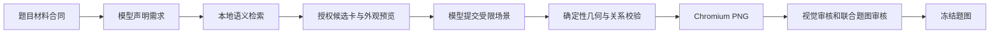

# 教学 SVG 素材库与题图装配

左侧「教学素材库」进入 `/diagram-library`，浏览项目维护的 **1,079 个矢量素材**。完整库存、名称、别名和功能见 [DIAGRAM_ASSETS.md](DIAGRAM_ASSETS.md)。目录按 17 个学科、34 个素材族组织；预览结构检查和实际题意审核分别进行。

v2 为 **31 个组件和 10 个装配配方**提供明确领域几何，登记在 `app/diagrams/semantics.py`；全部1079个登记素材经 `app/diagrams/adapters.py` 统一提供实际参数几何、可用能力、端口与标记。只允许登记的参数和物理端口，不把静态示意冒充任意科学构造。

内置素材随代码发布为公有资源；运行新增素材分为管理员维护的公有库与用户自己的私有库。支持上传、模板和图元编辑、真实LLM生成或修改草稿，预览后显式保存和启用。题目产物按账户私有冻结，库变更不覆盖旧图。

## 配图工作流与模式



v2 实现在 `app/illustration/`，需求提示词注册为 `2.2.0`，构图、视觉审核和联合审核为 `2.1.0`。模型没有素材搜索工具，也不读取库文件；项目执行检索并决定可选 ID、版本、能力和参数。

默认 `QUIZ_ILLUSTRATION_PIPELINE=shadow`：兼容组件路径对外交付，CAT 另有不对外展示的 v2 对照任务。`v2` 模式才接入新的普通出题发布门和 CAT 任务返回协议。v2 必须通过实际 PNG 的视觉审核与联合审核；关闭旧账户可选审图偏好不会降低该门槛。详见 [ASSESSMENT_ILLUSTRATION_PIPELINE.md](ASSESSMENT_ILLUSTRATION_PIPELINE.md)。

普通出题以题面草稿和 `QuestionMaterialContract` 为基础，题图就绪后注册。CAT 的文字题先冻结、独立可答，后到的图只作 `supplemental`；读图才具备必要条件的 `essential` 题必须在注册前完成全部材料。

## 声明、检索与构图协议

| 合同 | 职责 |
| --- | --- |
| `QuestionMaterialContract` | 绑定题目身份、公开条件、事实、实体、关系和私有答案/量规 |
| `VisualBriefV2` | 声明用途、视图、素材需求、事实引用及已知标签 |
| `CandidateBundleV2` | 本地检索返回的授权 ID/版本、能力、参数语义、端口和区域 |
| `SceneDraftV2` | 模型提交的实例、实体映射、事实绑定、关系、标签和分层 |
| `ScenePatchV2` | 绑定基础场景 hash 的受限修复，冻结事实保持不变 |
| `DiagramSourceV2` | 私有场景、实例事实、实测布局与审核证据 |

例如，题面已明确“滑块 block 放在水平面 plane 上”，材料合同登记这两个实体和支撑关系后，需求声明可为：

```json
{
  "schema_version": 2,
  "visual_role": "supplemental",
  "purpose": "表示滑块与水平面的接触关系",
  "view": "front_orthographic",
  "needs": [{
    "need_id": "main",
    "name": "水平面滑块",
    "entity_ids": ["block", "plane"],
    "capabilities": ["support"],
    "quantity": 1,
    "fact_bindings": []
  }]
}
```

检索只在已登记的语义组件和配方中选择，每类需求最多六个候选。名称、中文/英文别名和模糊相似度用于匹配，能力与支持视图是硬约束；学段用于筛选。候选卡包含参数的条件含义、单位、定性许可、端口、敏感区域和配方关系。候选外观拼图由本地 Chromium 生成，展示读数和数据明确标为样例。

每份声明最多 12 类需求、24 个实例。模型可基于同一实体/事实集合请求一次重新检索；缺少候选或必要材料时返回明确错误。响应 schema 为闭合字段，模型 SVG、外链和任意片段不进入构图。

该候选的当前版本为 1，场景示例：

```json
{
  "schema_version": 2,
  "action": "compose",
  "canvas": {"profile": "question_landscape"},
  "asset_instances": [{
    "instance_id": "main",
    "need_id": "main",
    "asset_id": "recipe.horizontal_block",
    "version": 1,
    "entity_map": {"block": "block", "plane": "plane"},
    "fact_bindings": {},
    "non_quantitative": [],
    "anchor_intent": "滑块底部接触水平面，周围留白",
    "x": 30,
    "y": 15,
    "scale": 1,
    "rotation": 0,
    "layer": "body"
  }],
  "relations": [],
  "annotations": [],
  "alt": "水平面上的滑块"
}
```

配方在实例化时展开具名子组件及其必要关系；省略显式 `relations` 不会跳过配方内部支撑检查。版本应始终使用本题候选卡返回的值。可选画布使用固定 profile：`question_landscape`、`question_square`、`coordinate_plane`、`comparison_split`、`tabletop`，尺寸不由模型任意扩张。

`layout.py` 根据实例参数生成真实几何，并实测边界和字体。端口用于连接、支撑和悬挂，区域用于液体、器材主体和不能遮盖的刻度；编译器检查接触、浸没、碰撞、画布边距和可读性，确定性安排连线路由与外置标签。允许的内部重叠由配方或材料关系限定。失败可提出补丁，再完整编译、渲染和审核。

## 素材与科学约束

| 层次 | 内容 | 实现位置 |
| --- | --- | --- |
| 基础图形与数学 | 几何体、分数、坐标、函数、向量、统计 | `mathematics.py`、`extended_math.py` |
| 仪器与物体 | 容器、实验配件、测量、力学对象 | `instruments.py`、`physics.py`、`extended_physics.py` |
| 生物与地理 | 细胞、器官、地形与地球 | `life_earth.py`、`extended_biology.py`、`extended_earth.py` |
| 化学与通用 | 分子键型、逻辑门、生活对象 | `systems.py`、`extended_systems.py` |
| 兼容完整构图 | 实验、力学、电路、几何和统计模板 | `templates.py`、`extended_experiments.py`、`extended_deferred.py` |
| v2 装配语义 | 实例参数、动态端口/区域、部件分层与配方 | `semantics.py` + `app/illustration/` |

素材是项目原创 XML 矢量路径，使用教材配色和简洁轮廓；黑白预览使用灰度画面。液面、刻度、接头、火焰和虚实线均按真实结构表达，器材名称放在图库卡片外，题图标签只表达允许公开的条件。

- 条件参数必须引用题目 `fact_id`，包括读数、量程、点燃/闭合状态、统计数据和函数。服务端绑定值驱动实例，不复制 `sample_params`。
- 只在合同允许且非按比例表达时，使用显式声明的定性参数。例如 `fill` 是图示液面高度比例，不把任意形状容器的体积值直接当作高度。
- 定性液体条件使用有原文依据的 `liquid_present`；浸没区域、器材前后部件与刻度区域参与关系和遮挡校验。
- 测力计、温度计、电表和量筒的读数、单位、刻度及端口来自该实例的参数；读图题的待求读数不写入 alt、caption 或额外标签。
- 柱状图等按真实数据生成，函数使用受限 AST 解释器；单位、数据类型和区间必须与参数合同匹配，不执行用户代码。
- 几何图仅表达材料合同给定的构造、条件和标记；未按比例示意的像素半径不能冒充题目中的物理长度。
- 科学可用性由静态检查和当前题目的视觉/联合审核共同判定；图库能够渲染不代表任意题意都可用。

## 冻结、兼容与存储

公开图片仍使用 `illustration` 字段。历史 schema 1 / sanitizer 1、2 可读；兼容组件图为 schema 2 / sanitizer 3，v2 图为 **schema 3 / sanitizer 3**。组件图最大 128 KiB、1200 节点、4000 路径段、深度 10，必须经 defusedxml 白名单重建，禁止脚本、HTML、事件、外链和动画。

v2 的 `material_contract` 与 `diagram_source` 保存在账户私有题目快照；`QuestionPublic` 只返回题面、视觉角色、artifact 引用和规范化图。场景、事实绑定、内部审核文字和答案不随答前题卡下发。

运行数据根下 `illustrations/<owner>/` 保存 job、追加阶段记录、不可变 artifact 与 PNG。该根已绑定统一路径，并登记测试沙箱、账户删除与孤儿清理。兼容 v1 补图缓存仍在原 `students` 根。历史图复用冻结 SVG，不因素材升级重画；同题重复启动共享任务，失败显式重试生成新的 job/run，不能覆盖 ready 产物。账户删除使旧运行失效并取消后台任务，避免数据重新出现。

v2 默认每次配图最多五次调用、两次补丁，草稿最多 45 秒、CAT 补图最多 30 秒。普通出题还受整组生成预算约束。完整预算、API 所有权和 `essential` 发布门见 [配图协议](ASSESSMENT_ILLUSTRATION_PIPELINE.md)。

## 前端与目录接口

图库支持学科、学段、类型筛选，名称/别名模糊搜索、共享分页、放大、真实参数调节、恢复展示样例，以及教材配色/黑白印刷切换。浅色和深色页面的彩色 SVG 保留白色纸面。

前端经 `apiFetch` 访问，沿用 `/api/v1` 的登录访问门。目录仅列出审核状态为 `passed` 的共享素材；预览不调用模型、不修改库，也不写学生题目。

| 方法 | 路径 | 行为 |
| --- | --- | --- |
| GET | `/api/v1/diagram-assets?q=&subject=&family=&education_level=&asset_kind=&page=0&per=12` | 元信息、分类计数和预览；分页从 0 开始，单页最多 48 |
| GET | `/api/v1/diagram-assets/taxonomy` | 学科、学段、类型等筛选目录 |
| GET | `/api/v1/diagram-assets/{asset_id}` | 尺寸、锚点、参数、展示样例及预览；已登记组件附带 v2 元数据 |
| POST | `/api/v1/diagram-assets/{asset_id}/preview` | 以 `params` 和 `profile`（`textbook` 或 `monochrome`）生成预览；未知 ID 为 404，非法参数为 422 |

SVG 用 data URI 的 `img` 图片上下文展示。题卡、报告和证据详情复用 `QuestionIllustration`，历史恢复通过只读题图接口进行。任务的阶段、失败码和重试入口独立于 CAT 文字题作答状态。

## 维护素材与验证

项目维护者在 `services/api/scripts/build_diagram_catalog.py` 声明稳定 ID、名称、别名和能力，并在对应渲染器实现真实结构、参数与边界。静态素材统一经 `adapters.py` 适配；新增定量或科学装配能力时须登记单位、条件参数、实际动态端口、区域及关系规则，不能只靠标签或相似外形取得资格。

修改素材含义或参数时提升相应版本，旧场景版本不匹配则明确拒绝。目录和渲染器须一同发布，历史冻结图保持原样。

`test_diagram_library.py` 覆盖共享目录、参数、规范化和兼容构图。`test_illustration_v2.py` 使用合成科学场景与 fake LLM，通过真实 Chromium 检查实例关系、绑定和 PNG；`test_illustration_jobs.py` 检查鉴权、公开投影、冻结复用、重试和删除竞争。

`apps/web/scripts/check-diagram-library.mjs` 渲染全部目录素材，输出人工审查拼图与边界报告；应逐张核对变形、位置、刻度、接头、遮挡和两种风格。自动检查通过不能替代截图审阅。既有首轮记录见 [DIAGRAM_REVIEW.md](DIAGRAM_REVIEW.md)，运行命令及真实 v2 多场景验收见 [TESTING.md](TESTING.md)。已完成14类题图情境及两组数值的真实模型和PNG验收，详见[验收记录](DIAGRAM_LIBRARY_ACCEPTANCE.md)。目录适配只承诺已登记的能力，不承诺任意题意都能表达。

## 公有与个人创作素材

内置每项独立目录 `services/api/assets/diagram_library/materials/<asset_id>/` 保存 `asset.svg`、`material.json`、`usage_guide.json`；`python3 services/api/scripts/build_diagram_packages.py --check` 校验可重建与一致性。预览参数不是题目事实。主提示只含通用规范，子提示按本轮相关素材和阶段加载，审图只加载最终选用版本。

运行新增素材保存在数据根 `diagram_assets/<public|owner>/materials/<id>/versions/<revision>/`，同样分离SVG、元信息与短提示，另存实际PNG。短使用说明可以编辑，每次保存形成不可变版本；索引仅在完整版本写入后原子发布。旧版JSON可读取，下次编辑使用新布局。

`/api/v1/diagram-materials` 提供分页列表、创建、详情、历史版本、编辑、删除；`/templates` 给出设计样例，`/preview` 安全规范化并真实渲染，`/generate` 调用配置模型生成可编辑草稿。scope=public的写操作仅管理员，身份只用 `resolve_student_id()`；其他账户私有素材不可读取或检索。保存需要最新base_revision，冲突返回409。模板/上传/生成均进入Modal编辑器，历史只读不会自动保存；生成不自动发布。

当前上传SVG只具备静态整体能力，无任意定量参数或物理端口；实际题图必须重新通过视觉与联合审核。删除账户和孤儿清理覆盖该根，公有库受保护，后台取消与epoch避免已删除账户被重新写入。
