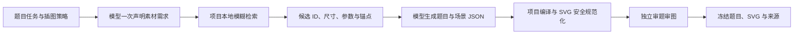

# 教学 SVG 素材库与出题构图

系统已接入 **1,079 个正式矢量素材**，前端入口是左侧「教学素材库」，页面地址 `/diagram-library`。数学、物理、化学、统计、生物、地理、信息技术、语言、历史、经济、工程、天文、音乐、美术、体育、农业与环境科学共用一套教材配色、线条与构图规范。烧杯、滑块、小球、单摆、酒精灯、试管，以及柱状图、扇形图均有预构建素材。

完整名称、英文、别名、功能和后续扩展候选逐项记录在 [DIAGRAM_ASSETS.md](DIAGRAM_ASSETS.md)。目录按 17 个学科、34 个素材族组织；所有已登记素材都经过目录检查、结构检查和双风格预览检查。

## 出题流程



模型只描述「需要什么」，没有素材搜索工具，也不访问库文件。蓝图阶段可同时返回 `requirements`，项目在本地按名称、别名和功能约束模糊检索；候选返回后，模型选择组件、调整比例和参数、声明连接与已知标签。`compiler.py` 负责最终 SVG。聊天出题、练习适配与普通测评复用 `generate_verified_questions`。

需求声明使用注册提示词 `quiz_visual_requirements`，构图使用 `quiz_component_scene`。确定性组件编译始终执行；生成审查默认关闭，用户开启后才增加一次独立题图一致性审查。模型自报的来源、计算事实、审核结果、hash 与规范化图片不能成为可信结果。

### 第一轮：声明需求

```json
{
  "requirements": [{
    "question_slot": "q1",
    "illustration_needed": true,
    "scene_brief": "烧杯间接加热装置",
    "needs": [
      {"key": "beaker", "name": "烧杯", "quantity": 1, "features": ["可加热", "可显示液面"], "category": "chemistry"},
      {"key": "lamp", "name": "酒精灯", "quantity": 1, "features": ["点燃状态"]}
    ],
    "visible_labels": [],
    "layout_intent": "主体居中，酒精灯在三脚架下方，留出题目标签位置"
  }]
}
```

每题最多 12 类需求、24 个实例，每批最多 5 题、24 类需求。`q1..q5` 对应初始题目顺序；类型过滤和部分修订之后，通过题目 ID 保留原声明槽位。需求不是自由执行指令。候选返回失败时，`auto` 降级为无图；`required` 返回明确失败，不允许自行补画。候选素材不会自动按检索顺序平铺：正常构图由模型使用节点参数、锚点、连接、标签、比例和层次来完成；仅在模型响应不可用时才启用“强语义候选 + 完整模板优先”的确定性恢复。

### 项目检索

名称经 NFKC、大小写和标点归一化，中文名、英文名、常用别名共同进入索引。排序结合精确命中、名称包含、编辑相似度和 BM25；例如 `beakr` 可匹配烧杯。功能是硬约束，学科是排序参考。烧杯不会因为外形相似而匹配「带侧管」要求。

每个需求最多返回五个候选，带原生尺寸、版本、允许旋转状态、实际支持的参数与具名锚点；候选卡同时提供类别、英文名和别名，帮助模型区分同义器材与专用变体。场景名称命中完整模板时，额外提供整体构图。不会把整个目录或全量 SVG 放进模型上下文。

找不到素材时返回 `missing`。组件链路不接受 `fragments`、模型自定义 SVG、外链图片或任意补画；需要补充的通用素材由项目维护者绘制、检查后发布。

### 第二轮：选择组件与构图

```json
{
  "illustration": null,
  "diagram_scene": {
    "schema_version": 1,
    "width": 640,
    "height": 400,
    "profile": "textbook",
    "nodes": [{
      "id": "apparatus",
      "asset_id": "template.heating_beaker",
      "version": 1,
      "x": 16,
      "y": 16,
      "scale": 0.9,
      "rotation": 0,
      "params": {"fill": 0.35, "lit": true}
    }],
    "connections": [],
    "labels": [],
    "alt": "烧杯置于金属网和三脚架上，架下酒精灯点燃。",
    "caption": ""
  }
}
```

节点位置指原生画布的左上角，统一缩放，旋转绕组件中心；图表、函数、关系图、容器和完整模板不接受整体旋转。模型只能引用该题检索到的 ID 与可用版本；编译器会拒绝模型直接传入的 illustration/SVG。连接必须指向具体节点的具名锚点，支持线、导线、绳、导管、箭头、虚线，以及直连或折线路由。节点顺序决定遮挡顺序。

编译器限制 24 个节点、48 条连接、24 个标签，画布宽 320–960、高 200–720，长宽比 0.75–3，保留 4px 边距。未知 ID、未知参数、缺失锚点、非法数值、超界构图都会进入已有修订或拒绝路径。`required` 不会静默交付缺图题；`auto` 声明失败可继续生成完整、自足的文字题。

## 素材与视觉规范

| 层次 | 内容 | 实现位置 |
| --- | --- | --- |
| 基础图形 | 点线、箭头、角标、几何体、分数与计数对象 | `mathematics.py`、`extended_math.py` |
| 数学与统计 | 坐标、函数、向量、积分、各类数据图 | `mathematics.py`、`extended_math.py` |
| 仪器与物体 | 容器、玻璃仪器、实验配件、力学对象 | `instruments.py` |
| 物理 | 电路、光学、测量、波动、流体 | `physics.py`、`extended_physics.py` |
| 生物与地理 | 细胞、分子过程、器官、地形与地球 | `life_earth.py`、`extended_biology.py`、`extended_earth.py` |
| 化学与通用 | 分子键型、物质微观图、关系图、逻辑门、生活对象 | `systems.py`、`extended_systems.py` |
| 完整构图 | 加热、过滤、滴定、力学装置、电路、几何与统计场景 | `templates.py`、`extended_experiments.py`、`extended_deferred.py` |

所有素材是项目原创 XML 矢量路径，没有外链图片或运行时生图依赖。默认使用深蓝灰轮廓、低饱和蓝/金/绿/红、小面积玻璃色与统一圆角。器材保留口沿、支架、刻度、接头、火焰、液面等识别细节；符号采用简洁教材线条。黑白模式使用灰度画面。复杂度来自真实结构，避免用标题框或装饰替代对象。

预览中的名称放在卡片外部，识别题不会自动把学名写进图内。构图标签只允许题目已知条件；不填入正确选项、待求数值、解题辅助关系或量规。

### 参数与科学约束

只有渲染器真正使用的控制项才会出现在详情接口和前端面板，固定结构没有虚假旋钮。常见可调项包括液面及颜色、刻度容量、点燃状态、单摆角度与长度、球半径、弹簧长度、多边形边数、骰子点数、函数与数据。

- `fill` 表示高度占比，不等同任意形状容器的体积占比。倾斜加热试管的液面按重力保持水平，并限制装液范围；普通装液容器禁止整体旋转。
- 量筒容量、温度计和模拟表读数由项目计算相应刻度位置。量具的固定外形素材用于辨认和装置示意，不把未建模的量具读数冒充精确测量题。
- 柱状图、饼图等正式出题必须提供真实 `values`，关系图必须提供 `items`。展示样例只有预览模式可用，不自动成为题目条件。
- 饼图按数值比例计算圆心角；直方图支持分组边界，不等宽分组必须使用频数密度；堆叠图、累计图、误差范围、经验分布与箱线摘要由代码计算。
- 统计图限制数据与标签密度，避免细柱、过密文字或大量对象挤出画布。结构不完整、数据类型错误和超密布局返回可读错误码。
- 函数表达式使用受限 AST 数学解释器，不执行 `eval`、属性访问或用户代码；定义域和显示范围显式给出，断点分段绘制。切线、向量与积分区间必须处于有效范围。
- 分子素材显式绘制常见单/双/三键和原子连接；通用示意不是任意化合物的自动化学建模器。科学完整性仍须结合实际题目审图。

## 冻结、兼容与存储

`diagram_source` 包含目录版本、渲染器版本、场景 hash、素材版本与场景 JSON；`visual_requirements` 保留声明。两者随普通题进入私有 `Question/TaskSnapshot`，参与同 ID、同 revision 的材料不可变检查。`QuestionPublic` 继续只投影公开题面，不暴露内部来源或答案。历史显示使用冻结后的 SVG，不因素材升级重新绘制。

最终图片仍沿 `illustration` 字段交付。旧 schema 1 / sanitizer 1、2 保持 24 KiB、180 节点、800 路径段；项目组件图使用 schema 2 / sanitizer 3，最多 128 KiB、1200 节点、4000 路径段，深度仍为 10。组件图也必须通过闭合白名单，禁止脚本、HTML、事件、外链、动画与 DTD/实体。资源不依赖 `<use>` 或外部字体。

CAT 保持文字题先冻结并可作答，之后运行「声明 → 本地检索 → 编译」补图；生成审查默认关闭，开启后才增加独立审查。补图不改题干、答案、解析、选项或量规，不增加文字中没有的必要条件。缓存仍写到现有账户 `students/<owner>.question_illustrations.json`，采用账户隔离、文件锁与原子写入；并发请求共享生成任务，恢复后复用已审核图片。没有新增用户存储根。

普通出题与修订共用有界预算：默认最多 6 次逻辑调用、90 秒截止时间、最多 2 次修订；声明也计入预算，可通过 `ASSESSMENT_GENERATION_MAX_CALLS`、`ASSESSMENT_GENERATION_DEADLINE_SECONDS` 和 `ASSESSMENT_GENERATION_MAX_ATTEMPTS` 调整。CAT 补图共用最多 3 次逻辑调用 / 30 秒预算；可审图时常规流程分别使用声明、构图和审核三次调用，不额外叠加无界重试。

## 前端与接口

素材库集成到原有 workspace 导航与中英双语系统。支持按学科、类型筛选，名称/别名模糊搜索，统一分页，点击放大，参数调节、更新预览、恢复示例，以及教材配色/黑白印刷切换。固定结构素材仍可切换风格。浅色和深色页面的彩色 SVG 都使用白色纸面，保留正确配色。

前端经 `apiFetch` 访问以下接口，沿用 `/api/v1` 的访问门。素材是版本化公共项目资源，浏览与预览不会修改公共库，不调用模型，也不写入学生题库。

| 方法 | 路径 | 行为 |
| --- | --- | --- |
| GET | `/api/v1/diagram-assets?q=&subject=&family=&education_level=&asset_kind=&page=0&per=12` | 返回目录版本、总数、分类计数、素材元信息与预览；分页从 0 开始，单页最多 48 |
| GET | `/api/v1/diagram-assets/{asset_id}` | 返回尺寸、锚点、参数契约、展示样例及预览 |
| POST | `/api/v1/diagram-assets/{asset_id}/preview` | 接收 `params` 与 `profile=textbook|monochrome`，校验并返回新预览；未知 ID 为 404、非法参数为 422 |

前端通过 SVG data URI 的 `img` 图片上下文展示，不把 SVG 内联成可执行 DOM。题卡与放大弹窗复用现有 `QuestionIllustration`；公共素材库使用相同规范化图数据。

## 开关与发布

`QUIZ_SVG_ENABLED=1` 是新图总闸，账户偏好与本次 `auto/none/required` 意图继续生效。`QUIZ_DIAGRAM_MODE` 仅为旧配置兼容字段，运行时始终使用素材组件链路，不能切回模型直接生成 SVG。关闭新图生成不影响历史图片和素材库浏览。不迁移旧记录、不修改账户配置、不上传或发布站点。

重启项目后即可看到新导航与接口。生产部署按原有前后端发布方式构建；目录文件和渲染器必须一同发布。

## 添加素材与后续扩展

先在 `services/api/scripts/build_diagram_catalog.py` 的库存中声明稳定 ID、中文/英文名称、别名、真实功能；在对应渲染器实现独立结构、原生边界、语义锚点、真实参数与确定性事实。数据图必须要求真实数据，展示值只进 `sample_params`。不要复制相似轮廓然后只改标题。

新增或修改后执行目录生成、聚焦测试和全量渲染检查。逐一核对接头、刻度、键型、虚实线、可见/遮挡关系、边界与两种风格；完成检查才从扩展候选移除。已发布素材改变含义或参数时提升素材版本和目录/渲染器版本；冻结历史仍使用原 SVG，旧场景版本不匹配时明确拒绝，不能静默替换。

后续扩展顺序：气体制备/收集和蒸馏等严格管路装置；电化学、光路和读数量具；遗传系谱、根尖分区、地理动态过程；复杂化合物与专门信息结构。每项先补结构数据与参数，再补构图模板，最后跑同一套审查。具体候选 ID 已完整列在清单中。

## 验收

`services/api/tests/test_diagram_library.py` 覆盖全部正式素材的双风格规范化、本地模糊检索与功能过滤、真实数据计算、受限编译、片段边界、调用预算、CAT 冻结与缓存、API 分页和非法预览参数。存储沙箱同时重定向补图缓存，避免测试读写运行数据。

`apps/web/scripts/check-diagram-library.mjs` 在 Chromium 中渲染全部素材，导出每页 40 个的人工审查拼图和边界报告；任何越界令检查失败。正式素材需逐张人工复核，自动检查通过不等于任何科学题意都正确。浏览器回归另外遍历前端的全部分页，核对图片加载、搜索、参数变化、放大、浅色/深色和 1024px 桌面窗口。

运行命令和隔离环境说明见 [TESTING.md](TESTING.md)。截图与临时审查产物写到 `/tmp` 或 `apps/web/test-results`，不提交学生数据或运行缓存。

首轮全部素材的逐项复核、修订内容与实际验证结果见 [DIAGRAM_REVIEW.md](DIAGRAM_REVIEW.md)。
