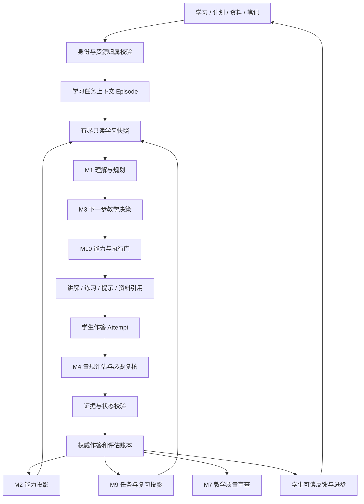

# Edu_Agent 审核与优化计划

> 审核日期：2026-09-05。代码基线：`bf2f334`，以审查时工作树为准。
> 本次交付范围：审查、设计与实施计划。**没有实施下述业务代码、接口、数据库或界面变更。**
> 文中的「现状」来自代码核查；「建议」「拟新增」「目标」均为后续方案，不代表已经实现。完成本文不等于完成平台优化。

## 1. 决策摘要：真正要交付什么

平台应帮助学习者在自己的目标、教材和时间条件下，逐渐形成**能够独立解释、完成任务、迁移应用，并在一段时间后仍然保留的能力**。像真实教师，体现在知道依据什么判断、何时追问、如何解释、何时调整，以及承认暂时无法判断；不体现在模块数量、回答长度或每天出题数量。

本轮建议采用三个方向：

1. **先保证学习证据可信。** 修正评分信任边界、部分得分丢失、无作答推进复习、测评状态不一致等问题。错误的证据进入档案后，更强的 LLM 也只会更有说服力地做出错误决定。
2. **把有教育意义的语义判断交给 LLM。** 将错因、理解程度、下一步教学、补充测评、阶段总结、重规划等判断改为有来源、有量规、有不确定性和可回放结果的结构化评估；保留身份、权限、状态机、预算、幂等、算分与存储的一致性约束。
3. **把学生界面围绕行动收敛。** 建议四个主入口「学习 / 计划 / 资料 / 笔记」。测评、图谱、进步、记忆和设置按任务进入。保留已有好功能和深链，不因减导航而删除学生资产，也不把所有功能塞进一条无边界聊天流。

首个可交付版本只做一条纵向闭环：**从某教材概念开始 → 学生作答 → 可信结构化评估 → 针对性反馈 → 具体下一步 → 下次回来继续**。不同时重写 M1–M10，不新建一套与现有系统平行的智能体平台。

### 1.1 基本假设和范围

- 暂按「围绕教材学习的个人自学者」安排优先级，同时保留小学、初中、高中、本科/成人的适配。用户尚未指定唯一优先群体；本假设影响试点语料与界面文案，不影响证据和权限底座。
- 首轮验证选择一个概念边界清晰的教材单元，另加一个非计算学科的小样本，避免只对数学选择题优化。全面多学科发布须分别通过相应量规验证。
- 不假设学校班级、教师后台、家长监管、证书考试、社交社区、付费运营已经是必要需求。
- 不把年龄、学段、表达习惯等同于能力；不从少量聊天推断稳定人格、智力或心理健康。
- 所有工作允许「复核后保持现状」。任何条目若在实施前已经被修复，应记录证据并关闭条目，不能为了完成清单再改一次。

### 1.2 判定新增需求是否必要

每个新增需求必须回答：学生遇到什么具体困难；现有能力为什么不能解决；是否改变其下一步行动；最小实现是什么；如何验证；何时停止投入。

优先级定义：

| 级别 | 判定 | 本项目对应内容 |
| --- | --- | --- |
| P0 | 学习记录可能不可信、越权写入、不可恢复的重复记分或错误状态 | 评分和资源归属、稳定题目 ID、幂等、unknown/partial、测评生命周期 |
| P1 | 直接影响教学判断、任务衔接和完成学习的效率 | 结构化诊断、下一步策略、复习证据、导航收敛、进步解释 |
| P2 | 主闭环成立后，可能带来进一步学习收益 | 反向讲解、迁移挑战、笔记到复习、跨教材概念对齐 |
| 暂缓 | 缺少明确用户任务、证据或资源条件 | 新模块总览、智能体广场、人格雷达、积分经济、全自动自改策略 |

## 2. 审核方法、边界与已验证结果

### 2.1 方法

核对 `AGENTS.md`、`docs/DESIGN.md`，沿「入口 → 前端请求 → API → 业务管理器 → 判定函数 → 持久化 → 下一轮消费」检查，而不是仅依据页面标题或文档自述。

重点覆盖：全局导航与 19 个 `page.tsx` 路由文件；对话、总览、知识图谱、学习编排、测评、记忆、画像、洞察、资料、笔记、归档、帮助和管理员入口；M1 任务理解/规划/M10 门控；M2/M3/M4 评估与写回；M6 记忆边界；M7/M8 评价；M9 任务与复习；题目质量门、学习账本及既有测试。

审查开始时已有 `frontend/package.json` 和演示学生编排文件的工作树修改。本次不修改它们，不读取真实用户私密会话作为审查材料，不访问生产账号数据。

证据标签：

- **R：已复现**，用纯函数或 `StorageSandboxTestCase` 临时存储复现。
- **S：静态确认**，能从源码与调用链确定，但没有在真实部署上执行。
- **H：待验证假设**，如学生认为某张卡重复、某个视觉效果妨碍操作，需用户任务测试。

没有进行生产攻击测试、真实 LLM 教学效果测试或浏览器全页面交互实测。因此本文不声称已经发现全部运行时死按钮、不提供虚构的页面使用率/延迟数据，也不把推测写成上线故障。

### 2.2 本次执行的验证

在 `backend/` 下以 `PYTHONDONTWRITEBYTECODE=1 python3 -m unittest` 执行以下现有测试类，共 **62 项通过**：

```text
tests.test_assessment.TestEvaluateMC
tests.test_assessment.TestParseGrade
tests.test_assessment.TestAdaptiveTest
tests.test_assessment.TestAssessmentResultBinary
tests.test_teaching_engine.TestStrategySelection
tests.test_teaching_engine.TestMisconceptionDiagnosis
tests.test_skill_runtime.TestLearningEvidenceGate
tests.test_evaluation.TestTraceAnalyzer
tests.test_orchestration.TestSpacedRepetition
```

额外执行临时审查脚本，结果如下。脚本未加入业务仓库，涉及写入的案例使用仓库统一存储沙箱并在结束时清理：

| 输入/操作 | 观察到的结果 | 含义 |
| --- | --- | --- |
| 解析 `[部分对]` | `score=0.5`，`correct=False` | 到二元写回处丢失部分掌握信息 |
| 难度 3、最近两题正确、上限 6 | `should_stop()` 返回 `mastered` | 掌握结论没有覆盖/独立性/延迟证据条件 |
| 错因文本「没有混淆概念，只是算错了」 | `MistakeType.CONCEPT` | 关键词没有处理否定关系 |
| `knowledge_search` 被调用且结果为 wrong | `FailureType.RETRIEVAL_MISS` | 是否检索过被当成错误归因依据 |
| 两次 unknown 复习质量映射并更新 | `repetitions=2`，`interval=6` 天 | 没有有效召回证据也可能延长复习间隔 |
| 任务理解输入「继续」 | `TaskType.CHITCHAT` | 短确认规则未利用待完成教学上下文；不代表最终回答必然失败 |
| 沙箱中 B 身份向 A 的会话提交 `/quiz/record` 路由函数调用 | A 的题目结果被写为 correct | 会话写回缺少资源所有权校验；该复现在 M4 关闭分支，开启分支也调用同一未校验写回函数 |

**测试通过说明原规则被正确实现，不说明原规则具备教育测量效度。** 本次未跑全量后端、前端构建或视觉回归，因为没有修改业务代码；这些是未来实施阶段的发布门槛，见 §13。

## 3. 第一性原理：教师闭环与成功标准

### 3.1 教师真正面对的是不完全可观察的学习状态

一次正确答案可能是理解、猜中、照抄或在提示下完成；一次错误可能来自概念、计算、题意歧义、识别错误或教师给出的错误答案。系统只能获得局部证据，不应把一个分数当成学生的全部能力。

每次有意义的判断至少包含：

```text
目标：学生要能做什么？
任务：什么活动能让这项能力显现？
证据：学生具体做了什么？得到过什么帮助？
解释：哪些推断被证据支持，哪些仍未知？
行动：现在最有价值的一步是什么？
验证：如何知道这一步起了作用？
```

这里参考证据中心设计对能力、任务和证据模型的区分，并将教学行动接入同一闭环。这是本方案的设计依据，不是声称本系统已获得教育测量认证。[ETS：Evidence-Centered Design for Learning](https://www.ets.org/research/policy_research_reports/publications/report/2011/imbu.html)

### 3.2 学生应当能感知的五个变化

1. 打开平台就能继续上次的具体问题，知道今天先做什么。
2. 教师说清楚「你这一步是对的，卡在这里」，而不是只有红绿判定和泛泛重讲。
3. 教师确实会根据新的证据调整，也允许学生说「今天只讲解」「这个判断不对」。
4. 进步有可查看的例子和适用范围；暂时没测过的内容显示未知。
5. 本次理解能在之后的独立任务中维持；平台逐渐减少帮助，而非持续增加学生对答案的依赖。

间隔复习、练习提取、例题与独立练习交替、深层解释问题已有教育研究依据，但不同做法的证据强度不同。这里用它们选择可测试的教学干预，不据此保证某个固定题数或间隔对所有人都最优。[IES：Organizing Instruction and Study to Improve Student Learning](https://ies.ed.gov/ncee/wwc/PracticeGuide/1)

### 3.3 北极星指标和不能混淆的指标

北极星：**目标能力在无答案提示条件下、延迟复测中的达成情况**。先以概念/任务为单位衡量，报告样本数和未参加复测的比例；不把未回来的人默认记作不会，也不只报告留下来的高分者。

| 维度 | 可观测指标 | 禁止替代为 |
| --- | --- | --- |
| 学习收益 | 基线与延迟平行任务表现、迁移任务表现、必要帮助量变化 | BKT 的变化量、模型自评分、题量 |
| 使用效率 | 进入有效学习任务的时间、无效跳转次数、恢复学习成功率 | 停留时长越长越好 |
| 评估可信性 | 人工量规一致性、错误掌握声明率、弃权率、证据引用有效率 | JSON 合法率或 LLM 自报 confidence |
| 主动性 | 学生可拒绝测评、调整计划、纠正判断，调整能生效 | 更多自动弹窗、更多自动任务 |
| 系统质量 | 每个闭环成本、P50/P95 延迟、失败恢复率 | LLM 调用次数越多越智能 |

一项高中数学随机试验表明，辅助练习期间的表现不能代替移除辅助后的学习结果；其结果有明确场景限制，不能推广为所有 AI 教学必然有害。本项目因此必须把「有帮助时完成」与「独立能力」分开验收。[Bastani 等，PNAS 2025](https://doi.org/10.1073/pnas.2422633122)

## 4. 已经做得好的部分：明确保留

| 能力/设计 | 核查依据 | 处理决定 |
| --- | --- | --- |
| 教材驱动、来源定位、分级检索证据与深读 | `core/evidence_gate.py`、`core/evidence_context.py`、`tools/knowledge_read.py`、DESIGN 的 P8/P9 | 保留；新评估直接消费同一授权来源，不能再建一套检索体系 |
| 公共教材管理员写、用户/工作区资料隔离 | `identity/deps.py`、`api/v1/textbook.py`、`core/workspace.py` | 保留；按明确发现补齐答题端点，不能概括成整个系统没有隔离 |
| 先答后揭晓、答题卡刷新恢复、避免重复显示解析 | `components/chat/QuizCard.tsx`、`api/v1/quiz.py` | 保留交互成果；服务端 ID、幂等与答案可见性需要补强 |
| 变式出题与两轮命题设计、已有 critic | `tools/fit_quiz.py`、`core/quiz_design.py`、`core/quiz_verify.py` | 继续复用，完善验证状态与证据门的连接；不再建议「从零增加变式/审题」 |
| 学习账本独立于来源会话，错题本兼容旧数据 | `core/learning_records.py`、`core/error_notebook.py` | 保留资产与删除语义；逐步扩展版本化作答事件 |
| M10 已有 E0–E5 证据分级与 unknown 阻断 | `agents/skill_runtime/evidence.py` | 保留原则，补入帮助/题目验证/来源可信信息，校正使用方式 |
| M9 任务完成与掌握度分属不同模块 | `learning_orchestration/task_executor.py:148` | 保留；新界面继续区分「做完」与「会了」 |
| 周规划、日编排已经调用 LLM | `weekly_planner_llm.py`、`daily_composer.py` | 不重造规划器，改其输入证据、任务绑定和可行性约束 |
| `/plan` 已合并，旧记忆审计已收起并按空态隐藏 | `app/(workspace)/plan/page.tsx`、`memory/page.tsx` | 不把已处理事项再列为新增工作；保留兼容跳转 |
| 笔记 Markdown、版本冲突保护、每笔记助手与温故联动 | `core/notes.py`、`agents/notes_agent.py`、`test_notes_m9_sync.py` | 保留编辑器和权限模式，只补学习证据衔接，不推倒重写 |
| M7 指导提案已能应用和吊销 | `api/v1/evaluation.py`、`teaching_engine/guidance_store.py` | 保留人工控制；优化部署结果校验、影响统计和适用范围 |
| 双主题、分页/输入/弹层原语、SSE 恢复与语音文字同会话 | `components/ui/`、`lib/voice/`、`api/v1/voice.py` | 保留设计体系和已有韧性，不以全新视觉系统增加工作量 |

已有功能只有在新验收中暴露实际问题时才修改。源码过长、模块名字不理想、视觉偏好不同，本身都不构成重构理由。

## 5. 界面审计与收敛方案

### 5.1 现状口径：数量多不等于全部无用

`frontend/src/lib/nav.ts` 当前有 **11 个普通用户主导航项，另有 1 个管理员项**。19 个页面文件还包含登录、注册、宣传页、帮助和重定向，不能直接称为「19 个学习界面」。普通用户能看到模块编号，包括 M1/M2/M5/M9 等；源码注释也把导航定位为智能模块的窗口，这是信息架构按后端模块组织的直接证据。

「死界面」要分清四类：真正无动作/断链、停止生产新数据的历史视图、真实但低频的管理能力、数据驱动但不能帮助学生行动的展示。只有第一类直接按缺陷修；其余分别处理归档、入口层级和信息用途。

### 5.2 全路由处置表

| 当前入口 | 核查到的实际能力 | 判断 | 拟处理及完成标准 |
| --- | --- | --- | --- |
| `/` | 宣传页展示 M0–M10、产品入口 | S：技术架构占据较多产品介绍 | 保留页面，主叙事改为三个真实学习场景；架构放技术说明。登录后可直接继续学习 |
| `/login`、`/register` | 认证、学习信息、回跳 | S：必要 | 保留；注册不强制做能力测评，不把账户学段当能力结论 |
| `/chat/[[...sessionId]]` | 核心教学、题卡、资料、语音 | S：核心 | 保留 URL 和聊天实现；加入任务上下文、评估卡、恢复锚点。全局导航和会话边栏避免同时抢占窄屏 |
| `/dashboard` | 问候、活动、掌握度、近期、今日任务、近期作答 | S：与多页重复投影；H：阅读负担 | 复用为 `/learn` 的行动首页；默认一个继续入口、最多三个建议。详情进 `/progress`，旧路径跳转 |
| `/orchestration` | 多目标、周任务/子任务、今日任务、习惯 | S：可编辑并有真实写入 | 主导航改称「计划」，保留能力和路径。默认当前目标与本周，其他周/任务编辑渐进展开 |
| `/assessment` | CAT、最近习题、错题、报告、加入周计划 | S：有效能力且存在状态缺口 | 取消独立主导航，作为学习内的「检查掌握情况」入口；错题成为同一学习记录的筛选视图；保留显式测评工作流 |
| `/knowledge` | 章节图谱、概念抽屉、路径条、教学模式/难度/日志 | S：功能真实但职责混合 | 从教材详情/学习任务进入「章节与知识关系」。保留图谱与学习 CTA；模式状态机移到诊断详情，路径在计划统一呈现 |
| `/plan` | redirect 到 `/knowledge` | S：已经合并 | 本轮不再实施合并；后续与 `/knowledge` 的定位调整一起维护，不恢复成新页面 |
| `/memory` | 活跃提示词画像、工作区摘要、账本入口、程序性统计、历史审计 | S：并非整页死数据 | 「AI 记住什么」并入设置；学习结果去进步；工作区摘要留该区详情；历史审计放高级入口，保留空态隐藏 |
| `/profile` | 账户管理、学术画像、目标镜像、交互画像、激励 | S：设置与推断混杂 | 账户/可控偏好到 `/settings`；能力证据到 `/progress`；不重复完整目标列表。旧入口保留跳转和注销可达性 |
| `/insights` | 技术统计、trace、策略提案与应用、上下文预算 | S：普通用户可见，并非纯管理员页面 | 技术项进入「设置 → 高级 → 诊断」；学生反馈/教学偏好保留简化入口。跨用户汇总若未来增加，另设管理员鉴权 |
| `/resources` | 文件/教材兼容重定向 | S：必要路由 | 保留现有 query 深链兼容，不建立第三个资料真相源 |
| `/resources/files` | 文件夹、下载、上传、来源 | S：必要管理能力 | 保留在「资料」；统一说明文件属于哪里、哪些对话能用，减少让用户理解后台 scope 名称 |
| `/resources/textbooks` | 教材状态、卷组、章节、重建、公共/私有 | S：核心资料能力 | 保留；从教材/章节一键开始学习时携带稳定上下文，不再只拼概念名称 |
| `/notes/[[...noteId]]` | 完整编辑器、关系图、笔记助手、温故 | S：有独立高频创作任务 | 保留主入口。新用户优先显示新建/最近笔记；关系图在有链接数据时突出。不能把自动生成笔记算作学生理解 |
| `/archive` | 归档、恢复、永久删除 | S：低频但必要 | 从设置/历史管理进入，保留数据权限和删除说明；不占学习主导航 |
| `/docs` | 使用文档、管理员编辑 | S：必要帮助 | 保留顶栏帮助或设置入口；不与教学内容争夺导航 |
| `/admin` | 账号、公共教材策略、OCR、清理等 | S：管理员必要 | 保持角色隔离。导航收敛不删除运维能力，不默认向管理员开放私密教学原文 |

### 5.3 可以立即列入收敛的展示

- **模块徽章**：普通学习流程去掉 M 编号；保留内部诊断和技术文档中的编号。
- **同一数据的多处完整版**：今日任务在学习页显示下一项，在计划页显示全部；目标只在计划页编辑；进步页持有能力解释；记忆设置不再复制学习账本。允许不同场景的短摘要，禁止复制编辑入口与状态。
- **六模式进度条与难度拨盘**：它们描述教师内部控制状态，不是学生成长进度。学生侧改为「这一轮先做什么、原因是什么」；不要把 introduction→challenge 画成人人必须走完的学习流程。
- **交互画像的耐心/放弃信号/平均长度**：当前 `InteractionCard` 把推断和技术计数直接呈现。改为可纠正的「讲解简短/详细、语速、是否多举例」；弱推断不贴「耐心低」标签。
- **语音手机模拟的返回/主页图标**：DESIGN P10 明示为装饰，不能称为已证实坏按钮；若用户任务测试中引发误点，删除装饰或明确非交互。语音、板书、停止播报和挂断的真实功能保留。
- **笔记首页关系图**：不是死功能。若无数据或不帮助首个任务，使用空态/最近笔记替代默认焦点，不删除已有链接系统。

### 5.4 目标导航与恢复路径

```text
学习 /learn
  ├─ 继续当前任务 → 现有 /chat/<session_id>
  ├─ 检查掌握情况 → /assessment（学习内场景）
  └─ 查看进步与待巩固 → /progress（二级入口）
计划 /orchestration
资料 /resources/{textbooks,files}
  └─ 教材/章节 → /knowledge（带教材和章节上下文）
笔记 /notes

头像菜单：设置 /settings、归档 /archive、帮助 /docs
高级诊断：/insights；管理员入口：/admin
```

这是主任务入口的收敛，不是要求最终 URL 只能有四个。首版尽量复用原页面组件；`/learn`、`/progress`、`/settings` 是现有信息的归位，不增加新的平行业务系统。

首页示例：

```text
继续学习《概率论》· 条件概率                [继续]
上次：已经能列条件，但归一化分母仍需一次检查。
今天可用：15 分钟                          [调整]
建议：先完成 1 个不带提示的判断题。
其他选择：只看讲解 / 换任务 / 查看依据
```

没有作答证据时必须改为「尚未确认掌握情况」，不能生成上述结论。首页只读现有快照，不为一句问候启动 LLM。

### 5.5 界面验收

选择至少 5–8 名符合试点群体的学习者完成：选教材开始、从昨天恢复、找到错因并重练、查看依据并纠正、管理资料范围、导出笔记、找回归档。记录成功率、时间、返回/误点路径和访谈原因。该样本用于发现可用性问题，不用于证明普遍教育效果。

新入口先灰度；深浅主题、360/390px 窄屏、键盘导航、缩放和 reduced-motion 都验证。无权限、空数据、能力关闭、加载失败必须分别表达；不能都变成「暂无数据」。装饰图标不得冒充控件，所有主 CTA 都必须有真实行动和结果回显。

## 6. 智能决策与闭环缺陷台账

下列优先级是本次审查的实施建议，不是已创建的开发工单。源码路径均相对于仓库根；行号以审查基线为参考，实施时应再次定位函数。

| ID / 级别 / 证据 | 现状及依据 | 对学生的具体影响 | 优化和验收方向 |
| --- | --- | --- | --- |
| A01 / P0 / R+S | `api/v1/quiz.py:26` 的 `_write_back_answer` 按请求的 session_id 加载并保存；`/record`、`/grade` 未先验证会话 owner；`core/quiz_attempts.py:185` 还按 session_id 追加转写 | 他人会话题卡/学习痕迹可能被污染，身份隔离不等于资源归属校验 | 在任何 LLM、评分、写入前验证 session/question/episode 的 owner；跨 owner 返回 404、所有存储零变化；开启和关闭 M4 均覆盖 |
| A02 / P0 / S | `quiz.py` 接受客户端 correct_answer、题干、知识点；`assessment.py` 的 AnswerRequest 接受 raw_grade，非空直接供 parse_grade；StartRequest 接受 mastery | 客户端可改变评分依据或直接指定批改结果，错误结论进入个人能力档案 | 权威题目/答案/量规从服务端题目实例读取；raw_grade 不作为公共 API 的可信输入；外部自带题目只进入未验证练习；掌握度从身份绑定档案读取 |
| A03 / P0 / S | `assessment/manager.py` 按学生保存单一测评，开始时 AssessmentSession.session_id 默认空，API 返回 sid；`next_question` 不要求当前题已答；`get_active_session` 不检查 status；answer 返回 stop_reason 却未持久化终止，前端直接进 done | 多标签页互相覆盖、未答跳题、终止状态不一致；刷新仅探测 disabled，不能完整恢复当前测评 | 引入独立 assessment_id、状态转换和版本；提交携带 question_id；答案提交事务内完成停止判定；GET 恢复当前题和已答状态；生成失败可恢复 |
| A04 / P0 / R+S | `assessment/state.py` 的 correct 属性把 0.5 变为 False；`manager.py:143` `_record` 仅调用二元 record_quiz_result；CAT、账本和 Bloom 聚合仍按 0.5 | 同一份作答在不同页面/策略中表达不同的能力，部分正确可能被过度降级 | 记录量规条目结果和连续得分；通过一个明确的测量适配器更新 M2。首版证据不足时保留条目状态，不强行把 partial 塞成失败或自动改用未校准线性混合 |
| A05 / P0 / S | `_record` 使用固定评分置信度 MC=1.0/raw=0.85/LLM=0.75；gate 的 max_confidence 未继续传给 M2；assessment_evidence 支持 is_variant，但该调用未传；题目验证状态未纳入 gate | 字母判分确定被误当成题目可靠，证据分级未完整落地，受提示或未审题结果也可能获得相同权重 | 将题目有效性、评分可判定性、帮助程度、任务变化和来源可信性分别保存并门控；缺失不默认高置信；相同证据不能重复影响 M2 |
| A06 / P1 / R+S | `adaptive_test.py` 两题正确且难度≥3即 mastered；两题错误且触底即 confirmed_gap；交替判断实际比较任意不同 verdict，partial 也参与；生成未见校准题库/信息量选择 | 停止理由会夸大为掌握或缺口，少量同型题无法证明迁移能力 | 产品先称「自适应诊断」；LLM 依据覆盖、错误假设和独立表现建议继续/补测/结束，硬限制保护时长与题数。没有 IRT/题目校准不能宣称测量级 CAT |
| A07 / P0 / R+S | `learning_orchestration/manager.py:149` 对 concept touched 以无 verdict→quality=3 更新 SM-2；`spaced_repetition.py` unknown 也返回 3 | 只听讲两轮也可能被当成两次召回，复习间隔增长，真正需要巩固的内容被延后 | exposure 只登记接触/安排首次检查；只有有效 recall evidence 能更新复习质量，unknown 不增加成功次数；自评可调日程但须单独标记 |
| A08 / P1 / S | `supervisor.py:762` 的 `_evaluation_record_turn` 只看当轮工具顶层 verdict，n_questions 和 tokens_used 为 0；题卡评分在 `/quiz/*` 外部发生；`_orchestration_record_turn` 同样只查看当轮工具 | M7 可能评到出题而非作答，M9 收不到本轮真实答题，效果/成本指标脱离事实 | committed assessment 事件直接供 M2/M3/M7/M9 投影消费；绑定 question→episode→teaching decision，而不是下轮猜测；分开 generated/attempted/graded |
| A09 / P1 / R+S | `evaluation/trace_analyzer.py:60` 把「检索过+答错」优先归因 retrieval_miss；无测评归 no_assessment；`strategy_analyzer.py` 将 engaged 计为 success；learning_gain 使用 BKT delta | 可能修错地方，或者把正常只读讲解当教学失败；改进建议由错误指标驱动 | LLM 诊断列可支持/反驳的假设，允许 unknown；检索质量由证据相关性/支持度决定；参与、满意、学会分别统计；BKT delta 改称模型状态变化 |
| A10 / P1 / R+S | `task_understanding.py:106,237,287` 规则短路短消息；LLM 理解只输入当前文本，session 参数未用于其上下文 | 「继续」「B」「这一步呢」容易丢失具体指代；后续 executor 能补救，但前置规划缺少同样信息 | 给理解器加入待回答题目、上一教学目标、当前 episode 的有界快照；显式点选答案直接按结构化动作处理；无待办时继续保留简单寒暄快道 |
| A11 / P1 / S | `teaching_engine/strategy.py`、`difficulty.py` 和 `policy.py:222` 的 compose 是规则/模板；错因扫描反馈关键词而不是作答；Bloom 多为生成题目标签和统计 | 教学模式缺少针对学生实际解题过程的推断；给题标 analyze 不证明学生表现出分析能力 | LLM 输出评估和单步教学决策，旧六模式变成行动类别/降级配方；分别保存题目认知要求和学生观察到的能力，不新增另一套 Bloom 雷达 |
| A12 / P1 / S | `task-link.ts` 只生成 `/chat?q=概念文案&send=1`，没有 task_id/goal_id/workspace_id；`manager.py:472` 按概念名称/ID匹配今日所有任务，有任意非空 verdict 即可完成 | 从计划进聊天后上下文丢失；同概念的多个任务可能串联完成，补练无法归属 | 任务 launch 在服务端验证并绑定 episode；完成根据该任务的行动证据，达标另外判断。保留用户手动完成，但标 self_report，不写 mastery |
| A13 / P1 / S | `goal_analyzer.py:148` 无记录归 missing，估期默认 5 概念/周；`manager.py:1084` summary 调用 `_mastery_view_safe()` 漏传 student_id | 未测可能被当缺口，课程粒度影响估期；needs_replan 在此路径可能依据游客档案 | unknown 与 confirmed_gap 分开；估计按任务耗时/可用时间形成区间；修正 summary 身份传递并加入双学生回归 |
| A14 / P1 / S | 题卡写回用题干前 60 字，学习账本 record_verdict 用前 100 字；账本当前会修改记录，并非不可变事件日志 | 重复/相似题可能匹配错；重评覆盖旧判断，难以撤销对掌握度的历史影响 | 为题目实例、作答、评估各设稳定 ID；追加评估修订并 supersede；旧记录只作为 legacy snapshot，不能伪造历史事件 |
| A15 / P1 / S | M8 ResponseQualityEvaluator 默认无反馈给 0.85、按反馈关键词/长度计分；反复追问可触发低表达评分；M2 style_inference 与 M6 prompt profile 也记录偏好 | 礼貌或探究可能被理解为教学成功/失败，偏好来源不一致造成长期错误适配 | LLM 区分澄清、深入追问、异议和格式需求；直接设置优先、推断可撤销有期限；无反馈不给客观有效性高分。保留 M8 不写能力的边界 |
| A16 / P1 / S | `evaluation.py:61` 先把提案标 applied，调用 `_deploy_guidance` 后不检查返回值；impact_turns 统计应用后所有 trace，而非实际使用该指导的轮次 | 「已应用/已影响 N 轮」可能只表示时间经过，不能证明部署成功或被消费 | 应用成功后才置 applied；实际决策记录 guidance_ids_used；区分使用次数和效果证据，保留撤销 |
| A17 / P1 / S | `quiz_verify.py` critic 看得到拟定答案，拿不准判 correct；缺 verdict 仍放行；basic 模式下 answer_verified 的语义也不等于独立内容验证 | 已有 critic 有价值，但「verified」标签比实际保证强；错误题污染学生评估 | 分 structural_valid/content_checked/ambiguous/unchecked；关键评估独立重解不先展示拟定答案；不确定/不完整判定不能伪装成验证通过 |
| A18 / P2 / S | M6 当前 core profile 压缩后不能按单会话准确反向删除，已有 UI 说明；新评估还未接入可逐条撤销的证据引用 | 新的能力推断若再次只存摘要，错误会变得难以纠正 | 保留历史限制说明；新系统保存 claim→evidence 引用和撤销关系，摘要可重建；不承诺恢复旧压缩前的来源 |

### 6.1 文档与实现存在的分歧也需要治理

DESIGN 的「智能化统一改造」描述 L2 统一智能决策，但 M3 模式选择、compose、M4 停止和 M7 诊断仍主要为规则；该文档同一历史章节也明确保持这些机制不变。这不是「全部 LLM 已完成」的证据，应把已接入点和未接入点逐一列明。

其他例子：早期页面总表仍列独立 `/plan`；学习账本被描述为 append-only，但 `record_verdict` 会修改现有条目；M7 影响回显描述与真实使用归因不同。实施时更新 DESIGN 的当前事实部分，并把历史冻结区标注为对应批次约束。**本计划提出未来必要的管线变更，不沿用旧批次冻结区作为永久产品限制；本次仍只写计划。**

## 7. LLM 结构化教学决策设计

### 7.1 分工原则

满足「在各决策和评估点使用 LLM」应当落在**教育语义**：辨识意图、理解解题过程、判断证据支持什么、选择教学行动、评估干预效果、调整长期计划。LLM 不替代加减乘除、权限判断、存储事务，也不能用一句「已掌握」绕过证据校验。

已有的选择题字母比对继续确定性执行；LLM 在相关的诊断/阶段决策中解读其证据范围。仅选对一个选项时，结构化结论应是「此题结果正确，推理过程未观察」，而不是补写一个学生没有表达过的解题过程。

LLM 调用可合并、可缓存、可按事件触发，但不能把规则产生的教育标签伪装成 LLM 评估。寒暄、页面读取和已有结果重播不触发新的教学判断。

### 7.2 完整决策点地图

| 决策点 / 属主 | 触发条件与输入 | LLM 必须输出的结构化内容 | 确定性边界与失败行为 |
| --- | --- | --- | --- |
| D01 目标澄清 / M1+M9 | 新目标、目标歧义；用户原话、教材、时间 | 可观察的达成标准、范围、约束、最多一个关键澄清项 | 学生确认的目标不被覆盖；不够信息仍允许直接开始探索 |
| D02 回合理解 / M1 | 实质性输入或存在待答任务；有界会话快照 | intent、引用对象、目标概念、输出约束、是否包含学习证据 | 资源 ID 必须属于候选集；不能把引述的「我不会」当自述 |
| D03 起点诊断 / M4 | 开始一个新单元且基线未知 | 已知/未知范围、最少必要探测任务、选题理由 | 支持跳过；跳过不记不会；已有新鲜证据不重复入学测试 |
| D04 任务与量规设计 / M4 | 需要练习或补充证据 | 能力主张、条目量规、接受的等价解、干扰项假设、材料依据、预期任务复杂性 | 量规在看学生答案前形成并版本化；明确可判分条件 |
| D05 题目质量验证 / M4 | 新生成题进入评估 | 独立解答结论、是否有歧义、各量规是否可观察 | 结构门先行；未验证只可练习/讨论，不支持达标结论 |
| D06 作答分析 / M4 | 提交文字/公式/图像确认文本/语音确认转写 | 每条量规结果、首个实质错误、证据引用、错因假设、未知项、下一次探测建议 | 禁止从答案中接受系统指令；识别含混先澄清；不会/拒答/空答分别处理 |
| D07 概念证据解释 / M2 | 新的 committed assessment | 各能力维度支持与反证、覆盖缺口、是否足以支持范围内的结论 | M2 是唯一能力写入属主；统计参数不是 LLM 随意赋值；未覆盖维度保持 unknown |
| D08 下一步教学 / M3 | 评估完成、学生新约束、连续困惑 | 一个主要行动、目标、材料、提示强度、预期观察、停止条件、简短理由 | 显式学习意愿/时间限制优先；规则候选作为降级，不并行给出冲突教学指令 |
| D09 即时表达调整 / M8 | 学生反馈或表达方式不匹配 | 反馈是困难/深入探究/异议/格式偏好；本轮调整建议与有效范围 | 本轮偏好优先，不推断能力；明确设置立即生效，无需等待 LLM |
| D10 自适应继续/停止 / M4 | 已评分作答后 | continue/probe/finish，已覆盖/未覆盖、是否存在矛盾、停止理由 | 题数/时长/成本上限强制；用户结束立即结束；信息不足时以未定结束，不判失败 |
| D11 课堂小结 / M3+M4 | 单次学习结束或暂离 | 学生已展示的能力、未解决问题、下一次恢复锚点 | 只引用已接受证据；没有测评时写「已讲解，待验证」 |
| D12 复习安排 / M9 | 有效召回评估、到期重排、可用时间变化 | 复习目标、建议任务、优先顺序、是否需要缩短/延后 | 日期与容量用程序验证；SM-2 等算法只消费合法 recall 信号，exposure 不延长间隔 |
| D13 周计划与重规划 / M9 | 目标变化、连续失败、缺席、期限变化 | 可执行任务草案、证据支持的优先顺序、容量解释、相对旧计划的 diff | 保留用户编辑/已完成任务；大改目标或时间承诺须学生确认；不追溯重排历史 |
| D14 记忆与偏好沉淀 / M6 | 有新且值得跨会话保留的信息 | 事实/偏好/暂定推断、范围、来源、撤销关系、保留期限 | 只消费授权范围，不将完整私有档案全量注入；能力主张仍以 M2 证据为准 |
| D15 教师质量审查 / M7 | 明显冲突、连续无改善、抽样或周期复盘 | 可证实的问题、竞争性解释、建议、反证、验证方案 | 不能只因学生答错归咎教师/检索；不能因未测评处罚用户只读需求；不自动部署全局策略 |

这些是职责和契约，不是 15 个需要逐轮串行调用的新 Agent。首版将 D06+局部 D07+D08 建议合为一次评估调用，D08 的最终执行由 M3/M10 校验；D01/D13 为计划事件调用，D11/D14 可在结束时合并处理，D15 后台抽样。

### 7.3 系统化评估维度

默认能力框架：概念理解、操作/程序、推理与解释、应用与迁移、延迟保持、自我检查。按学科取用，不强制每道题评六维，不把 Bloom 六层级视为唯一能力向量。

| 维度 | 可接受证据例子 | 不能推出的结论 |
| --- | --- | --- |
| 概念理解 | 用自己的话说明条件、区分反例与正例 | 原样重复教师定义不能证明深度理解 |
| 程序/操作 | 独立完成关键步骤，单位和条件处理正确 | 答案碰巧对不代表过程对 |
| 推理解释 | 指出依据、解释一步为何成立、比较方法 | 字数更多不等于推理更好 |
| 迁移应用 | 在条件改变或新情境中识别适用方法 | 仅换数字的题不能标迁移已通过 |
| 延迟保持 | 指定延迟后、不展示旧答案的召回 | 同一会话刚看过答案后的重做不能代替 |
| 自我检查 | 学生指出自己的不确定性、检验结果并修正 | 不能从一句「我懂了」推断校准良好 |

每条量规结果使用 `met / partial / not_met / not_observed / not_applicable`，并带证据引用。分数由已冻结的量规权重计算；观察不足时 score 可为 null。正确性、证据可靠性和能力覆盖是三个不同字段。

错因至少支持：概念关系、过程遗漏、运算/单位、推理/条件、读题理解、表达不足；允许多假设、无分类、题目有问题。不得把一次错误形成永久标签。语言类的表述能力和数学推理分开计分；根据题目量规判断，不奖励文风或迎合。

### 7.4 最小充分评估与教学控制

采用「提出可检验假设 → 选择区分这些假设的最小任务 → 获取作答 → 更新判断」流程。例如学生漏除归一化分母：可能忘记公式，也可能不知道条件概率中的样本空间发生变化。先用一个对比例子区分，不重新讲一整章。

判断是否需要继续测，不使用固定「每轮必出一道」。学生明确要求只讲解时允许停在 exposure；有足够证据时直接推进；有矛盾时补一个针对性任务；连续没有新信息或达到约定时间则结束并说明未知。

首版掌握声明的保护条件：至少有独立表现、量规关键条件满足、题目可靠、证据不全来自同一道/同一模板，并明确覆盖范围。延迟保持与迁移状态分开，不要求学生为了看到进步每次完成全部检测。这些是待校准的产品判定策略，不冒充通用科学阈值。

### 7.5 LLM 可靠性、预算与降级

- 所有结构化调用沿用 `core/llm_async.py`，新 prompt 注册到 `prompts/registry.py`，记录 schema/prompt/model/policy 版本。遵循现有结构化 complete 的 `disable_thinking=True` 兼容纪律；真实质量靠量规和验证，不靠输出原始思维链。
- Pydantic 严格解析类型、范围、引用和枚举；文字理由允许开放表述。自由教育判断与有限执行动作不冲突：模型能解释新错因，但只能请求已经注册的工具。
- 无效 JSON 最多修复一次；优先把修复限制为格式。仍失败则 `abstained` 或 `pending_retry`，不制造默认分数。
- 「继续提供普通帮助」可以 fail-open；**权威评估和学习状态写入必须在证据无效时关闭**。LLM 故障不得降级成把 partial/unknown 判错，或把未经验证的题视为可靠。
- 新评估以同一题目版本、作答版本、量规版本、评估器版本为缓存键。同一提交重试不重复生成评估和记分。
- 首版普通讲解默认最多新增 1 次轻量教学决策调用；作答默认 1 次结构化分析；独立复核只用于争议/高影响判断/抽样。题目设计与 critic 已有成本必须一起统计，不能把增量预算当总预算。
- 候选预算：轻量决策 1,500–3,000 输入 tokens、300–600 输出；主观题评估 2,000–6,000 输入、600–1,200 输出。复杂证明允许分段/更大预算并显式说明，不能截掉关键过程后照样评分。这些是压测起点，发布值由实测决定。
- 超过请求时间预算返回受理状态，由持久化任务继续处理；页面可离开后恢复。临时 `asyncio.create_task` 不能单独承担必须保存的评估任务。
- 模型不能自评自己一定正确。争议复核采用独立提示、先独立求解；条件允许时用不同模型，但不同模型一致也不是正确性证明。必须有学科人工金标抽样与漂移检查。

LLM 评委研究记录了位置、长度、自我偏好等偏差。因此模型输出的 confidence 只能是未校准信号，不能直接解释为「正确概率 85%」；后续用实际量规金标检验弃权和置信分层。[Zheng 等：Judging LLM-as-a-Judge](https://arxiv.org/abs/2306.05685)

## 8. 目标架构与数据契约

### 8.1 沿现有属主扩展，不增加 M11



- M1 负责流程，不持有第二份能力状态。
- M4 负责题目量规、评分与评估记录；M2 负责能力投影和结论的当前状态。
- M3 只使用已接受的证据产生教学决策；M10 校验工具/动作前置条件与副作用。
- M9 持有目标、计划、任务和日程；完成任务、证明能力、安排复习使用不同字段。
- M6 保存可控偏好和摘要；M8 负责表达；两者都不能把「学生喜欢这段回答」写成能力证据。
- M7 消费实际 assessment/decision 关联结果，提出改进；单轮自评分不驱动自动上线。

### 8.2 数据对象、属主及不变量

以下为拟新增/扩展契约。涉及命名可在实现时与现有类型合并，但职责、关联关系与不变量不能省略。

| 对象 | 核心字段 | 属主及不变量 |
| --- | --- | --- |
| `LearningContext` | workspace_id?、goal_id?、task_id?、textbook_ids、chapter_ids、concept_refs、grade、language | 复用现有工作区和会话；不是新建「课程/工作区/项目」三套容器。绑定都经 owner 校验；教材来源可访问且显式选入 |
| `LearnerSnapshot` | snapshot_id、schema_version、source_versions、as_of、target、evidence_summary、unknowns、recent_attempt_refs、preferences、time_budget | 只读聚合；同一次决策各模块使用同一快照；保留来源时间和缺失状态，不能将 null→0 |
| `LearningEpisode` | episode_id、owner、context、session_id、assessment_id?、objective、status、resume_anchor、revision、created_at | 一个可恢复的学习片段，可跨多个聊天轮；不复制 transcript；状态建议 active/paused/completed/abandoned |
| `QuestionInstance` | question_id、version、origin、concept_refs、public_content、private_solution、rubric_id、verification、task_family_id | 服务端生成全局唯一实例 ID；答案和量规不能由提交者改写；同模板变式保留 family 关系，不冒充完全独立证据 |
| `Rubric` | rubric_id、version、claims、criteria、weights、equivalent_solutions、critical_conditions、source_refs | 看学生作答前冻结；只对任务可观察部分评分。修订题目/量规形成新版本，并能触发受影响评估复核 |
| `Attempt` | attempt_id、question_id/version、episode_id、answer、answer_revision、modality、assistance、submitted_at、idempotency_key | 学生作答原件/确认文本与模型解释分开；不在 trace 复制完整答案。首次提交锁定，改答案创建新 attempt/修订关系 |
| `AssessmentRecord` | assessment_record_id、attempt_id、rubric_version、criterion_results、score?、verdict、hypotheses、evidence_refs、uncertainties、eligibility、provenance、supersedes? | 权威评估记录；status=pending/accepted/abstained/superseded/void。只有 accepted 且合格证据影响能力，abstained 不是 wrong |
| `TeachingDecision` | decision_id、snapshot_id、evidence_ids、action、target、assistance_plan、rationale_short、expected_observation、stop_condition、guidance_ids_used | 单一主要行动；记录解释摘要而非原始思维链。执行前检查快照是否仍有效 |
| `CapabilityProjection` | concept_ref、dimension、observed_level、evidence_count、coverage、independence、recency、uncertainty、claim_status、last_event_seq | M2 唯一当前能力视图，可由账本重建；旧 p_known 可兼容展示为模型估计，不能宣称校准概率 |
| `TaskOutcome` | task_id、episode_id、completion_state、completion_source、evidence_ids、attainment_status | M9 属主；completed 可以表示完成练习，attainment 仍可为 needs_work；用户手动完成不可自动生成能力达标 |

`concept_ref` 必须包含稳定概念 ID、图谱版本/来源教材，展示名只是标签。跨教材同名概念先建立显式映射，不自动把两个同名概念的能力分数合并。材料失效时保留历史版本引用和缺失状态，不静默改指另一段教材。

### 8.3 结构化评估示例

下例仅是拟定契约示例，不来自任何真实学生。它展示「结果分数、可观察证据和后续行动」分离；实际量规按学科任务配置。

```json
{
  "schema_version": "assessment.v2",
  "assessment_record_id": "ar_example_01",
  "attempt_id": "att_example_01",
  "question_id": "q_example_01",
  "question_version": 1,
  "rubric_id": "rubric_conditional_probability",
  "rubric_version": 1,
  "status": "accepted",
  "verdict": "partial",
  "score": 0.5,
  "criterion_results": [
    {
      "criterion_id": "select_intersection",
      "result": "met",
      "awarded": 1,
      "possible": 1,
      "evidence_refs": ["att_example_01:span_1"]
    },
    {
      "criterion_id": "normalize_by_condition",
      "result": "not_met",
      "awarded": 0,
      "possible": 1,
      "evidence_refs": ["att_example_01:span_2"]
    }
  ],
  "hypotheses": [
    {
      "kind": "concept_relation",
      "statement": "可能尚未把条件事件视为新的样本空间",
      "status": "tentative",
      "evidence_refs": ["att_example_01:span_2"],
      "alternative": "也可能只是遗漏归一化步骤"
    }
  ],
  "observed_capabilities": [
    {"dimension": "procedure", "status": "partial"},
    {"dimension": "transfer", "status": "not_observed"},
    {"dimension": "delayed_retention", "status": "not_observed"}
  ],
  "uncertainties": ["尚未取得学生对分母含义的解释"],
  "eligibility": {
    "question_content_checked": true,
    "student_action_confirmed": true,
    "assistance": "none_observed",
    "allow_evidence_commit": true,
    "allow_mastery_claim": false,
    "reason_codes": ["single_task", "partial_critical_criterion"]
  },
  "feedback": {
    "strength": "交集事件选对了。",
    "next_step": "再说明一下：已知条件成立后，分母应该统计哪些情况？"
  },
  "provenance": {
    "grader_version": "configured-grader-v1",
    "prompt_version": "assessment_rubric@1.0",
    "policy_version": "evidence_policy@1.0",
    "snapshot_id": "snap_example_01"
  }
}
```

`none_observed` 只表示平台未观察到帮助，不保证学生没有使用外部工具。平台内查看答案、使用提示、复制教师示例、语音转写待确认都应明确记录；未监控的行为不伪称可检测。

证据引用的 span 范围必须存在于服务器保存的作答版本，并经过校验；不接受模型伪造引用 ID。学生答案中的字符串不能变成工具调用或量规指令。练习题答案已展示后，后续正确作答可以证明修正行为，但不计作独立召回。

### 8.4 最小实现文件落点

| 位置 | 拟变更 |
| --- | --- |
| `agents/assessment/` | 扩展 state/question；新增或拆出 rubric、structured_evaluator、continuation_policy；manager 继续作为统一入口 |
| `agents/teaching_engine/` | 加入 LLM 教学决策适配；原 strategy/difficulty/policy 保留为可审计降级配方 |
| `agents/skill_runtime/evidence.py` | 扩展输入，校验来源、帮助、题目验证和引用；不创建另一个 mastery store |
| `agents/supervisor.py`、`task_understanding.py` | 输入统一 snapshot/episode，合并主要教学指令；替换外部作答被遗漏的事件连接点 |
| `core/learning_records.py` | 扩展权威作答/评估数据版本，统一 ID 与事件序列；提供旧读取适配 |
| 拟 `core/learning_snapshot.py`、`core/learning_episodes.py` | 只读快照聚合和学习片段生命周期；是否独立文件可按规模调整 |
| `agents/student_model/`、`learning_orchestration/`、`evaluation/` | 幂等消费 accepted/superseded 评估，保留各自投影属主 |
| `prompts/registry.py` | 版本化 D01–D15 实际调用 prompt；不注册没有消费方的「智能」占位 prompt |
| `api/v1/quiz.py`、`assessment.py`、拟 `learning.py` | 可信提交入口、兼容适配、资源校验、可恢复任务和读模型 |
| `frontend/src/lib/api*.ts`、`types*.ts` | 统一类型与 apiFetch；复用 SSE 错误/恢复机制 |
| `frontend/src/components/chat/`、`components/pages/` | 复用题卡渲染器，加证据/下一步/争议组件；不再做一份独立评分 UI |

### 8.5 事务、幂等和存储迁移

不因为本次优化直接把文件存储重写为数据库。先在现有 `core/atomic.py` 与文件锁约束下建立可证明的提交协议；如果并发和数据规模实测超出约束，再评估 SQLite/PostgreSQL，迁移依据是负载与一致性要求。

建议将该学生的题目实例、作答、权威评估事件与待投影标记保存在学习账本同一版本化 envelope 中，单次原子替换完成一次权威提交。`LearningEpisode` 可使用 `students/<sid>.learning_episodes.json` 保存恢复信息，它是可重建投影，不与权威账本假装具有跨文件原子事务。

提交过程：

1. 校验 owner、题目版本、episode 状态和 Idempotency-Key；短锁内受理 Attempt，保留 pending job 与输入摘要，不持锁等待 LLM。
2. 评估 worker 根据持久任务租约取得执行权，读取冻结输入；LLM 结束后检查作答/题目/量规版本是否仍适用。
3. 短锁内一次写入 AssessmentRecord、递增 event_seq 和待投影事件。对相同 attempt+评估版本的结果只接受一次。
4. 各属主按 event_seq 幂等消费；投影状态与消费游标在该属主同一个原子写入中提交。写入失败保持 pending，可在重启后恢复。
5. 学生端区分「作答已保存」「评估已完成」「进步正在同步」。只要权威记录存在，投影失败可补偿；不能用若干 try/except 把部分成功伪装成全部完成。

租约超时只允许重复计算，不允许重复记分。客户端断线、刷新、两个标签页、worker 重启、同一请求重复到达都进入同一协议。`GET` 可以读取和报告 stale，不能触发付费 LLM 或偷偷改变任务计划；必要的维护转显式写动作/后台修复。

重评采用 `supersedes` 关联：原记录保留审计，但从当前能力计算中排除。BKT/能力投影按有效事件重放，不能简单减去旧分数假装撤销贝叶斯更新。题目被判错误时，相关评估变为 void，不能处罚学生。

迁移纪律：

- v1 记录先保留为 `legacy_snapshot`，没有帮助、题目版本、量规等信息一律 unknown，不补造高置信标签。
- 暂存历史结果、迁移索引、对账报告；不改写既有题干/答案，不靠题干前缀自动合并冲突记录。模糊匹配项标 ambiguous 并只读保留。
- 新写入口统一，旧接口通过适配器进入同一事件提交；禁止新旧评分各写一次 M2。
- 每次 schema 演进增加 version 和兼容读取。回滚前检查旧服务是否能保留未知字段；不能让旧版整体覆写丢掉新评估事件。
- 新文件/根或新的文件类别同时登记 `tests/storage_sandbox.py`、`core/orphan_cleanup.py` 和 `core/account_data.py` 的清理与删除规则；演示数据的 Git 例外仅按既有明确白名单处理。

### 8.6 M2 首版如何实际处理 partial 和能力状态

首版不发明一套未经校准的「LLM 分数转掌握概率」公式。采用分轨但单属主的兼容方式：

1. 权威量规条目保留全部 `met/partial/not_met/not_observed`；对可评分条目按预先定义的权重计算题目得分，分母不把 not_applicable 计入，关键条目 not_observed 时整体成绩可暂不确定。条目观察覆盖率另列，不能因只回答一个简单条目就显示全题满分。
2. M2 的 v2 投影按概念×能力维度聚合有效条目、独立/受助证据、题目族、反证和最近时间；LLM 提出范围内能力判断，M2 根据证据条件接受为 `developing / demonstrated_in_scope / needs_recheck`，没有观测保持 `not_observed`。不同维度不平均成一个「学生总能力分」。
3. legacy BKT 仅继续消费来源可信、可解释为二元观测的旧兼容结果。partial 暂不做一次完整负向更新，其详细证据仍进入 v2；旧模型的更新时间/估计性质必须标出。不得同时把 partial 作为多个伪造的独立二元题更新 BKT。
4. 教学策略与新进步页优先读取 v2 的条目证据和未知范围；旧 p_known 在迁移期只作历史估计/降级辅助，不独立驱动「已掌握」。重评分按有效事件重建两个兼容投影，避免一边撤销另一边残留。
5. 等量规、题目族、帮助行为的校准数据足够，再比较部分得分观测模型或其他知识追踪模型。是否更换由预测与学习效果验证决定，不把统计模型替换作为 R1 的前置条件。

独立性、迁移和延迟确认必须各自可见；`demonstrated_in_scope` 的含义只是「在已观察条件下展示了能力」。初始证据策略可以要求多个不同任务的关键条目成立，但具体样本门槛需在试点金标上锁定，不能直接复用当前两题即 mastered 的强结论。

## 9. 接口设计与兼容路径

以下接口均以 `/api/v1` 为前缀。新字段默认兼容，新增端点不意味着全部在首个版本一起上线。

### 9.1 公共协议

- 受保护端点统一依赖 `resolve_student_id()`；不接受客户端 owner/student_id 作为授权依据。
- 每个关联资源独立校验归属。公共教材可读，公共教材写仍限管理员。管理员身份不自动获得读取私人学习原文的能力。
- 所有产生评估/计划/任务的 POST 支持 `Idempotency-Key`；同 key 同负载返回原结果，同 key 不同负载返回 409；幂等范围至少包含 owner、operation 和 request hash。
- 需并发保护的操作带 `expected_revision` 或 `If-Match`；409 返回最新 revision 和恢复动作，不静默覆盖。
- 语义状态不以 HTTP 200 空对象掩盖：201 创建成功、202 已受理、401 未登录、404 不存在或不属本人、409 状态/版本冲突、422 输入不合法、429 配额、503 能力不可用。兼容旧接口暂保留旧 status envelope，由适配层映射。
- 对外错误使用稳定 code、request_id、retryable 和简短说明，不回传异常栈或模型服务密钥。
- 列表使用 cursor+limit 的服务端分页，新前端继续复用 Pager；旧接口无须一次全改。

### 9.2 首批接口（P0/P1）

| 接口 | 输入要点 | 输出要点 | 行为/复用 |
| --- | --- | --- | --- |
| `GET /learning/home` | workspace_id?、timezone | continue_episode、next_actions≤3、due_count、capabilities、source_versions、freshness | 聚合现有任务/记录/会话，只读零 LLM；失败模块单独标记 unavailable |
| `POST /learning/episodes` | source=chat/task/textbook/assessment、对应资源 ID、objective?、time_budget_minutes? | episode_id、session_id、context、revision、launch_url | 校验并绑定来源；从已有会话继续不重复创建；task 来源携带 goal/workspace |
| `GET /learning/episodes/{id}` | 路径 ID | status、context、resume_anchor、current_question?、pending_assessment?、revision | 刷新/跨设备恢复，同一题卡状态一致；不返回未到揭晓时机的答案 |
| `PATCH /learning/episodes/{id}` | expected_revision、status 或时间预算 | 更新片段与 revision | active↔paused、completed/abandoned 按合法状态转换；放弃不记能力失败 |
| `POST /learning/attempts` | question_id、question_version、episode_id、student_answer、modality、answer_revision | attempt_id、assessment_job_id、status、events_url | 不接收 correct_answer/raw_grade/mastery；服务端补 assistance 元数据并受理评分 |
| `GET /learning/attempts/{id}` | 路径 ID | 已保存作答、当前权威评估、投影同步状态、可用行动 | 所有题卡共享结果；未评分 score=null |
| `GET /learning/assessment-jobs/{id}/events` | Last-Event-ID? | accepted / progress / assessment_ready / failed / done | 浏览器经 apiFetch 流式读取以携带身份；仅发布可对学生展示的内容 |
| `GET /student/evidence-profile` | workspace_id?、concept_id?、cursor、limit | 能力维度、证据条数/范围/时间、unknown、claim_status、依据 | 复用 M2 读投影；不返回整份私密 trace 或原始思维链 |
| `POST /learning/assessments/{id}/review` | reason、correction?、evidence_refs? | review_job_id、status | 学生提出异议；发起独立复核，结果 supersede 或维持原判并解释 |
| `POST /orchestration/tasks/{id}/launch` | time_budget_minutes?、expected_revision? | episode_id、session_id、launch_url | 复用 M9 查询与 episode 创建，替代仅拼文本的 taskChatHref |

`capabilities` 至少区分 enabled/disabled/unavailable，和 data_empty 分开。服务端发出的 next_action 应包含 action_id、target_ref、reason、requires_confirmation、expires_at；客户端不得根据 LLM 文本自行拼可执行命令。

### 9.3 自适应测评接口（替换单学生单槽模型）

| 接口 | 合同 |
| --- | --- |
| `POST /assessment/sessions` | 输入 concept_ref/context、purpose、max_questions、time_budget_minutes；创建独立 assessment_id，返回 generating/asking；起点能力服务端读取 |
| `GET /assessment/sessions/{id}` | 返回状态、当前题公开内容、已答进度、停止理由和报告引用；支持刷新恢复 |
| `POST /assessment/sessions/{id}/next` | 当前题已完成有效评估后才可生成下一题；幂等重试返回同题；仍有未答题时返回当前题或 409，不叠加新题 |
| `POST /assessment/sessions/{id}/finish` | 用户主动结束/放弃并说明可选原因；立即持久化状态；证据不足也可正常结束 |
| `GET /assessment/sessions/{id}/report` | 已覆盖与未覆盖、实际表现、帮助情况、下一步；不把所有终止理由显示成掌握 |

作答统一走 `/learning/attempts`，QuestionInstance 绑定所属 assessment_id。服务器在评估提交后计算 D10 并持久化会话状态；报告与前端不再各自判断是否结束。状态建议为 `generating → asking → evaluating → asking/finished`，另有 paused/abandoned/failed；每个状态列出允许操作并做并发测试。

停止理由分别使用 `sufficient_evidence / needs_targeted_support / insufficient_evidence / time_budget / question_cap / user_finished / service_unavailable`。只有 sufficient_evidence 且能力门通过时，特定能力结论可达标；finish 不自动产生 mastered。

### 9.4 旧接口适配

| 旧接口/字段 | 迁移方式 |
| --- | --- |
| `/quiz/record`、`/quiz/grade` | 首先修归属与可信题目查找；新客户端传 question_id。旧客户端依据本人 session 的服务端题目快照解析，无法唯一匹配时返回可恢复错误，不能照信 correct_answer |
| MC 的 `record=false` 点评 | 可以保留只读反馈语义；基于已保存评估生成/读取说明，绝不重复写能力或把不同点评变成第二次评分 |
| `raw_grade` | 从公共写接口弃用；服务器内部已验证的评分对象可跨函数传递，不能把内部优化通道暴露成客户端信任通道 |
| `/assessment/start/answer/next/report/abandon` | 薄适配到唯一明确的活动 assessment_id，兼容响应增加真实 ID。多活动会话无法确定时返回冲突，不能随意挑一个 |
| `/chat/stream` 与语音开始消息 | 增加可选 episode_id/task_context_ref；服务器校验并绑定。缺字段继续普通聊天；语音识别内容确认后进入相同 Attempt 契约 |
| `/student/mastery`、`/student/bloom-profile` | 保留旧字段，增加 source/coverage/unknown/estimate_kind；新页面优先消费 evidence-profile；不强制一次删除全部旧模型 |
| `/student/error-notebook`、`/quiz/recent` | 逐步改为账本投影；按 assessment/attempt ID 链接，保留 legacy 来源状态 |
| `?q=&send=1` | 继续支持普通深链；学习任务优先使用服务端 launch。跳转迁移保留参数和历史书签，refresh 不重复发送 |

兼容窗口按客户端实际使用情况结束；不能只按日期删除入口。新客户端应在迁移首批停止发送权威答案字段，旧端点先加适配与审计再停用。

### 9.5 流式响应示例与失败恢复

```text
event: accepted
data: {"event_id":"1","attempt_id":"att_01","status":"pending"}

event: progress
data: {"event_id":"2","stage":"evaluating","message":"正在核对关键步骤"}

event: assessment_ready
data: {"event_id":"3","assessment_record_id":"ar_01","verdict":"partial","feedback":{"next_step":"请解释分母的含义"},"projection_status":"pending"}

event: done
data: {"event_id":"4","attempt_id":"att_01","status":"accepted","projection_status":"synced"}
```

示例省略身份和题目正文，不使用 token 作为 URL 参数。event_id 是持久事件游标；断线后可以续读，若事件窗口已过则 GET attempt 获得最终状态。进度提示不是模型思维链。生成失败时发布 failed+retryable，保留学生作答并显示重试；不显示正确/错误结论。

### 9.6 后续扩展接口（P2，按功能门启用）

- `POST /orchestration/replan-previews`：生成相对现计划的 diff、容量与依据；`POST /orchestration/replan-previews/{id}/apply` 携带 base_revision 应用。复用现有周规划 LLM 和 `_merge_user_plan`，不再建第二套计划。
- `PATCH /user/learning-preferences`：仅可控偏好，如详略、示例、语速、默认学习目标范围；复用 profile 存储属主，增加来源/有效范围。不允许修改评估分数。
- `POST /memory/claims/{id}/corrections`：纠正/撤销 AI 推断，返回重建状态。新证据有来源才能精确撤销；旧压缩画像单独提供整体纠正/重建，不承诺逐会话精确删除。
- 笔记到检查/复习的操作优先扩展既有 notes actions 与 M9 review 接口，使用 note_id+revision+concept_refs；不新增平行闪卡库。

接口生成/更新 OpenAPI、前端类型和错误码说明时必须与实现同批完成；上述设计不是已经发布的 OpenAPI。

## 10. 必要的创意与功能：少量、具体、可验证

### F01：找到第一处卡点，而不是重新讲一遍（P1）

场景：学生有完整解题过程但做错，当前三级反馈不足以指导修正。

最小实现：D06 返回首个有证据支持的实质错误位置、前面做对的部分、两个以内的错因假设；D08 选择一句区分性追问或一个局部修正任务。学生在原题卡附近继续，不跳到诊断中心。

复用：当前主观题批改、QuizCard、量规和 teaching_engine。新增的是过程定位与下一步，不是第二个错题本。手写/OCR 场景必须先确认关键公式的识别结果；不能把识别错误评成学生不会。

验证：与现有反馈对比，学生能否指出需要修哪一步，是否能独立修正，再以平行题检验。若量规无法稳定定位，就输出「还无法判断，请补这一行」，不能编造根因。

### F02：逐渐撤掉帮助的私人教师（P1）

场景：学生在完整解析帮助下总能做对，换一道题就不会。

最小实现：同一目标下支持「完整示范 → 关键步骤提示 → 独立任务」；LLM 根据学生表现决定下一种帮助程度，允许直接独立练习、局部回退和用户要求完整讲解，不规定固定升级次数。记录 help_requested、hint_level、answer_revealed，明确平台仅能观察平台内帮助。

复用：已有例题、变式工具、题卡；不增加一个「脚手架模式」主页面。内容已被学生看过时不能把原题再次正确当独立证据。

验证：新题独立表现提升、提示依赖下降；若只是降低答题完成率且未提升独立表现，调整或停止默认启用。

### F03：用一次反向讲解检验理解（P2）

场景：学生会算，却解释不清为什么条件改变后方法不成立。

最小实现：学生用 30–90 秒或一小段文字向「初学者」解释一个关键关系；教师提出一个真实反例/边界问题，按量规标注条件、因果、反例处理等。语音沿现有通话路径，不新增语音平台；口头表达不顺不能自动降低学科能力。

只在推理/概念证据不足时推荐，随时可改为文字或跳过。它不是娱乐角色扮演、不是再加一个人格 Agent。

验证：能否发现单纯选择题未暴露的混淆，且后续修正可迁移。没有人工可用量规的学科暂不启用。

### F04：中断后恢复与十分钟重排（P1）

场景：几天没来、今天时间变少，打开平台面对一堆过期任务，不知道先做哪一项。

最小实现：从已有目标、待完成 episode、可靠的复习证据和今天时间中，提供一个可完成的小任务；解释推迟了哪些任务，允许接受/编辑。关键是恢复上次问题、学生的最后一步和下一步动作，而不是一句通用问候。

复用：M9 日编排和任务 carryover、现有会话。LLM 负责优先顺序，确定性容量验证负责总分钟数、截止时间和冲突。不要把遗漏学习直接贴上拖延/缺乏毅力标签。

验证：返回用户恢复首个有效任务的成功率和时间；重排不得丢失用户任务、已完成记录或偷偷延长承诺时长。

### F05：可以核对和纠正的进步说明（P1）

场景：图谱显示「掌握 80%」，学生不知道为什么，也不知道接下来做什么。

最小实现：显示「已能完成什么 / 哪份作答支持 / 哪些条件未测 / 建议下一步」，点击可查看本人的相关作答并发起复核。高层只显示少量当前目标能力，细节按需展开。

复用：M2、账本、现有进步图表。不是新增荣誉证书或总智力分。老 BKT 数值可放高级解释，不能默认当真实能力概率。

验证：学生能准确复述系统结论的范围；纠正一个错判后，反馈、能力、下一步推荐和复习都能一致更新。

### F06：让笔记回到学习任务（P2）

场景：AI 整理了漂亮的笔记，但学生没有真正理解，之后也不再打开。

最小实现：用户把本次卡点保存为现有笔记中的「我原先怎么想 / 修正依据 / 下次检验」草稿；经用户选择后，注册一个针对该能力的复习任务。复习直接用题卡/反向讲解，不复制笔记全文当答案。

复用：现有笔记模板、版本号、来源链接、M9 notes review 集成。笔记由 AI 生成只算 artifact_created，只有学生独立解释/应用才产生能力证据。已有温故功能不重复开发。

验证：笔记是否提高后续召回和修正，是否减少重复错因；如果只增加笔记数量而无人使用，保留手动保存，不继续自动生成。

### 10.1 现在不做的东西与重新考虑条件

| 暂缓功能 | 当前理由 | 重新考虑的证据 |
| --- | --- | --- |
| 教师/家长/班级控制台 | 当前核心是个人学习，角色和授权会显著扩张 | 有明确机构试点、授权模型、共同任务和资源承诺 |
| 多 Agent 人格团队、公开 Skill 市场 | 增加成本与界面，不能直接证明教学收益 | 现有能力注册确有第三方扩展需求，且隔离契约成熟 |
| 自动生成大规模题海 | 题目可靠性、覆盖和独立证据比数量紧迫 | 有经验证的题目族、有效的题库质量和检索需求 |
| 全面 IRT/学习模型训练 | 当前主要缺输入证据和测量定义 | 有足够匿名/授权的校准数据、学科专家和验证预算 |
| 自动策略自改/在线进化 | M7 当前归因与效果数据不足 | 固定金标、真实无辅助学习指标和可靠回滚体系成熟 |
| 勋章、榜单、连续学习惩罚 | 容易优化参与度而非学习，和本轮核心痛点无直接关系 | 用户研究显示其解决具体坚持问题且没有明显负担 |
| 同时引入数据库、向量模型、消息中间件全家桶 | 不能用基础设施规模替代可信闭环 | 当前文件锁/容量/恢复 SLO 实测不能满足需求 |

## 11. 个性化、用户控制与扩展边界

### 11.1 个性化分层与优先级

个性化由具体目标、材料范围、已观察能力、时间、学生明确偏好组成；不通过建立更多人格字段实现。

优先顺序：身份与资源/安全边界始终由系统执行；在允许范围内，当前明确请求优先于已确认目标约束，已确认设置优先于临时推断，可靠作答证据优先于历史摘要。矛盾记录保留出处，由 LLM 提出有边界的澄清或补测，不能简单取最后一条文本覆盖全部档案。

例如「今天只想听讲」应暂停该次检测，但不删除已有任务；「我其实已经学过」标记为自述并提供可跳过的快速验证；「答案不对」触发评分复核，不扣参与分。

### 11.2 材料和记忆范围

- 全局可用的是用户同意跨会话使用的有限偏好/总体能力摘要；某工作区的原文、笔记、详细答题过程不会因为建立统一 snapshot 自动泄露到另一工作区。
- snapshot 明确 `global_summary` 和 `workspace_evidence` 边界，读取前按当前上下文检查源权限。M1、M3、M4 只接收本次所需摘要/引用，按需检索细节。
- 教材页码、原文引用与评分依据保留 source revision；题干和答案来源不是一段模型无出处解释。
- 归档/删来源会话延续现有学习结果保留规则，并明确来源失效状态；永久删除账号要清理作答、评估、任务租约、快照、派生缓存和复核队列，不留孤儿文件。
- 「永久遗忘提示词影响」、删除学习结果与删除账号是不同用户动作，沿现有边界说明。新推断可追溯撤销；历史压缩部分的限制如实保留。

### 11.3 学科扩展协议

通过现有 Skill Registry 扩展 `AssessmentRubricProvider`/任务模板能力，而不是硬编码越来越多判断词表。每个学科包至少有：

1. 支持的目标能力和任务类型；不适用场景。
2. 可观察量规、等价答案处理、常见歧义和错因假设示例。
3. 来源/工具要求、评分可确定部分和必须 LLM 解释部分。
4. 题目验证器、金标样本与回归门槛。
5. 版本、允许读写对象和失败行为。

数学重视条件、推导与反例；语言重视内容理解、论证和任务要求，不默认只有一份参考表述；程序设计可在后续接入隔离执行器验证测试用例，执行器必须受限，不能因为它是教育代码就直接运行任意学生代码。

模型/视觉/OCR/语音提供者继续走现有封装，角色可配置，但首版不强制多供应商。外部学习平台的接入先复用可信的 Question/Attempt/Assessment 契约；外部上传的成绩带 provenance，只读展示或经验证后使用，不能以第三方 JSON 直接覆盖 M2。

### 11.4 可观测内容与人工复核

记录 decision_id、输入快照版本、使用的证据 ID、判定摘要、实际 action、guidance_ids_used、结果状态、耗时/成本和失败原因。不得记录原始思维链、秘密或把完整私人作答复制到通用诊断日志。

学生可查看自己的证据和结论。运营侧默认只看匿名聚合/脱敏错误；确需学科人工复核时另有授权入口和最小可见范围。没有实际人工服务就显示「自动复核仍无法确定」，不能承诺教师已核验。

## 12. 分阶段实施与交付拆分

### 12.1 发布顺序与依赖

```text
R0 可信底座与现状基线
  └─ R1 单教材、单目标的结构化评估纵向闭环
       ├─ R2 界面收敛与跨日任务/复习接通
       └─ R3 教师质量复盘、必要创意的小范围实验
```

简单导航文案/入口验证可在 R0 后进行，但不提前上线虚构的「掌握进步」卡。保留既有界面直到新场景覆盖原功能，旧路径只在功能验收后跳转。

### 12.2 可执行工单包

建议责任角色是实现/验收分工，不要求增设团队或并行智能体。下面工期是熟悉代码的人天粗估，不是承诺；学科标注、用户招募和真实复测等待时间另计。

| 包 | 目标与内容 | 涉及位置 | 依赖 / 粗估 | 验收与回滚 |
| --- | --- | --- | --- | --- |
| W0 现状与金标基线 | 固定本台账；复核已修复项；选试点单元；建立任务可用性与教学案例基线；为 A01–A18 分配 owner | 文档、沙箱回放、授权样本 | 无 / 2–3 人天 | 每个问题有证据与预期行为；现有可用功能不得被误删 |
| W1 评分入口可信化 | A01/A02；资源归属；服务器题目实例 ID；客户端答案字段弃用；重复提交、版本冲突；题目验证状态；先阻断 A07 无评估更新，并收紧 A06 掌握文案 | quiz/assessment API、Question、quiz_verify、M9 信号入口、题卡数据 | W0 / 4–7 人天 | 越权零写入；旧客户端无法唯一匹配时可恢复；同提交记分一次。安全修复独立发布且不随实验回滚 |
| W2 记录与生命周期 | A03/A04/A05/A14；Attempt/AssessmentRecord；accepted/abstained；CAT 独立 ID/状态；partial 不丢失；兼容投影 | assessment manager/state/session_store、learning_records、M2、sandbox/清理 | W1 / 6–10 人天 | 刷新/双标签/断线/重启/重评一致；旧资产数量与来源状态对账通过 |
| W3 结构化教学闭环 | D02/D04/D06/D08/D10/D11；量规；上下文指代；F01/F02/F05 的最小形式；LLM shadow 对照 | M1/M3/M4/M10、prompts、评估卡 | W2 / 7–12 人天 | 冻结金标通过；没有证据不宣称会；仅一个主要下一步；关闭新模型仍能帮助但不污染状态 |
| W4 任务和复习接通 | A07/A08/A12/A13；task launch；作答事件供 M9；复习不再从曝光增加成功；容量可行性 | M9、episode、snapshot、task-link | W2，教学闭环后联调 / 4–7 人天 | 只更新绑定任务；unknown 不延长复习；读请求零 LLM；手动完成≠掌握 |
| W5 界面收敛 | 四主入口；首页/进步/设置归位；深链与旧数据保留；卡片统一与状态回显 | nav/shell、现有 pages、api/types | W0 先验证，W3/W4 后上线 / 5–9 人天 | §5.5 任务可达、窄屏/双主题/键盘通过；无原功能失联；可切回旧导航而使用同一数据 |
| W6 教师改进可信化 | A09/A15/A16；M7 基于真实事件和教学决策关联；指导应用可靠、实际使用计数；M8 不伪造效果分 | evaluation、ux、guidance、trace | W3/W4 / 3–6 人天 | 效果与使用次数分开；未测评不是失败；无证据的归因可弃权；指导可立即吊销 |
| W7 创意与扩展试点 | F03/F06、F04 深化；第二学科量规；延迟/迁移学习试验 | 现有 notes/voice/M9/评估工具 | R2 稳定与标注资源 / 4–8 人天 | 单功能有独立收益验证；无收益则关闭默认推荐，不阻碍 R2 交付 |

W0–W6 粗估合计 31–54 人天；是否并行取决于实际团队、模块熟悉程度和标注资源，不能由此推导一个固定交付日期。每包拆成可独立审阅的小 PR，禁止把全部改变压成一次难以回滚的大提交。

发布包对应：R0=W0–W2（W1 的可信入口和无评估阻断可先独立发布）；R1=W3；R2=W4+W5；R3=W6+按验证结果选择的 W7。W4 的完整复习联动不阻塞 W1 先停止错误增长。

### 12.3 每个发布的最低完成定义

**R0：可信底座。** A01/A02 的入口问题修复；服务器 ID 与幂等可用；unknown 不写成绩、不延长复习；当前掌握声明文案不夸大。即使后续 LLM 项目停止，这一批也能独立改善产品。

**R1：证明一个学生确实被因材施教。** 一个试点概念从起点、题目、作答到结构化评估、局部反馈、下一步和恢复全过程成立；partial/帮助/证据不足均可解释。不得以「有新接口」「能生成 JSON」替代验收。

**R2：把能力带回日常使用。** 新主导航经过任务测试；学习任务与会话/教材正确绑定；下一次学习和复习使用可靠记录；刷新、设备变化、断网、重评都保持一致。原资料、笔记、归档、账号和管理员能力仍可达。

**R3：评估教师与创新。** 教学质量复盘依赖真实教学事件；至少一项创意完成对照试点。R3 不作为 R1/R2 必须等待的条件，也不能借 R3 无限追加界面。

### 12.4 实施时必须先复核的历史成果

每个 W 包开始前查看当前 diff、源码和回归，不以本文行号强行覆盖新实现。尤其是 `/plan` 合并、M7 guidance 应用、错题账本、notes review、style_inference 和 SRS/作答联动，可能在后续开发中已被改善；符合验收就关闭相应事项并保留原样。

## 13. 评估方案、回归与发布门槛

### 13.1 四层验证，不能互相替代

| 层 | 验什么 | 方法 |
| --- | --- | --- |
| 契约/安全 | 数据可信、隔离、幂等、状态、回滚 | 沙箱单测、API 回归、故障注入、跨身份与多标签并发 |
| 教育判定 | 模型是否依据合理量规判对、识别未知、提出有效下一步 | 学科专家标注、双评审与分歧裁决、盲评、冻结集 |
| 产品可用性 | 学生能否开始、继续、修正、理解依据和管理资产 | 真实用户任务测试、路径观察与访谈 |
| 学习效果 | 学生是否增加独立能力、保持与迁移 | 基线/练习/延迟平行任务，适当对照、报告样本和缺失 |

### 13.2 教育金标建设

首轮建议 200–300 个经授权或合成后人工核验的案例，围绕试点单元分层：正确且过程完整、正确但过程有问题、部分正确、概念混淆、运算错误、多个等价解、读题歧义、错误参考答案、OCR 不确定、提示后完成、空答/拒答、学生异议、只要求讲解、跨轮「继续/这个/B」。至少覆盖一个非计算任务。

按题目族和概念情境切分开发/冻结测试，不能把仅换数字的同模板题分到两边；模型生成的答案不能自我充当金标。每份标注包括量规、证据位置、允许的多种解释、必须弃权情形和可接受的下一步范围，而不只给唯一文本答案。

加入偏差测试：同一数学解答的简洁/冗长表述、语言差异、礼貌与不礼貌、调换候选顺序、无关身份提示。对表达本身就是考点的语言任务单独定义量规，不能机械地要求措辞变化后分数完全一致。

候选发布门槛（先试跑基线再锁定，均不是本次已测结果）：

- 资源/状态/幂等/无效证据回归 100% 通过；所有 known P0 反例必须关闭。
- 已接受评估的必需引用 100% 能解析到对应版本证据；引文本身存在不等于推断合理，后者仍需人工量规判断。
- 已知 malformed/无答案/模型超时案例不得产生 accepted 能力写入；系统对学生请求给出明确可恢复状态。
- 量规等级与人工共识的加权一致性可暂以 κ≥0.80 为目标，同时报告逐类混淆矩阵、样本数和区间；稀少类别不能只看总体值。
- 「无充分证据却声明掌握」作为高代价错误单独统计，冻结反例集不得出现；自然样本报告置信区间，不能把小样本零事件宣称为零风险。
- 人工认可的下一步行动比例目标≥85%，按学生水平、错误类型和学科分层；大部分都选择讲解并不自动算通过。
- 弃权率必须与判错率一起看，防止靠全部弃权刷准确率；应报告 accepted 覆盖率。具体覆盖门槛根据试点基线设定。

### 13.3 最低回归矩阵

| 场景 | 必须观察到的行为 |
| --- | --- |
| 两个账号、游客、公共教材、工作区/会话/题目交叉 ID | 每个资源分别校验，越权请求不启动模型、不写任何目标资源；公共读和管理员写规则保持 |
| 同一请求重试、同 key 不同负载、两标签同时提交 | 同作答记分一次；负载冲突 409；后续可查看唯一权威结果 |
| 相同题干前 60/100 字、同题多个变式和不同量规版本 | 按稳定 ID 定位，不靠前缀串题 |
| partial、unknown、拒答、空答、答案已揭晓、提示后正确 | 分别保存语义；unknown 不写能力/成功复习；帮助后表现不伪装独立掌握 |
| 模型超时/坏 JSON/返回不存在证据/题目 critic 缺判定 | 可弃权或 pending；不默认分数、不丢学生答案、不假装内容已验证 |
| 测评刷新、断线、进程重启、已停止后 next/answer | 恢复同题同状态；非法操作拒绝；停止原因与报告一致 |
| 重评改分、发现题目错误、撤销推断 | 旧记录可追溯，当前投影只计有效记录；M2/M3/M9/进步页一致 |
| 作答完成但某投影写入失败 | 权威记录保留，pending 明示，恢复后幂等补投影 |
| 「继续」「B」「这个为什么」及无待办时「你好」 | 有任务时解析指代，无任务寒暄不触发评分；用户只讲解意愿生效 |
| 同概念两个目标、绑定教材变化、图谱重建 | 只更新所属任务；历史证据保持来源版本，不能跨课程误算 |
| 单纯听讲、多次打开复习页、用户手动完成任务 | 不增加有效召回成功次数，不写已掌握 |
| 两个学生的 needs_replan | 读取各自真实能力，summary 不回退另一身份 |
| guidance 部署失败/不适用/实际使用/撤销 | 不虚报 applied；只计实际使用，不把时间窗口等同效果 |
| M1 legacy、M2–M10 开关、LLM 新决策关闭 | 聊天与基础管理可用，权限/可信写入门始终有效，不能因降级重开 P0 缺陷 |
| 资料/会话/笔记/账号删除和归档恢复 | 沿既有保留与删除规则；新增存储/派生物被统一清理，无生产孤儿数据 |

### 13.4 工程检查

- 后端先跑改动对应 unittest，再跑全量 `python -m unittest discover -s tests`。需要落盘的测试继承 `StorageSandboxTestCase` 或调用完整 patch 清单；任何合成学生都不得写入生产根。
- 前端变更必须运行 `pnpm exec tsc --noEmit`、`pnpm exec eslint src/`、`pnpm exec next build --webpack`；视觉与路径验证涵盖深浅主题和窄屏。
- 所有批次运行 `git diff --check`；API、存储或 agent 管线改变时同步更新 DESIGN 的现状与迁移说明。
- 提交/PR 描述注明行为前后、权限边界、兼容/回滚、实际测试和未验证事项；UI 提供截图或录像。不能复用本文 62 项测试结果作为未来新代码已验收的证明。

### 13.5 成本、延迟与收益实验

先测当前配置基线，再设 SLO。候选目标：受理作答的本地响应 P95≤500ms（不含模型）；普通单题反馈就绪 P95≤8s，超过则转持久任务并持续可恢复；这些数值是试点目标，复杂证明和多模态应分组报告，不能截断学生过程来满足延迟。

按决策点记录总 token/调用次数、模型端失败、重试、缓存命中、生成蓝图/critic/记忆等成本。关键单位是「每完成一个有效学习片段的总成本」，并比较旧流程与新流程；不虚构模型定价。重复 GET 和同提交重试不产生额外模型费用。

学习实验先在一个单元开展：记录起点能力，固定学习时间范围，比较现有流程与新流程的独立平行任务表现；隔几天再次测量并增加一个迁移任务。正式间隔按学科和目标预先规定，不把建议的 2–7 天当通用最佳值。报告实际参与人数、流失、帮助条件、题目版本、区间和可能混杂因素。

启动前确定最小有意义收益和非劣效界限；样本量由预期差异和方差决定，不能用 5–8 人界面访谈证明学习效果。小规模试点只能发现明显问题和收益线索，不能宣称全面优于真实教师。

### 13.6 灰度、停止和回滚

建议分开控制 `STRUCTURED_ASSESSMENT_MODE=off|shadow|active`、`TEACHING_DECISION_MODE=rules|shadow|active` 和 `LEARNING_NAV_MODE=legacy|compact`。最终命名纳入 settings 统一管理；不要用一个总开关同时切换 UI、评分和存储。

- shadow：新模型产出独立对照，不写能力、不影响任务、不替代学生可见评分；只对授权样本或明确预算内流量启用。
- active：先试点群体，再扩大；依据稳定 owner 分组防同一学生来回切换。监测错误掌握、评分异议、弃权/等待、恢复失败和成本。
- 立即停止扩大：越权/重复记分、已知证据反例再次出现、评估不可恢复、误导性掌握声明或成本显著超预算。保留提交入口的安全修复，关闭新决策写入，恢复最近验证过的行为。
- UI 可独立回滚；评估数据必须保留兼容读取和事件历史。数据库/文件 schema 的备份与恢复先演练；不可直接回到会丢字段的旧写入版本。
- 连续两轮评估/产品试点没有收益线索的 P2 功能，停止默认扩张；已有用户创建的笔记和任务照常保留。

## 14. 后续执行目标与防遗漏交接

这一节是供未来实施会话读取的持久任务说明，**不是授权本次开始改代码**。当前会话目标仅是完整审查并交付本计划。

### 14.1 后续实施总目标

在保留现有教材检索、聊天、笔记、账号权限、归档和降级能力的前提下，将 Edu_Agent 收敛为围绕真实学习任务的私人教师平台：有教育意义的判断使用可追溯 LLM 结构化评估；服务端可信作答成为唯一评估依据；学生能在少量入口中开始、继续、纠错、验证和管理自己的学习。

### 14.2 不可在压缩或交接中丢失的约束

1. 不按后端模块一对一新增页面；目标四主入口，保留有价值的二级页面和全部必要资产操作。
2. 已经合并的 `/plan`、已存在的变式/critic/错题本/notes review/M7 guidance 不重复开发；实施前必须再核查是否已经满足。
3. 第一优先级是 A01/A02/A03/A04/A05/A07 的可信入口、状态与证据问题；不能先做漂亮进步图再补其依据。
4. LLM 决策输出至少有 scope、evidence、uncertainty、next_action；无证据不得推断掌握，partial 不丢失，未知不等于不会。
5. 身份、资源归属、题目版本、幂等、状态转换、预算、存储一致性始终由程序约束；模型不能取消这些门。
6. 原题目答案/量规存服务端；公共写 API 不信客户端 correct_answer/raw_grade/mastery；外部题目需验证和来源标记。
7. M2 仍唯一持有当前能力，M9 唯一持有计划/复习，M4 持有权威评估；通过可补偿幂等事件连接，不再增加平行状态。
8. exposure、self_report、assisted performance、independent performance 和 delayed recall 分开。做完任务不等于掌握。
9. 用户明确需求可停止测试、要求只讲解和纠正判断；不会因为拒绝测评或暂离而被自动降级。
10. 任何新增持久数据登记沙箱、孤儿扫描和账号清理；测试不触碰生产学生、资料、会话、笔记、上传与 traces。
11. 完成判定依赖契约回归、教育金标、真实用户可用性和学习效果各自证据；不能以模型满意度、BKT delta、JSON 合法率替代。
12. 分 R0–R3 发布，按 W0–W7 拆分；每包可暂停/复核/回滚，P2 无收益不继续扩张。本计划的详细接口/schema 是设计目标，实施后才更新为已完成。

### 14.3 执行台账格式

未来每个工作包更新以下字段；本次全部为「未实施」，避免后续会话把设计误认为功能已经存在：

```text
工作包：Wn
状态：未实施 / 进行中 / 已验证 / 已存在无需修改 / 暂缓
对应发现：Axx
验收条款：本文章节 + 场景
当前基线：commit + 工作树说明
实际变更：文件、接口/schema/prompt 版本
验证证据：命令、结果、用户任务、金标与限制
迁移/回滚：已验证方式和未覆盖事项
下一步：只列尚未满足的验收，不重复已完成成果
```

优先启动 W0 和 W1；R1 成立后再决定扩展速度。若复核发现某个现有功能已经很好，记录它满足了哪个标准，然后让它保持原样。

## 15. 执行台账（随实施更新）

本节由实施会话按 §14.3 格式登记，与正文的设计性表述区分：本节中的「已验证」均有可复现命令或 file:line 证据。

### 15.1 W0 现状与金标基线

```text
工作包：W0
状态：已验证（代码复核部分）/ 待外部资源（金标与试点招募部分）
对应发现：A01–A18 台账整体
验收条款：§12.2 W0 行、§12.4 复核纪律
当前基线：commit 4ebe499（= bf2f334 + docs/updatePlan.md + frontend/package.json 版本号 + 1 个数据文件；后端零差异），工作树干净
实际变更：无代码变更；本台账登记复核结论
验证证据：2026-09-05 实施会话对 HEAD 逐项复核（含 file:line 定位）：
  - A01 确认未修：api/v1/quiz.py 三个路由均未校验 session_id 归属；_write_back_answer(:29) 与 core/quiz_attempts.py:record_quiz_attempt(:185) 按裸 session_id 读写。
  - A02 确认未修：GradeRequest.correct_answer / RecordRequest.correct_answer 必填且直接参与判分与 LLM 批改；assessment.py AnswerRequest.raw_grade 非空绕过 LLM 批改（manager.evaluate_and_record → parse_grade）；StartRequest.mastery 直达 derive_concept_status。
  - A03 确认未修（W2 范围）：无独立 assessment_id，students/{sid}.assessment.json 单槽；next_question 不要求当前题已答；answer 不持久化 stop_reason。
  - A04 确认未修（W2 范围）：assessment/state.py AssessmentResult.correct 将 0.5 判 False；manager._record 仅二元写回 M2。
  - A06 确认未修：mastered/confirmed_gap 原始字符串经 SummaryCard 通用行直达用户；页面文案「M4 CAT 自适应测评…定位概念掌握水平」过强。
  - A07 确认未修：learning_orchestration/manager.py:144 无 verdict→quality=3 走 SM-2 通过路径；quality_from_verdict("unknown")==3 兜底延长间隔。
  - A08/A09/A10/A11/A12/A13/A15/A16/A17/A18 抽查与台账一致（详见各条目；未逐条重放，按 S 级静态确认维持）。
  - 修复复用件确认存在：chat.py:35-45 _load_owned_session（404 不可见语义）；manager.upsert_review_card（仅建卡不推进 SM-2）；session.quiz_history 服务端题目快照（含 answer/explanation）；core/atomic.py file_lock。
迁移/回滚：无
下一步（待外部资源，不阻塞 W1）：按 §13.2 建设 200–300 案例金标；选定试点教材单元与 5–8 名试点用户；为 A09–A18 分配实施 owner。
```

### 15.2 W1 评分入口可信化

```text
工作包：W1
状态：已验证（2026-09-05 实施会话）
对应发现：A01、A02（+ 阻断 A07、收紧 A06，按 §12.2 W1 行）
验收条款：§12.2 W1 行「越权零写入；旧客户端无法唯一匹配时可恢复；同提交记分一次。安全修复独立发布且不随实验回滚」
当前基线：4ebe499 → 本轮提交序列（见下）
实际变更：
  - backend/app/api/v1/quiz.py：归属校验（_load_owned_session，404 不可见，chat 同款语义）；
    _resolve_question_snapshot 服务端权威题目（精确题干优先，60 字前缀需无歧义，携带题套 verification）；
    correct_answer 降级为兼容字段（不一致仅审计日志，不记内容）；解析失败 → /quiz/record 返回
    unverified_practice/question_unresolved（422 级可恢复语义，HTTP 200+code），/quiz/grade 保留流式反馈
    但 done 标 unverified 且零写入；同提交幂等（quiz_history 已有同作答 result → 重放判定，不二次评分）；
    _write_back_answer 增加 owner 纵深防御 + file_lock 临界区；fit_quiz 题套作答以 is_variant=True
    进入证据门（VARIANT_TASK）。
  - backend/app/core/session.py：新增公共 session_path()（外部 load-modify-save 复用同款锁键）。
  - backend/app/api/v1/assessment.py：AnswerRequest.raw_grade 一律忽略（保留 schema 兼容）；
    StartRequest.mastery 一律忽略，起点掌握度由 _server_mastery 按身份绑定档案 best-effort 读取。
  - backend/app/agents/assessment/manager.py：evaluate_and_record/_record 透传 is_variant → assessment_evidence。
  - backend/app/agents/learning_orchestration/{manager,spaced_repetition}.py：A07——exposure（无判定讲解轮）
    与 unknown 只建卡安排首检，不进 SM-2 通过路径（quality_from_verdict 对 unknown 返回 None）；
    submit_review 事件加 source="self_report"。
  - frontend/src/app/(workspace)/assessment/strings.ts + components/pages/assessment/SummaryCard.tsx：A06——
    页面文案改「自适应诊断」（去 M4 徽章与「定位掌握水平」过强声明）；stop_reason/status 映射为诊断性
    中性表述（mastered →「本轮诊断表现稳定（非长期掌握结论）」等），原始枚举不再直达学生；sum.verdict
    「掌握结论」→「本轮表现」。后端契约值保持稳定，仅展示层映射。
验证证据：
  - 新增 tests/test_quiz_ownership.py（13 项，StorageSandboxTestCase）：跨身份 /quiz/record 与
    /quiz/grade(record=true) → 404 且沙箱全存储根字节级零变化；越权请求 LLM 零调用；legacy 未盖章会话
    归游客；客户端伪答案按服务端快照判 wrong 并落账本；stem 无法解析 → unverified_practice 零写入；
    无 session_id → 未验证练习；同一作答重复提交 M2 仅记一次、/quiz/grade 重放不触发第二次 LLM；
    record=false 零写入；批改 prompt 使用服务端答案。
  - tests/test_assessment_identity.py +2：raw_grade 被忽略（fake manager 断言收到 None）、mastery 服务端解析。
  - tests/test_orchestration.py：test_quality_from_verdict 更新（unknown→None）+3 项新增
    （exposure 不增长间隔、unknown 不增长间隔、自评 source 标记）；tests/test_quiz_quality.py 的
    record=false 用例改为本人会话 fixture（归属校验后幽灵 session_id 正确 404）。
  - 命令与结果：PYTHONDONTWRITEBYTECODE=1 python3 -m unittest discover -s tests → 1703 项通过（4 skipped
    为既有跳过）；pnpm exec tsc --noEmit / eslint src/ / next build --webpack → 全部通过；
    git diff --check → 干净。
迁移/回滚：请求 schema 完全兼容（correct_answer/raw_grade/mastery 字段保留，值不再可信）；无新增存储根
  （无需登记 sandbox/orphan_cleanup/account_data）；无 feature flag——安全修复无条件生效、可独立回滚
  （quiz/assessment/orchestration 改动分批提交）。W1 未做的事项：A03/A04/A05/A14 的完整
  Attempt/AssessmentRecord/独立 assessment_id 属 W2；A06 的后端停止规则重设计属 W3（D10）。
下一步：W2（记录与生命周期）——A03 CAT 独立 assessment_id/状态机/stop_reason 持久化、A04 partial 分轨
  写回、A05 评分置信与题目验证状态完整门控、A14 稳定 ID 与 supersede 语义。
```
