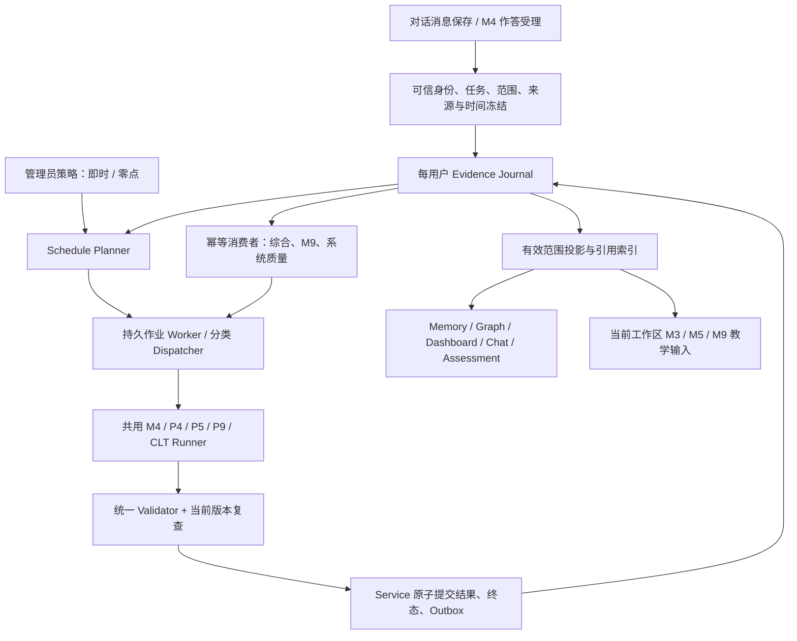

# plan.md 实现审计与评价模式更新方案

> 审核日期：2026-09-14；源码基线：`12f3594`（审核开始时工作树干净）。
>
> 本次交付仅为审核文档。没有修复业务代码、修改配置、迁移真实数据、提交或推送代码。以下“修复”“新增”均为后续实施方案，不能视为已完成。
>
> 审核依据：根目录 `plan.md`，`AGENTS.md`，`docs/DESIGN.md`，G0–G7 关卡记录，当前前后端源码及测试。检查重点为学生表现 → 受理 → 模型评价 → 校验 → 概念状态 → 综合 → 教学消费 → 用户页面的完整链路。

## 1. 审核结论

**项目不符合 `plan.md` 的全部完成条件，当前应认定为“部分实现，不能通过版本验收”。** 已建立统一评价协议、journal、M4 受理入口和可视化组件，但存在执行入口未接通、运行时异常、工作区边界失守、失效传播不完整和页面请求错误。现有测试通过不能支持“所有功能完成、没有缺陷或链路问题”的结论。

对本次明确要求逐项回答：

| 要求 | 当前结论 | 关键依据 |
|---|---|---|
| 单次单轮对话结束后自动评价、更新 | **未闭环** | turn hook 只登记来源和 queued 作业；生产路径没有调用 `run_dialogue_job` 的 worker |
| 完成习题后立即评价、更新 | **部分实现** | 三类提交入口进入统一 M4，但同步等待模型；故障、积压、重试及下游消费不可靠 |
| 管理员选择即时／每日零点评价，默认即时 | **未实现** | 只有环境变量 `LEARNER_EVALUATION_MODE=active/off`；无上述策略 API、管理面板、日批次与补跑机制 |
| 面向用户的评价可视化完成 | **不通过** | Memory 的 `limit=200` 与 API 最大 100 冲突，浏览器稳定复现 422；概念证据时间线键不匹配；状态更新与深链缺失 |
| 每个用户、每个概念的掌握情况得到维护 | **部分实现但不可靠** | 用户 journal 与完整 ConceptRef 已存在；来源准入、范围复查、依赖撤销、后台执行和消费者仍有缺口 |
| 知识图谱展示同一概念的个人评价 | **部分实现但不满足隔离合同** | 已有类别、线型、图标和抽屉；overlay 使用裸 concept_id，范围未强制求交，同 ID 跨教材可错配 |

这里的“掌握情况”继续遵守原计划：保存有条件、可追溯的语义判断，使用 `not_observed / emerging / supported_in_scope / fragile / conflicting`；它们不是从低到高的等级，**不新增百分比掌握率或全用户能力总分**。

## 2. 本次实际验证及其边界

测试在仓库外的受版本控制文件副本中执行，未复制真实 `.env` 或未跟踪的用户数据；额外复现使用 `StorageSandboxTestCase` 和合成文本。没有用真实用户作答作测试材料，没有运行付费模型评测。

| 检查 | 本次结果 | 能证明什么 |
|---|---|---|
| 评价、作答、生命周期、图谱投影等 16 个聚焦模块 | **148 项通过，16.136 秒** | 现有聚焦断言通过 |
| `python -m unittest discover -s tests` | **1,698 项通过，6 项跳过，125.385 秒** | 当前 keyless 回归没有失败；不等于计划要求的端到端覆盖完整 |
| `pnpm exec tsc --noEmit` | 通过 | TypeScript 静态类型通过 |
| `pnpm exec eslint src/` | 通过 | 当前 ESLint 规则通过；不覆盖 Python 未定义变量和业务行为 |
| `next build --webpack` | 通过 | 生产前端可以构建 |
| `scripts/check_repository_invariants.py` | 8 项通过 | 受控数据白名单、指定旧文件／标识退役及单 worker 部署约束通过 |
| 隔离浏览器检查 `/memory` | 明／暗 × 360／768／1440px，**六种组合均出现 concepts 请求 422** | 学习档案真实请求合同错误；外壳可显示但数据失败被表现为普通无证据空态 |
| 浏览器基本布局 | 上述六种组合未检测到页面横向溢出 | 仅是该页基础布局结果，不能据此通过全站视觉、键盘、焦点验收 |
| 专门的合成数据复现 | 见下表，多项现有测试漏测的问题确认 | 直接确认对应运行时行为 |
| 全套原有 Playwright E2E | 本次未重跑 | 已检查源码，未发现覆盖本版评价链路的三个专项 E2E 文件 |
| 真实 provider 全链路、教育质量 gold set | 本次未运行 | 不作真实模型质量／教学效果验收结论 |

浏览器使用隔离 backend、生产构建的 frontend 和合成账号；浏览器 API 请求转发到隔离 backend，未访问线上服务。启动时跳过维护型 lifespan，此项用于确认读取 API 与页面的交互，不作为 worker 启动验证。

可复现的关键观测如下。直接服务测试与 HTTP／浏览器验证分别标明，避免把测试辅助调用误报为真实用户全流程通过。

| 复现方式 | 输入／操作 | 实际结果 |
|---|---|---|
| HTTP + 浏览器 | 工作区概念列表 `limit=200` | 422；页面其他 Promise 成功结果也未进入档案 state |
| API handler + 沙箱 | 已有一条 `c1` 观察，按完整 concept key 查时间线 | 全部时间线 total=1，概念筛选 total=0 |
| API handler + 沙箱 | 对有效解释提交复核 | `ModuleNotFoundError: No module named 'app.api.v1.llm'`；复核请求已经落盘 |
| evaluator + fake runner | 复核结论 invalidate | `TypeError: invalidate_interpretation() got an unexpected keyword argument 'extra_ops'` |
| evaluator + fake runner | 复核结论 revise | 返回 succeeded，但当前解释 ID 无对应已存解释，job 仍 running，active review 仍存在 |
| lifecycle + 投影 | 归档已产生 supported 判断的会话来源 | 来源 archived，概念仍 `supported_in_scope / ready` |
| DELETE handler + journal 重读 | 删除已有判断的单条证据 | 来源消失，**原始引文仍在 journal，概念仍 supported** |
| 投影 + 沙箱 | 至少一份错误作答进入错题投影 | `NameError: name 'sid' is not defined` |
| scheduler + 沙箱 | 连续五次可重试失败、允许立即重试 | 已存 attempt_count 均为 1，始终 retry_wait |
| validator | 引文 ref 为不存在的 `invented_reference`，文本坐标正确 | issues 为空 |
| validator | 支持性主张没有 evidence；模型自填 retention 的 `server_facts.interval_hours=48` | issues 为空 |
| scope 选择函数 | 当前 allowed_concepts 为空，题目带旧 ConceptRef | 仍选入一个题目概念 |
| 判分函数 | 重复 criterion、未知 criterion；审核 rejected 的 MC；空白 MC | 分别可得到 correct、correct、wrong |
| submissions handler + fake runner | 本人题目 + 不存在／非本人 workspace_id | 仍受理，调用模型一次，返回 evaluation ready；不是 404 |
| commit service + 沙箱 | 已保存 source revision=2，提交 revision=1 的旧快照 | 旧解释仍发布，解释 revision=1 |
| 实际 after-turn hook | 已保存合成学生消息 | 来源 1、job queued、runner 调用 0 |
| M4 + fake runner | 模型返回 first_error 和 task_feedback | 两字段均未进入已提交 TaskResult |

复现脚本和浏览器截图仅在本次临时审核环境产生；本文记录合成输入、结果和定位，不向仓库加入临时账号、凭证或运行数据。

## 3. plan.md 完成度对照

不按“目标文件已经存在”计为完成，按可达调用链和验收合同判断。

| 原计划章节／交付 | 已存在的基础 | 审核状态及主要缺口 |
|---|---|---|
| §2–§4：唯一评价域、协议、两类来源 | 严格 Pydantic 模型、ConceptRef、SourceReceipt、TaskResult | 部分；校验仍可放过空证据／伪引用，消费者重新生成跨区水平 |
| §5：选卷、身份、revision | ScopeResolver、卷闭包、图谱语义指纹 | 部分；API／commit／图谱／消费者没有共同执行边界 |
| §6：journal、恢复、投递 | 原子追加、checksum、尾损坏处理、generation、job 操作 | 部分；worker、可靠消费、删除副本、重试预算未闭合 |
| §7 C0–C4：范围、教学、命题、作答 | P1/P2 已接出题，M4 统一提交 | 部分；C0 可绕过、C3 正式评价准入不严、C4 反馈字段丢失 |
| §7 C5：对话解释 | hook、登记、P4 函数 | 未闭环；无生产执行入口，前文／帮助／片段归属缺失 |
| §7 C6/C9：发布校验、复核 | validator、复核 DTO/API | 不通过；校验缺口、复核异常和替代解释悬空 |
| §7 C7：概念／对话／工作区综合 | P9 函数与入队 API | 未闭环；无调度调用、无正常终态提交，失效后不能恢复概念判断 |
| §7 C8：CLT 教学设计复盘 | P8 prompt、JobKind 和配置项 | 未接通；未发现实际 C8 调用与结果消费 |
| §8–§10：上下文、真实调用、预算 | runner 调用 complete，prompt 注册、基本解析／repair | 部分；缺预算裁剪协议、完整输入审计、累计预算、自动执行 |
| §11：API、CAT 身份 | question/revision/attempt、CAT 显式实例 | 部分；scope/probe/revision 参数未完全验证，响应生命周期不符合 202 模式 |
| §12：投影与递归失效 | 可从 journal 重放基础概念判断 | 不通过；archive/dispute/delete/scope 与投影脱节 |
| §13：M1–M10 与记忆 | 多个旧算法／字段已删除 | 部分；M3 未注入上下文，M5/M9 跨区读，outbox 无消费者入口 |
| §14：可视化与用户闭环 | 共用组件、图谱类别、Memory/Dashboard 区域 | 不通过；422、证据筛选、刷新、链接及键盘可达性缺口 |
| §15／§19：旧体系退役 | 指定旧文件和标识扫描通过 | 部分；改名后的支持占比 → 五级水平仍存在，不能只依赖标识扫描 |
| §16：迁移 | CLI、受控 demo journal、历史关卡记录 | 部分；本轮未重跑真实迁移，backfill 受理和执行资格有缺口 |
| §17–§18：工程／教学验收 | 现有回归与构建通过 | 不通过；上述反例、专项 E2E、真实 provider 与人工 gold set 尚未满足 |
| §20–§22：最终签收 | G0–G7 文档 | 不能签收；关卡记录中的完成声明与源码事实有冲突 |

## 4. 详细问题、影响和修复方案

优先级：P0 为阻断评价核心正确性、作用域隔离或主入口可用性的问题；P1 为必须在本次计划验收前补齐的链路／可靠性问题；P2 为体验与可维护性收口。优先级不表示低级别可以永久省略。

### R01 · P0：评价作业只有登记，没有后台执行闭环

- **定位**：`backend/app/agents/chat_agent.py:861` 的 `_after_turn_dialogue_receipt`；`evaluation/dialogue.py:145` 的 `after_turn_hook`；`evaluation/evaluator.py:23/233`；`core/learner_runtime.py:74`；`main.py::_lifespan`。本节 `evaluation/` 简写均指 `backend/app/agents/student_model/evaluation/`。
- **事实**：after-turn 只落 source/job。`run_dialogue_job` 和 `run_synthesis_job` 没有生产调用者。`JobScheduler` 的注释称 worker 在 runtime 启动，但 runtime/main 未启动该循环。retry/backfill/synthesis API 也只入队。main 的常驻清理循环是回收站清理，不是评价 worker。
- **影响**：只聊天的用户无法自动形成学习评价；综合和手动重试可长期 pending；服务重启不能主动续跑已受理评价。`/ready` 未反映这些缺失。
- **修复**：新增明确的 worker dispatcher，接入 lifespan，按 JobKind 路由来源解释、复核、综合、backfill、CLT；启动恢复 queued/retry_wait/过期 lease，工作完成后推进 outbox；有未完成任务时无需浏览器访问即可运行。shutdown 停止认领、处理在途租约并关闭共享 LLM 客户端。readiness 报告 worker/存储状态。
- **验收**：真实 `run_turn` 完成后不调用测试辅助 drain、不再发任何 HTTP 请求，仍自动产生 P4 调用、journal 结果与概念投影；重启恢复也成立。

### R02 · P0：习题受理同步依赖请求，且队列错误地混用执行器

- **定位**：`api/v1/assessment.py:117/597`，`api/v1/quiz.py:136`，`agents/assessment/manager.py:313`。
- **事实**：生产路由全部 `run_inline=True`，返回前等待模型；inline 循环最多认领六个 job，却不检查 JobKind，一律传给 `run_assessment_job`。dialogue 无 TaskSnapshot，assessment pack 会访问空 task；review/synthesis 也不应被交给此执行器。部分 pack 构造在异常处理块之外。
- **影响**：长提交、断连或积压导致作业悬挂；修复旧积压的循环可能反而认领并损坏其他类型作业。超过六项积压时本次作业仍可能留队。
- **修复**：正式提交只完成本地可靠受理和可确定 MC 判分，返回 202；用 R01 worker 统一执行，禁止 HTTP 请求排空其他 job。测试 inline 辅助仅能调用与指定 job 类型相符的 dispatcher。重复提交返回同 attempt 的当前统一 DTO。
- **验收**：同时排 dialogue/review/assessment/synthesis、制造超过六项积压并关闭浏览器，所有类型各归正确执行器，已受理任务最终完成且来源不重复。

### R03 · P1：对话来源、帮助条件和漏评恢复未落实

- **定位**：`evaluation/dialogue.py:28–79, 89–173`，`evaluator.py:49/112`，`context.py::assemble_dialogue_pack`；`chat_agent.py::_after_turn_dialogue_receipt`。
- **事实**：`_MIN_CHARS=2` 排除有可能有意义的单字／单数字答案；候选仅按当前消息包含完整概念名匹配，别名函数恒空，未取上一追问和当前教学目标。来源帮助列表恒空；P4 调用没有传 session_context。`prior_assessment_owned_spans` 无调用，assessment 用 reply_message_ref，而去重读 message_ref。hook 只处理最后一条且异常被吞；注释中的 `evaluation_receipt_pending`／reconcile 不存在。observed_at 取 hook 执行时间，未冻结接收时间和绑定 epoch。
- **影响**：回答“因为两端相同”“3”“是”等可能漏评；已示范的表现可能被当作独立作答；混合消息双计或漏计；保存成功、受理失败的消息以后不补；跨零点或移动工作区时归属错误。
- **修复**：消息首次保存时持久化稳定 ID、真实 observed_at、source revision、workspace binding epoch 和受理待办；按消息回补。记录答前提问、帮助、揭晓及任务引用，构建有边界的前文；只排除明确无关内容。当前教学概念、合法任务和检索节点提供候选；零候选保留可见原因。实现 span 级唯一属主及混合片段拆分。
- **验收**：简短数字／反例、上一追问无概念名、看过示范、题卡答案加独立解释、hook 写失败、消息跨零点及会话移动均有回归。

### R04 · P0：图谱范围和节点身份没有贯穿完整概念键

- **定位**：`api/v1/knowledge.py:26–48, 69–186, 205`；`agents/knowledge/manager.py:124–139`。
- **事实**：overlay 按 `concept_id` 做字典键；合并图谱也按裸 node.id 去重，内容则可被后读图谱覆写。带 workspace 的 graph 路由没有把结构强制限制在选卷 scope，显式请求未选教材也没有 scope 404；scope 解析异常变成空 overlay。详情只按裸 ID／名称匹配。完整 `graph_view_key` 未实现。
- **影响**：同名或同 ID 的两本教材可发生结构／内容／评价错配；用户在工作区视图看到范围外内容，却无法区分“未观察”与“不属于本学习区”。
- **修复**：结构身份固定 `(owner,textbook_id,node_id)` 并同步重编码边；评价身份使用含 revision 的 concept key，再加 trusted user/workspace。带 workspace 的 graph/详情必须复用 ScopeResolver、求交、严格 404；浏览模式明确无个人 overlay。chapter/section 仅显示覆盖计数。
- **验收**：两用户、两工作区、两教材同 node.id；只选上册却请求下册；不存在／外国 workspace；图谱与详情 judgment_id 完全一致。

### R05 · P0：提交归属可绕过，commit 未复查当前状态

- **定位**：`api/v1/assessment.py:60–117`；`agents/assessment/manager.py:224–312, 479–590`；`evaluation/context.py:32–54`；`evaluation/service.py:155–177`。
- **事实**：submissions 接受客户端 workspace_id；传 expected_scope_revision 时跳过 scope 解析；解析失败仍继续。assessment_id 没有在此入口验证题目属于该实例，reply_message_ref 被误当 session ID 读取。题目 concept_refs 直接进入 allowlist，未与当前 scope 求交。commit 的 scope/source 检查比较旧输入自身，不重新解析当前范围、source revision、source availability、workspace/账号存在性或当前 base judgment。执行器还在回包时重新取得 generation 作为期望值，丢失了调用前快照的防护意义。
- **影响**：来源可被受理到不存在／非本人工作区；旧题概念可越当前范围；旧 revision 模型回包可覆盖新解释；并发结果缺少真正的基线冲突保护。已复现 source=2 却发布 revision=1 的解释。
- **修复**：身份与 workspace/task/session/CAT 绑定在 service 入口统一从服务端事实解析；请求字段只能做期望断言。模型前、commit 短事务内各校验一次，compare-and-swap 使用冻结的 generation、scope revision、source revision、base judgment IDs。每 user/workspace 用 asyncio 锁串行；不能只靠 journal 文件锁。
- **验收**：外区／假区 404 且零模型调用；在途改 source、撤选教材、删工作区／账号、双标签页、两个不同 source 更新同概念均有故障注入；旧回包不能发布。

### R06 · P0：复核入口和全部结案语义有实质缺陷

- **定位**：`api/v1/learner_evaluation.py:323–367`；`evaluation/evaluator.py:140–226`；`evaluation/store.py:218–251`。
- **已复现**：POST review 导入不存在的 `.llm`；invalidate 传入不支持的 `extra_ops`；revise 只生成替代解释 ID，没有物化／保存替代解释、判断和任务改分；job 保持 running。
- **其他源码事实**：review 创建未检查 interpretation_id 属于该 source 的有效解释；重复判断只看 active 映射；结案不清除该映射。runner 查同 source 的第一条 review，而不是本 job 绑定的 review。复核结果未走统一引用／lease／generation 校验。insufficient_evidence 也统一标 resolved，决定内容没有完整查询投影。
- **影响**：用户不能完成纠错；请求报错但后台已登记，重试被当重复；可以形成悬空解释、永久“复核中”或展示旧判断。
- **修复**：复核受理为 source/review/job 同一事务，后台按 review_id 执行。uphold 恢复合法引用；revise 经 validator 后原子提交 replacement interpretation + TaskResult + judgments + 决定 + job 终态；invalidate 原子撤销并触发递归失效；insufficient 保持待确定。清除 active 索引、保留决定历史、允许新的合法异议。
- **验收**：四种决定、无效解释 ID、两次连续复核、HTTP 重试、进程重启和复核期间删除均经真实 API 完整测试。

### R07 · P0：删除／归档未清理真实依赖和原文副本

- **定位**：`api/v1/learner_evaluation.py::delete_evidence`；`evaluation/lifecycle.py:86–158`；`core/trash.py:375–432`；`evaluation/store.py::rewrite`。
- **事实**：单证据 DELETE 仅过滤 source_registered 所在事务，保留 result_committed 中原文引文和 ConceptJudgment；If-Match 未使用。删除会话的过滤也未覆盖所有来源修订、解释、复核／综合副本。归档函数仅改 availability，投影继续显示旧判断；真实 trash 接入导入新函数却调用已经不存在的 `mark_session_source_deleted/active` 等名字，并吞异常。保留 assessment 的路径未完整移除会话定位。工作区 scope 变化回调没有生产调用者。
- **影响**：用户执行“物理删除”后数据仍留存，且依赖它的能力结论仍有效；回收站和恢复后的评价不一致。
- **修复**：以来源／依赖索引做 operation 级重写和必要脱敏，不能只删整行 source 注册事务；先取消／失效，再物理清除所有相关引用副本、修订及缓存。保留独立答卷时明确 detach 会话定位；提供实际生效的“同时清除相关学习证据”选项。归档、恢复、删除、选卷和教材重建的真实路由均接 lifecycle。
- **验收**：先产生含引文的解释、复核、综合、历史修订及缓存，再经真实删除／回收站 API 操作；扫描剩余文件不得有被删原文，当前投影及下一轮 prompt 不得继续引用；同事务其他无关来源不得误删。

### R08 · P0：依赖失效不递归，概念重综合不能恢复状态

- **定位**：`evaluation/lifecycle.py:15–83`；`service.py::materialize_judgment/commit_result`；`projections.py:74/121/175`；`evaluator.py:233–326`。
- **事实**：依赖主要来自模型显式 dependencies，没有自动并入实际输入的历史结论、retained claims 及对应来源；没有持久保存 local observation ID 到稳定 ID 的完整映射。失效仅找直接相关的当前 judgment；review／archive 未暂停主张；synthesis 不因撤销或 scope revision 失效。P9 直接读至多 64 条 claims、较早遍历的 24 项观察，未完整过滤当前 scope／争议／归档；concept_key 参数没有用于观察筛选。提交只写 ScopeSynthesis，不完成 job，也不重建被撤销的 ConceptJudgment。
- **影响**：旧误判污染后续结论却不被撤销；图谱可能继续显示非法旧判断，或退成“没学过”后永不恢复；综合包含已删除／范围外内容。
- **修复**：建立 source → observation/interpretation → claim/judgment → synthesis → prompt-ref 的可重建反向依赖；依赖取实际 pack 输入与模型显式引用的并集。递归失效只撤解释，不删后续真实表现。争议时 `reconciling/state=null`。概念重综合必须能提交新的当前 ConceptJudgment；session/workspace 综合另存范围与水位，引用失效即隐藏正文。
- **验收**：A 判断被 B 保留、B 进入 C 综合，撤销 A 后 B/C 均失效；保留原观察可重综合恢复；缓存删除重放结果一致，GET 不调用模型。

### R09 · P0：学习档案主入口稳定触发 422

- **定位**：`frontend/src/app/(workspace)/memory/page.tsx:330–352`；`frontend/src/lib/api-modules.ts:160–170`；`api/v1/learner_evaluation.py::workspace_concepts` 的 `limit le=100`。
- **事实／复现**：Memory 固定请求 `limit:200`；API 允许最大 100。四个请求包在同一个 Promise.all，任一失败使 summary、evidence、sessions、concepts 都不被写入 state；有工作区时错误又主要被显示成普通空态。六种浏览器组合均复现。
- **修复**：保持统一分页上限，概念页用共享 Pager 和服务端筛选，不通过拉全量代替分页；不同区域的加载状态独立呈现。失败必须显示可重试错误，不能伪装“尚无证据”。工作区列表、对话、时间线也不能只截取固定前 N 条。
- **验收**：已产生真实合成判断的账号打开 Memory 能看到摘要、证据和概念；超过 100 概念可翻页；一个子请求失败不抹掉其他成功区域。

### R10 · P1：概念证据寻址错误，证据计数和时间口径错误

- **定位**：`api/v1/learner_evaluation.py::evidence_timeline`；`evaluation/projections.py:106–119`；`service.py::materialize_judgment`。
- **事实**：时间线 concept_refs 直接取原始模型的 `c1/c2`，前端却用 `ConceptRef.key` 查询；稳定键过滤返回空。ClaimView 中 obs ID 缺少完备的持久映射，难以从每条依据跳回真实 source。`evidence_count=len(judgment.claims)`，`last_observed_at=judgment.created_at`。
- **影响**：有结论却看不到依据；一条答案的多主张被算成多条独立证据；旧作答今日重评被显示为今日表现。
- **修复**：提交时持久化 short ref／local ID 到真实 ConceptRef、source/span/observation/claim 的映射；API 只使用稳定公开键。证据数量按有效 source identity 去重，来源时间取 observed_at，模型完成时间单列 evaluated_at。
- **验收**：一来源多主张／多概念、两教材同 ID、补评历史答案和复核均能精确定位引文，独立观察数不虚增。

### R11 · P1：运行状态与页面刷新只是外形存在

- **定位**：`evaluation/projections.py::concept_views/workspace_summary`；`api/v1/learner_evaluation.py::workspace_detail/job_events`；`frontend/src/components/learning-evaluation/`；`frontend/src/lib/api-modules.ts::getEvalJob/retryEvalJob`。
- **事实**：concept_views 和 workspace_summary 基本固定 ready，缺 judgment 就 not_observed；pending 计数按没有解释统计，不能区分 failed/cancelled/unassigned。job SSE 仅发送当前状态并立即 end，Last-Event-ID 无实际续传。前端 job 读取／重试函数未用于统一订阅；清 cache 的状态仓没有实际承载这些直接请求。删除／复核之后父列表和已展开概念可能仍保留旧 state；聊天没有自然对话新评价入口。
- **修复**：统一 evaluation-status reducer，区分长期评价状态、job 状态、TaskResult 状态、scope/source availability；实现经过身份认证的事件／轮询和终态幂等更新。维护真实查询缓存及 owner/workspace/revision key，收到结果后刷新 Memory、Graph、Dashboard、题卡和受影响消费者。错误／取消／停用显示原因及合法操作。
- **验收**：pending→ready、retry_wait→failed、复核 reconciling、source_deleted、off、切账号／切区慢响应和刷新恢复都有 UI 断言；不能每次手动重进页面才看见结果。

### R12 · P1：下一验证和跨页面链接丢失归属

- **定位**：Memory `startProbe`（约 380 行）；`ConceptDrawer.tsx:297–310`；`dashboard/AttentionCard.tsx`；`api/v1/assessment.py::start_cat/_generate_cat_question`。
- **事实**：开始验证仅跳 `/chat?q=...&send=1`，没有 trusted probe_ref/workspace/scope；概念抽屉没有接 onStartProbe。Dashboard 跳 `/memory` 不携带该行工作区；Memory 没有解析对应深链。CAT 收取 probe_ref 和 expected_scope_revision，但未完成对当前 judgment/probe 的权威读取和期望版本验证；部分逻辑将 probe_id 当普通目标文本。
- **影响**：下一题可能落到未绑定或不同工作区，无法验证原疑问；用户从概念进入档案后找不到原记录。
- **修复**：服务端提供有归属的启动动作，验证 judgment_id + probe_id + scope_revision，创建绑定工作区的会话／测评；正文不是已审核 probe 的替代品。统一 Memory/workspace/concept/source/session 深链及恢复入口。
- **验收**：A 区概念“开始验证”后产生的新 source 必须归 A；失效 probe 返回 409；用户能从 Dashboard → 对话 → 概念 → 原文 → 图谱返回同一判断。

### R13 · P1：有错题时投影触发未定义变量

- **定位**：`evaluation/projections.py:144–172` 的 `wrong_answer_items`。
- **事实／复现**：循环是 `for src in state.sources.values()`，返回对象却使用未定义的 `sid` 作为 source_id；无错题时不进入该分支，因而普通空数据测试通过。
- **影响**：错题本或使用错题素材的笔记链路在最需要时失败；上游若吞异常则错误显示无错题。
- **修复**：从 source receipt 获取稳定 source_id；统一使用当前、有效、未争议的 TaskResult，消除空字符串解释槽及随机 ID 字典顺序带来的结果选择歧义。
- **验收**：真实提交一题 wrong/partial 后调用错题 API、打开原题依据、生成笔记素材，复核改分后同步退出／保留正确条目。

### R14 · P1：题目审核、量规和作答反馈未完整贯通

- **定位**：`agents/assessment/manager.py::task_snapshot_from_legacy/task_snapshot_from_quiz_dict/run_assessment_job`；`evaluation/context.py::assemble_assessment_pack`；`evaluation/grading.py`。
- **事实**：P3 pack 未提供权威 task.answer/explanation，textbook_reference 也为空；快照转换丢失部分机会／审核细节，无量规时补“最终答案正确”。正式评价未把 verified 状态作为硬准入门。判分把 criteria 转 dict，重复条目最后一个覆盖，未知 criterion 未拒绝；空白 MC 可记 wrong。P3 输出的 first_error/hypotheses/task_feedback 未传入 compute_task_result 和最终 TaskResult。
- **影响**：开放题阅卷缺参考依据；未审核题仍产生正式判定／概念更新；详细反馈页面有字段却没有数据。已复现重复／未知 criterion 得 correct，以及模型返回的首错、反馈丢失。
- **修复**：冻结并完整携带任务、量规、审核、真实机会、答案和相关教材定位；正式 assessment 准入检查通过后才允许概念评价。criterion ID 必须恰好覆盖，重复／未知拒绝或明确 indeterminate；空白不作为错误观察。将经过校验的首错、假设、反馈原子保存到 TaskResult，所有入口读取同一份结果。
- **验收**：错误题、漏审题、缺量规、重复 criterion、未知 ID、合法等价解、空白、首次错误步骤和反馈持久化均覆盖；重连不重新阅卷。

### R15 · P0：证据 validator 的关键信任边界未生效

- **定位**：`evaluation/schema.py::ObservationClaim/EvidenceCondition`；`validator.py:47–76, 192–238, 313–346`；`llm.py::_repair_diff_violation`。
- **事实／复现**：只校验引文字面和坐标，不验证 span.ref 属于本 pack 的当前学生证据；current_evidence 可以为空；模型可自行输出 server_facts，retention 门直接相信该时间。帮助强度没有完整的服务端下限校验；同 span 被不同合法主张引用反而一律判 hard duplicate，违背“一来源可支持多概念”。机会缺失时仅丢 concept patch，违规 observation／feedback 仍可能被作为当前解释公开。格式修复差异检查函数恒返回空字符串。
- **影响**：无证据主张、伪造来源／间隔或增强式 repair 可通过；合法多主张又被误拒。不能以 schema 有字段代表边界有效。
- **修复**：模型输出与服务端补充事实采用不同 DTO；ref 必须映射到同 owner/workspace/revision/role 的确切 source span；支持性观察必须有有效证据。帮助／间隔／任务族从服务端推导。按 source 去重观察数而非禁止复用引文。机会违规要阻断其 observation、statement、feedback 及依赖结论，必要时 C9。repair 保守比较原始可恢复语义，无法证明不增强则失败。
- **验收**：空证据、假 ref、assistant 引文、伪 interval、已揭晓却称独立、修复加强结论以及同证据支持多个窄主张均有正反例。

### R16 · P1：ContextPack 预算、历史时间和输入审计不完整

- **定位**：`evaluation/context.py:78–135, 137–278`；`service.py::record_job_input`；`llm.py::run_structured`；`schema.py::PackManifest/EvaluationJob`。
- **事实**：历史函数没有当前 source 的 observed_at 上界参数；无法落实“只用发生前的历史解释变化”。历史按 400 字、P10 的 same_context 按 12,000 字直接裁剪；没有实际 tokenizer 预算、保护块、可靠分片及父子聚合，child staged 操作重放为 pass。input_hash 主要包含来源、概念键和 prior.keys，不包含完整历史内容／判断版本、系统合同／材料版本；record_job_input 没有保存可复现的输入清单。运行结果的 provider/model、usage、finish_reason、repair 和验证报告没有完整落账。
- **影响**：长答案／多概念可能被错误上下文解释；历史变化比较受未来表现污染；无法复盘“当时模型到底读了哪些依据”。
- **修复**：注入只读 context reader，按观察时间选择历史；保留活跃主张全量、最近反证与答前帮助，使用实际预算。超过预算分片必须保留完整任务／消息边界，父 job 合并后一份解释才发布。input_hash 覆盖规范化 pack 与版本；journal 保存受保护的最小可复现输入／引用清单，敏感副本纳入删除协议；普通日志只记 ID 和统计。
- **验收**：32KiB 中文答案、大量活跃主张、关键反证在尾部、后到历史观察、输入相同／历史改变 hash、删除材料后的副本清理及跨重启审计。

### R17 · P1：重试次数和总调用预算不能兑现

- **定位**：`evaluation/jobs.py::claim_next/fail`；`store.py::_apply_op/_retry_not_before`；`llm.py::_one_call/run_structured`；`core/config.py:118–129`。
- **事实／复现**：claim_next 只递增返回 job 的副本，lease 操作不递增已存 attempt_count；fail 使用已存值，连续五次失败仍为 1。retry_not_before 在重放时根据当前时间重新计算。repair 又启动新的 transport 预算，整个 job 没有统一 wall-clock deadline；累计 transport/repair 等字段不完整持久化。120 秒 job budget、45 秒整次调用预算等配置未形成真正总约束。
- **影响**：重试可能无限延长／反复计费；重启改变应执行时间；超时任务只能等待租约过期，UI 长期 pending。
- **修复**：lease 事务原子递增计数，失败事务记录绝对 retry_not_before；claim/dispatch 共同检查 attempt/transport/deadline。一次预算对象覆盖初次、transport fallback 和 repair；远端调用不能承诺 exactly once，但本地发布必须幂等。手动 retry 有 parent、频率限制和当前版本校验。
- **验收**：连续失败最终终态、重启前后 not_before 不变、repair 不重置预算、429 Retry-After、过期 lease 和旧回包不能无限增长或发布。

### R18 · P0：教学消费者仍跨工作区读能力，M9 仍生成等级

- **定位**：`agents/supervisor.py:200–214`；`api/v1/student.py:30–50`；`agents/learning_orchestration/manager.py:1449–1478`；该目录 `schema.py:74–109`、`goal_analyzer.py:225–249`。
- **事实**：M5 教学指令和 M9 读取所有工作区 judgment，按裸 concept_id 合并；M9 声称“保留最不利”，实际上 supported 状态会阻止后续覆盖。无 workspace 的 learning-path 也读全用户能力。`supported_ratio` 仍映射 novice/beginner/intermediate/advanced/proficient 五档 current_level，并参与策略推荐。不是只保留覆盖计数。
- **影响**：A 区表现影响 B 区教学计划；同概念不同条件被混合；旧数值能力体系换了字段名仍存在。
- **修复**：所有学习内容消费者显式要求 workspace 和 compatible concept key，经同一个有效投影 reader 读取；无区只给非个性化建议。按目标可观察行为与具体支持／待验证主张规划，删除支持占比到能力等级的映射，时间容量仍可用户级。
- **验收**：同用户两个区同节点结论相反，A 区计划和教学输入不能含 B 区结论；无区不继承能力；API/UI/prompt/存储无支持占比能力档位。

### R19 · P1：M9 outbox 无实际消费入口，任务／复习元数据也不足

- **定位**：`agents/learning_orchestration/manager.py:405–489`；`agents/assessment/manager.py:544–561`；`core/quiz_attempts.py`。
- **事实**：生产源码没有调用 `consume_evaluation_outbox` 的位置。M4 outbox 只带 source/question/concept badge/verdict/time，未带消费者需要的 attempt_id、session_id、可信 task_binding、workspace 或帮助／审核条件。消费者缺概念时退回 question_id；复核所谓“重放”是用当前时间新建卡，且查找键与带 workspace 的复习卡键不一致。未知事件直接 ack，异常常被吞。
- **影响**：做题不会可靠完成绑定任务或更新复习；即使接通现有消费者也可能跨区建卡、把揭晓后答对当独立召回、丢失撤销后的正确日程。
- **修复**：R01 worker 消费完整、版本化 outbox；从 source/task/launch 事实解析稳定归属。做题行为完成与学习达成分开；indeterminate 也可完成“已尝试”行为，但不能当成功召回。只有已审核、符合独立召回条件的结果更新间隔。M9 处理标记与卡片／任务同次原子写；复核按剩余合法历史重放卡片，保留用户日程调整；未知版本进入可观察错误队列。
- **验收**：不打开 M9 页面也能自动更新；重复投递无二次增长；同概念多任务只完成绑定项；已揭晓正确、未判定、复核撤销及断电重投均正确。

### R20 · P1：P6/P7/P8 注册不等于教学闭环接通

- **定位**：`agents/supervisor.py::_adapt_via_engine`（约 556 行）；`agents/task_understanding.py`／`agents/state.py`；`prompts/learner_evaluation.py:149–171`。
- **事实**：M3 从 `understanding.evaluation_context` 读取评价，但生产源码没有给 understanding 注入该字段的路径，常态为空。P7 `teaching_evidence_directive`、P8 `teaching_clt_review` 有注册，未发现实际使用入口；CLT 的 job kind／抽样参数无执行链。部分 curriculum 候选被清空，不能算完整的 scoped next action。
- **影响**：学生概念判断即使形成，也未实际指导本轮教学；CLT→下一行动→后续表现验证缺失。
- **修复**：composition root 注入 scoped EvaluationReader；明确构建 M3 TeachingContext，包括当前主张、前置、帮助、近期 TaskResult 与偏好。把 P6/P7 接入对应动作／讲解位置；C8 在讲解完成后按稳定 turn ID 抽样／显式触发，结果只作为下轮教学建议，长期指导继续既有人审约束，不能写学生状态。
- **验收**：三条“表现→评价→教学动作→新表现”的真实运行轨迹；C8 无足够输入能 abstain，不能用长度推算认知负荷。

### R21 · P1：停用降级和游客隔离不符合原计划

- **定位**：`api/v1/assessment.py::_require_enabled`；`api/v1/quiz.py::_submit`；`evaluation/dialogue.py::register_dialogue_source`；`agents/assessment/manager.py::evaluate_submission`。
- **事实**：off 时整个作答入口返回 503，MC 本地判分和原始作答受理也不可用；不是“暂停长期评价”。共享 `student_default` 没有明确禁止持久评价的 service 准入，游客可进入普通用户 journal 写路径。projection 也没有统一显示 disabled。
- **修复**：身份、当场任务反馈和持久学习档案分层；off 保留原作答和可确定 MC 结果，开放题未判定／按独立可用反馈能力处理，已有评价只读并标暂停。共享游客仅会话级当场反馈，不往共享长期 learner journal 写个人判断，登录后从新表现建立档案。
- **验收**：active/off、各智能层关闭、AUTH_MODE=0 的两个独立游客；不能出现游客共用个人学习结论或 off 激活旧算法。

### R22 · P1：backfill 与 revision 迁移资格不完整

- **定位**：`api/v1/learner_evaluation.py::backfill`；`evaluation/scope.py::_resolve_uncached`；`scripts/migrate_learning_evidence.py`；`docs/plan-gates/G6.md`。
- **事实**：backfill 不核对 source 当时 workspace 等资格，也未使用 expected_scope_revision；kind 只按 provenance 决定，非 migration 的 assessment 可被排成 dialogue_evaluation。无执行器和来源级幂等批次。scope revision 未纳入独立教材内容 revision；ConceptRef.file_ids 赋整组选中卷列表，不是各节点精确 provenance。needs_mapping 和绑定 epoch 缺少完整投影／操作链。
- **影响**：历史答卷可能走错误解释模式或被错误归区；教材正文改变而图谱未变时旧上下文仍被当兼容；无法准确显示历史归属和待映射。
- **修复**：历史回填保持原 source_kind 与 observed_at，逐条核验完整答案、历史量规／审核、范围、真实 provenance；缺失者只归档并给明确原因。回填申请有批次幂等与受控预算；只对选定合法来源执行。scope／concept/material 引用纳入内容与语义 revision；变化进入 needs_mapping，不按名称搬状态。
- **验收**：截断旧答案、demo_fixture、unassigned、迁移 assessment、跨区 source、相同 chunk_id 不同内容、教材重建和重复 backfill 都可解释且无自动全量付费重评。

### R23 · P1：验收文档与实际覆盖脱节

- **定位**：`docs/plan-gates/G3.md/G4.md/G5.md/G7.md`；`docs/DESIGN.md`；`frontend/e2e/`；`scripts/check_repository_invariants.py`。
- **事实**：G4 声称 outbox 已由判分路径触发、消费方全改读新评价，但调用者缺失且跨区读取仍在。G7 自己明确真实 provider 与 gold set NOT RUN；后续两次 live hotfix 不能替代完整发布证据。现有 E2E 未覆盖计划要求的评价隔离／生命周期／复核场景；若干 unittest 直接注入 journal 结果或测试函数，绕过实际调度、API 和 UI。指定旧词扫描通过也漏掉 supported_ratio → current_level。DESIGN 的 M9 段仍描述旧直接 quiz fan-out 等非当前实现。
- **修复**：把关卡状态改为与本报告一致的部分完成；建立“需求→生产调用点→端到端断言→证据”矩阵。对旧体系做语义及动态检查；不要以删文件、改名或组件截图替代闭环。修复后更新 DESIGN、README、使用文档、配置、部署与所有关卡记录。
- **验收**：本报告反例进入正式回归；所有目标有可追踪证据，未运行项明确留空；真实 provider 和人工教育审核完成前不签 G7。

### R24 · P2：可视化可达性与语义文案仍需收口

- **定位**：`KnowledgeGraphView.tsx` 的 SVG 节点／pointer handler；`SemanticEvaluationPanel.tsx`；`EvidenceTimeline.tsx`；Memory/Dashboard。
- **事实**：图谱已使用线型和图标，但节点没有相应 tabIndex、role 与键盘开启抽屉的路径。证据详情只显示原文／引文文字，缺稳定引用的定位高亮；复核历史统一显示“复核中”，未展示真实决定。空态把“完成一次讲解”写成会产生学习结论，与只有学生表现才能更新的原则不符。新复核表单仍使用 ad-hoc textarea，而不是共享 Input/Field。
- **修复**：补图谱键盘导航／Enter/Space、焦点返回、状态 aria-live；依据可跳定位并按 Unicode code point 正确高亮；真实显示复核决定和时间。采用共享表单／Pager，主界面用教材／概念名而非内部 ID，空态说明需要可观察学生表现。
- **验收**：全评价链 light/dark × 360/768/1440px，键盘／焦点／reduced-motion、多语、长主张及公式；本次 Memory 无溢出检查不能替代这些验收。

## 5. 新增需求：管理员可选评价方式

### 5.1 产品合同

新增“学习评价方式”管理面板，两个互斥选项，**默认方案 1**。这两个数字只表示调度方式，与概念状态类别无关。

| 值 | 管理员看到的名称 | 行为 |
|---|---|---|
| `immediate`（1，默认） | 每轮对话／每次练习后立即评价 | 一轮学生消息可靠保存并完成本轮处理后自动受理，习题提交可靠受理后立即进入评价队列；完成后更新概念、对话和工作区档案 |
| `daily_midnight`（2） | 每日零点评价当天活跃账号 | 全天可靠保存来源；在下一自然日零点，对上一日有学习活动的账号，处理该日全部符合资格的历史表现，随后更新概念与范围综合 |

**日期边界必须明确**：假设配置时区为 `Asia/Singapore`，2026-09-15 00:00 执行的是 2026-09-14 `[00:00, 24:00)` 的历史；不能在新一天零点查询新一天刚开始的“当日”而漏掉前一天。界面用“每天 00:00 汇总前一自然日”消除歧义。默认取明确的业务 IANA 时区（本审核环境为 Asia/Singapore，UTC+8）；不能依赖服务器进程碰巧处于 UTC 或前端浏览器时区。

“全部当日历史”表示**全部当日候选来源都有最终处置**，不是把所有用户、所有聊天正文一次塞进模型，也不是重复评价所有历史日期：

1. 活动账号以可信服务端事件／来源 observed_at 为准，不用仅有 last_login、页面浏览或 LLM 完成时间判断。
2. 纳入该日学生对话表现、聊天题卡、习题中心、CAT 的正式作答；语音以可见转写为来源。
3. 纯问候、系统消息、AI 讲解、阅读、笔记生成、勾选等无新学习表现的活动可有活动统计，但零能力更新；模糊教学表现交 LLM 判断 applicability。
4. 每个账号内部仍分 workspace、选卷、concept revision；禁止做全账号跨学科“总能力”。无区／无法绑定／共享游客给明确排除或当场反馈，不偷选工作区。
5. 已按同 source_revision/policy 完成的评价复用；复核不是新观察。旧日期显式 backfill 与每日增量分开，不因启用定时模式触发全量历史付费重评。

### 5.2 本题反馈与长期学习评价的关系

建议面板说明为“更新学习档案和知识图谱评价的时机”，保留学生做题时及时得到本题反馈。否则方案 2 会让开放题 CAT 一整天无法继续。

- **方案 1**：继续使用同一 M4 的一次联合 P3 调用，得到 TaskResult + LearnerInterpretation；MC 判定可在受理时先给出。
- **方案 2**：MC 本题判定即时确定；开放题即时调用同一 M4 的严格 task-only 模式，仅输出本题量规结果与反馈，不发布 learner claims/judgments。零点再从同一 source、冻结任务和已存 TaskResult 进行语义解释与当日综合。两者写同一 journal，不新增第三种学生观察来源或独立能力写入口。
- task-only 与 nightly learner job 使用不同明确的输出模型／用途标记，task-only 不能把偷偷生成的能力句当临时反馈公开；夜间解释不能暗改既有本题判分，发现题目或判读疑点走复核。
- CAT 的下一题控制仅消费本题确定结果或 continuation，不把 learner pending 当 wrong；独立长期概念判断待零点发布。
- 原计划“开放题通常一次模型调用”的默认仍适用于方案 1；方案 2 开放题可能增加一次语义调用，是本需求引起的明确架构／成本变化，必须在配置说明和审计中记录。

若产品最终选择“包括本题阅卷在内所有模型评价均等零点”，则需另行固定 deferred grading 和 CAT 暂停体验；不能一边延迟所有阅卷，一边承诺练习现场可连续自适应。本文采用上面的推荐合同作为实施基线。

### 5.3 策略配置和管理员界面

建议持久化模型（名称可适配仓库风格，语义必须一致）：

```json
{
  "schema_version": 1,
  "revision": 1,
  "evaluation_schedule": "immediate",
  "timezone": "Asia/Singapore",
  "daily_local_time": "00:00",
  "effective_at": "2026-09-14T00:00:00Z"
}
```

- 新增 `GET/PATCH /admin/learner-evaluation-policy`，严格管理员权限，字段白名单、时区验证、expected_revision／If-Match，冲突 409。后端枚举和前端选项统一；配置缺失默认 immediate。
- `daily_local_time` 本需求固定 00:00，不额外增加任意 cron 编辑器或第三种调度档位。保留 `LEARNER_EVALUATION_MODE=active/off` 作为运行停用控制，并在面板单独显示服务状态；它不是 1/2 选项的替代品。
- 配置建议位于既有 settings 根，例如 `chat_history/settings/learner_evaluation_policy.json`，经 `core/atomic.py` 写入；新增常量登记 StorageSandbox。它是全局策略而非用户私有存储，不应被账号清理误删，也不能进入普通用户数据扫描。
- 管理面板显示当前模式、业务时区、下一次执行时间、待评价来源数、最旧等待时间、上一批次状态、失败／排除原因计数；保存后读回确认。不在列表暴露用户原始作答或完整 prompt。
- UI 使用既有 Card、共享 Field/Input、Button、Modal 和中英文 strings。保存过程及冲突有明确反馈，未保存的选择不能改变运行策略。
- 普通用户通过专用只读状态 DTO 获取与自己相关的调度说明，不读取管理员配置文件；新事件/接口仍使用 apiFetch 和可信 resolve_student_id。

### 5.4 策略切换与例外

| 场景 | 确定行为 |
|---|---|
| 首次升级且配置不存在 | 采用方案 1；恢复此前已受理的合法未完成任务；不隐式重评所有旧历史 |
| 1 → 2 | 新来源按日批次安排；尚未开始的来源任务按切换事务归入相应日期；已运行的任务允许按其冻结策略完成，夜间幂等跳过 |
| 2 → 1 | 已受理未完成、尚符合当前授权的来源立即释放入队，按 user/workspace/observed_at 顺序处理；不丢当天上午的 backlog |
| 模型失败／限流 | 原文已保存；进入有上限 retry_wait/failed；恢复后补跑，UI 显示原因，不造默认概念结论 |
| 服务器零点停机 | 重启恢复漏执行日期，直到最后一个已关闭自然日；按日期和水位补齐，不只看“今天有没有跑” |
| 运行期间改时区 | 用版本化生效点与 UTC 时间窗防止重叠／缺口；在途批次保留原时区，来源 identity 去重 |
| 用户异议、撤销、删除 | 立即受理并立即隐藏非法依赖；不能为省调用等到零点才撤下错误陈述。复核可走独立高优先级管理作业 |
| 删除／撤选／账号失效 | 立即取消／标无效；batch 及在途结果 commit 再检查，禁止批处理复活已删数据 |
| 多用户、大批次 | 公平排队、限制单用户占用；当前练习反馈优先，夜间批次不占满聊天资源 |

以上规则通过持久化策略转换记录和幂等键实现，不能靠只修改环境变量或内存布尔值。

## 6. 所需架构调整

### 6.1 保留唯一事实源，补齐调度与读取边界

不建议为两个模式新建两套 evaluator，也不建议另设数据库／能力服务。继续使用单实例部署、每用户 journal 和可重建投影。



关键所有权：API 负责 HTTP DTO 和权限入口；service 负责领域受理／提交／生命周期；store 负责原子日志；worker 只调度；projection 只重放有效事实。M9/M7/UI 不直接写学生结论。

### 6.2 持久调度协议

在现有 typed operation union 内扩展必要操作，不以任意 dict op 绕过协议。建议至少明确以下事实：

| 对象／事实 | 必要字段／约束 |
|---|---|
| 来源受理 | stable source/message/attempt、observed_at、workspace binding epoch、revision、source_kind、帮助／span 所属、scope snapshot |
| 调度归属 | policy_revision、schedule_mode、eligible_after_utc、local_activity_date、timezone、batch_id；这些是服务端字段 |
| 日批次 | student_id + local_date + timezone/policy window、UTC 起止、来源截止水位、状态、完整候选清单或可重建游标、排除原因计数 |
| 模型作业 | kind、source revision、review/synthesis 目标、lease/token、绝对 deadline/not_before、累计尝试与费用相关计数 |
| 输入准备 | 不变的 scope/generation/base judgment IDs、完整输入 hash、来源／历史引用、prompt/schema/model/policy 版本、预算删减说明 |
| 结果提交 | TaskResult、解释、ID 映射、judgments 或 synthesis、job 终态、batch 进度和 outbox 同一事务 |
| 批次完成 | 全候选均有完成／明确排除／可见失败处置；不能以“队列暂时为空”标全成功；不新增学习观察 |

日批次建议仍记录在该用户 journal，另设可重建的活跃账号／待作业索引用于定位，不能把全体账号来源复制到第二个权威账本。服务启动重建待办索引，只有需要工作的用户才进入扫描队列。

来源级去重以 `(student, source_id, source_revision, interpretation purpose/policy)` 为基础；日批次和手动重试不得产生第二份独立学习观察。mode 切换后已接受的有效解释复用，确需新策略重解释时保留版本与替代关系。

### 6.3 即时和每日执行算法

**即时模式**：消息／作答原子落盘并建立 job → 唤醒 worker → 每 user/workspace 有序认领 → 冻结上下文 → 调用模型 → 校验当前状态 → 原子提交 → 发布状态事件 → 消费 outbox → 对话／工作区综合 debounce。

**每日模式**：

1. 收到来源时即记录日期／策略归属；不用到零点才从可压缩的 messages 数组猜历史。
2. 定时器按 IANA 业务时区计算下一自然日零点对应的 UTC instant。不能 `sleep(86400)` 后假定仍是本地零点。
3. 零点关闭上一日时间窗，以该窗活动索引枚举账号，创建幂等 daily batch；无候选也记录明确 no_observation，而不是编造综合。
4. 每账号按 workspace 与观察时间处理全部合法未完成来源；长历史分组，既保留上下文又不混淆消息／任务身份。一个来源多概念仍是一份观察。
5. 来源评估成功后更新相应概念；合并同批次对话／工作区 dirty 事件；综合只使用合法已接受观察，显示覆盖与截至水位。
6. 对仍失败的来源保留失败清单和 retry 状态；综合可带“截至当前，部分评价尚未完成”，不能当作整日已全覆盖。后续成功再增量更新。
7. 持久化该日期完成水位；重启按未关闭批次／未处理窗口补跑。账号下游失败不能阻塞其他账号；不重放已完成模型调用，除非崩溃发生在远端完成、本地尚未提交的不可避免窗口。

实现时间计算应注入 clock 供测试；业务时区不依赖机器 TZ。未来如果扩展个人时区，需额外定义日窗口迁移，本轮先采用管理员统一时区。

### 6.4 状态、刷新与可视化合同

建议统一 DTO：

```json
{
  "evaluation_status": "pending",
  "reason_code": "scheduled_daily",
  "schedule_mode": "daily_midnight",
  "scheduled_for": "2026-09-14T16:00:00Z",
  "timezone": "Asia/Singapore",
  "pending_source_count": 3,
  "evaluated_through": "gen_x:104",
  "scope_revision": "sr_x"
}
```

- 方案 1：“已受理，正在评价”；方案 2：“已保存，将于 9 月 15 日 00:00（业务时区）更新学习档案”。不能显示“尚无学习证据”掩盖排队。
- 概念自身尚未形成可靠绑定时，pending 显示在来源／工作区；不要给全部未测概念打 pending 标记。
- 复核／撤销影响当前判断时隐藏非法正文，显示 reconciling；可以保留合法历史活动，但不得让旧判断继续驱动教学。
- 图谱节点批量读同一 projection；显示类别、条件、最后表现、证据数、状态。章节／section 只显示 `有证据 x / 范围内概念 y`，不做平均能力颜色。
- 时间线与依据从 claim → observation → source 精确寻址，区分 observed_at/evaluated_at；对未分配／已删除／范围变动显示明确状态。
- 定义缓存失效事件及稳定 event ID/watermark；认证 SSE 或有退避轮询均可，但必须实测断线恢复、切账号 abort 和旧回包不覆盖当前 workspace。
- 无 workspace 的图谱仅浏览，Memory／Graph／题卡的深链携带 workspace 和稳定引用；不得随便落到第一个学习区。

### 6.5 性能与可观测性

沿用原计划的单写实例与 `concurrency=2` 基础限制；同 workspace 串行，跨用户公平。新增目标须与模型耗时区分：

- 本地来源受理和回执目标 p95 ≤2 秒（不含模型），空闲 worker 唤醒目标 ≤1 秒；具体值以隔离负载实测确认。
- 每日批次目标在本地零点后 60 秒内开始受理扫描；**不承诺全账号在零点瞬间完成模型评价**。显示排队和批次进度。
- 有新结果后活跃页面目标 3 秒内显示或开始刷新；后台用户下次打开可直接读取已提交投影。
- 沿用原计划 5,000 observations／10 workspaces／3,000 concepts 的 GET 性能验收；增加大日批次与白天新作答同时存在时的公平性测试。
- 监控 queued/running/retry_wait/failed/abstained、最老待办、批次滞后、漏受理补偿数、outbox 未 ack、validation 原因、provider 调用／token 使用。日志不记录原答案、秘密或推理正文。
- `ready` 应明确评价功能 degraded 的原因；GET health 不调用模型、不偷偷开启补评。

## 7. 文件级实施清单

下表是后续修改范围，**本轮没有实施**。

| 文件／区域 | 后续工作 |
|---|---|
| `backend/app/core/learner_runtime.py`、`main.py`、`core/bootstrap.py` | 组装 scope/context/readers、启动 worker/每日调度/outbox、恢复、健康检查、关闭客户端 |
| `agents/student_model/evaluation/schema.py` | 服务端事实与模型输出分离；批次／调度／输入审计／终态 operation；稳定 ID 映射 |
| 同目录 `jobs.py`、建议 `worker.py` | 按类型认领分派、绝对 retry/deadline、同区 asyncio 互斥、公平并发、恢复和累计预算 |
| 建议 `core/learner_evaluation_policy.py`／同目录 `schedule.py` | 策略持久化、时区日窗、切换和补跑、活动索引／批次 |
| 同目录 `dialogue.py`、`core/session.py`、`agents/chat_agent.py` | 消息 observed_at／binding epoch、待受理标记、回补、span 所属、答前帮助 |
| 同目录 `context.py`、`ports.py` | 完整任务依据、发生前历史、当前合法主张、教材 hash、token 预算与保护块 |
| 同目录 `validator.py`、`service.py` | 唯一准入、空证据／引用验证、帮助下限、提交 CAS、观察／判断／反馈完整提交 |
| 同目录 `evaluator.py`、`llm.py`、必要的 synthesis 模块 | 正确 P4/P5/P9/CLT 执行，复核结案、概念重综合、格式修复不增强、总预算和审计 |
| 同目录 `store.py`、`projections.py`、`lifecycle.py` | 递归依赖、状态 reducer、物理删除、按 source 去重、日期口径、错题投影 |
| `agents/assessment/manager.py`、`api/v1/assessment.py`、`quiz.py` | 202 受理、可信绑定、正式题目准入、TaskResult 字段、mode 2 task-only、CAT/probe 生命周期 |
| `api/v1/learner_evaluation.py` | 分页合同、稳定概念筛选、实际状态事件、复核／重试／backfill／删除版本检查 |
| `agents/knowledge/manager.py`、`scope_primitives.py`、`api/v1/knowledge.py` | graph_view_key、卷级求交、overlay join、详情一致性及内容 revision |
| `agents/supervisor.py`、`teaching_engine/`、`learning_orchestration/`、`api/v1/student.py` | 去跨区能力聚合和支持占比档位；接 scoped context、M9 outbox 与合法召回重放 |
| `core/trash.py`、`account_data.py`、`workspace.py`、教材生命周期 | 修正旧符号调用；接真实 archive/restore/delete/scope/rebuild 事件及在途防复活 |
| `api/v1/admin.py`、前端 admin/strings、新评价策略面板 | 管理员策略 API、1/2 选项默认 1、时区／生效／执行状态 |
| `frontend/src/lib/api-modules.ts`、`types-modules.ts`、`store.ts` | 统一公开 DTO、真实查询 key、订阅／退避、跨账号清理及版本检查 |
| Memory、Knowledge、Dashboard、Chat、Assessment、learning-evaluation 组件 | 分页修复、依据深链、结果刷新、真实状态／决定、下一验证、键盘／焦点和文案 |
| `tests/storage_sandbox.py`、`core/orphan_cleanup.py`、清理工具 | 新常量和缓存纳入沙箱；新 per-user 根若有必须同时登记扫描／账号清理；全局策略单独保留 |
| `backend/tests/`、`frontend/e2e/`、独立 live harness | 真实入口的回归和模式／跨日期／恢复／隔离／可视化验收 |
| `plan.md`、`docs/DESIGN.md`、README、使用／部署文档和关卡记录 | 同版统一最终合同，删除过时声明，记录新模式和真实验收证据 |

## 8. 实施顺序与验收门

### 阶段 A：先修正错误发布和数据边界

完成 R04–R08、R15、R18 的范围、准入、复核、删除和失效协议；R09/R13 的明确运行错误可同步修复。此时先用 fake runner 验证完整领域事务，**不能先开启大规模后台评价，把错误自动化放大**。

出口：外区零模型调用；无效引用／过期来源不发布；复核可结案；删除原文和派生副本无残留；Memory 能正确读取非空数据。

### 阶段 B：打通方案 1 的可靠即时闭环

完成 R01–R03、R10–R11、R14、R16–R17、R19–R21；M4 202、对话 hook 回补、worker、outbox、M3 消费和当前范围综合全部接通。

出口：一次对话／一次习题，离开页面后仍最终评价；重启不丢任务；模型失败不造能力，重试有上限；三个页面显示同一个 judgment_id。

### 阶段 C：新增管理策略和每日批次

实现 §5–§6 的两个模式、默认即时、时区日窗、策略转换、遗漏日期补跑、公平调度；补 task-only 模式并明确费用和 CAT 行为。

出口：下列全部日期／切换用例通过，不依赖人工打开管理页触发。

### 阶段 D：用户链路、旧体系退役和质量验收

完成 R12、R22–R24，收口所有剩余文档／UI／迁移及能力等级旁路；补真实 provider 冒烟和人工 gold set。所有新增判断能定位来源、帮助、限制和下一动作，才可以重新评估 G7。

## 9. 必须补充的回归矩阵

### 9.1 后端与故障恢复

| 场景 | 必须断言 |
|---|---|
| 单轮对话自动评价 | 从真实 run_turn 到 P4、commit、projection；不允许测试手动调用 evaluator 冒充自动 |
| 四个作答入口 | chat quiz／center／CAT／文本关联题目使用同任务身份、受理和结果 DTO |
| 保存后崩溃 | session 已落盘而 source 未受理，重启可按稳定 ID 回补且只一次 |
| 受理后断连 | 已返回或已提交受理事务后关页不取消 job；后续 GET 恢复原 attempt |
| 日边界 | D 23:59:59 与 D+1 00:00:00 分属正确日窗，D+1 零点评 D |
| 活动账号筛选 | 有候选 source 的账号必被覆盖；只有登录／AI 输出者不凭空生成能力 |
| 当日完整性 | 多会话、多 workspace、多题面、分页量级来源均被处理；不只取最后 N 条 |
| 零点宕机／跨多天恢复 | 每个漏日期可补，不重评已完成来源，失败日不被成功游标跳过 |
| 两模式切换／改时区 | backlog 不丢、在途不重复、UTC 窗口无遗漏，policy revision 可追溯 |
| 多用户及同区并发 | 全局限流不破坏公平；同区基线 CAS；不同区不互相串结果 |
| 复核四决定 | uphold/revise/invalidate/insufficient 均有终态或明确待定；替代解释无悬空 ID |
| 删除／归档／教材重建 | 真 API 驱动全部副本与依赖失效；旧回包不能复活；恢复语义明确 |
| 模型和格式故障 | 空答、截断、超时、限流、一次 repair、恶意增强、累计预算和重启均受约束 |
| 证据负例 | 空引文、假 ref、别用户／别区／assistant 内容、伪间隔、已揭晓伪独立全部拒绝 |
| 历史解释 | 后到旧观察不覆盖新判断，observed_at 不变；同来源多主张不增观察数 |
| M9 任务／复习 | 绑定任务只完成一次；无独立召回不延长间隔；撤销后按合法历史重放 |
| off／游客 | MC／当场反馈按合同降级；共享游客无长期个人评价，不能读写别人的覆盖层 |
| 迁移/backfill | 完整性、当时归属、题型、source_kind、版本和预算逐条核验 |

新增测试继承 StorageSandbox；异步 worker、policy、clock、runner、缓存和索引全部可注入／重置。不能以直接 journal.append 构造最终状态作为唯一集成测试。

### 9.2 前端与端到端

建议落实原计划三个专项文件，并新增策略调度专项；测试名可调整，行为不能省略：

- `learner-evaluation.spec.ts`：真实非空档案、对话／习题自动评价、状态恢复、依据定位、下一验证。
- `evaluation-isolation.spec.ts`：两个账号同公有教材、一个账号两个区、同 ID 两教材、慢请求切区和登出切换。
- `evaluation-lifecycle.spec.ts`：复核四决定、删除／回收站／恢复、重建图谱、正文失效和原文副本不可读取。
- `evaluation-policy.spec.ts`：普通用户无修改权，管理员默认方案 1、保存 2 后读回、计划执行时间、策略转换和日批次状态。
- 大于 100 个概念、大于一页的 source/session；失败与未观察不同；各页面相同 judgment_id，不出现旧评价接口。
- 明暗主题及 360/768/1440px；图谱键盘可用，Drawer/Modal 焦点正确；公式／长中文／emoji 引文定位无 Unicode 下标错误。

### 9.3 发布证据

修复完成后，在受控环境依次运行聚焦回归、全量 unittest、typecheck、ESLint、生产 webpack build、专项及原有 E2E、repository invariants、`git diff --check`；新失败修复后针对受影响范围重测。

独立 live harness 使用合成材料和隔离存储，至少覆盖 MC、开放题、自然对话、对话错误恢复、复核、日批次、概念更新及页面读取；报告 provider/model、prompt/policy 版本、调用次数、延迟、终态和不包含秘密的证据。人工教育审核按 `plan.md §18.4–§18.6` 验证语义主张、条件比较、CLT 风险和 next_probe 的质量，不能用 fake runner 代替。

## 10. 后续签收清单

- [ ] R01–R24 逐项修复或以明确受限产品合同处理，并更新对应验收证据。
- [ ] 默认方案 1 对每轮合法对话／每份作答自动受理和及时执行，离线／重启后不丢。
- [ ] 方案 2 自动处理业务时区前一自然日全部合法候选，按账号和工作区隔离；失败可补、完成可对账。
- [ ] 管理员策略可持久保存、版本冲突可处理，普通用户无修改权，下一执行时间可见。
- [ ] 学习档案、概念详情、证据时间线、图谱、Dashboard、题卡的状态和 judgment_id 一致且自动刷新。
- [ ] 每用户／每工作区／每兼容概念 revision 的判断可追溯；未观察不等于不会，类别不转能力总分。
- [ ] 删除、归档、复核、scope 变化立即使非法陈述退出页面和教学上下文；物理原文副本清理完成。
- [ ] M3/M5/M9 使用当前工作区有效投影；任务行为与能力达成分离；outbox 和复习重放可靠。
- [ ] 专项 E2E、真实 provider 和教育 gold set 有当前版本证据；未运行项不能写“通过”。
- [ ] 文档、配置、demo、迁移工具和实际部署保持同一最终合同。

只有上述核心项完成后，才能把结论从“部分实现”改为“符合当前计划的验收要求”。本轮审核没有替项目作出无缺陷承诺。
